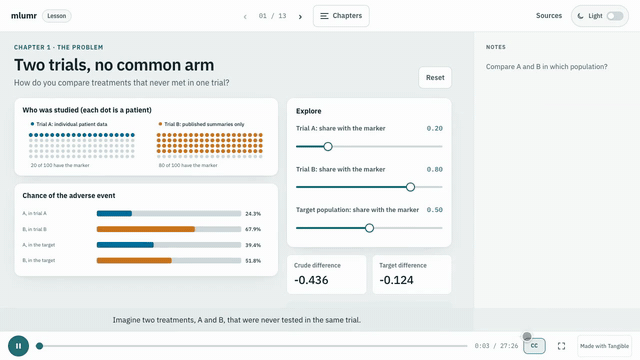

# mlumr lesson

A narrated, interactive lesson on multilevel unanchored meta-regression (ML-UMR) with the [mlumr](https://github.com/choxos/mlumr) R package. It is published at **https://choxos.github.io/mlumr/lesson/**.



<sub>A few seconds of chapter 1. [Watch the full 137 second tour](documentation/tour.mp4) at 1080p, silent with captions: chapters 1, 4 and 5, the mlumr R code and a Stan fit running in the browser, survival, a diagnostic case, a knowledge check and the dark theme.</sub>

This branch holds only the lesson, the same way the `webapp` branch holds only the web app. The R package lives on `main`.

The lesson is for researchers who know basic regression and are new to population-adjusted indirect comparisons. It has 13 narrated chapters. Every chapter has an interactive chart, and several have R code cells that run in the browser. The chapter on running mlumr loads the package's own R code with webR and fits its binomial Stan models with TinyStan, all on the page. There are also five knowledge checks, captions, light and dark themes, and a companion R script.

## Layout

| Path | What it is |
| --- | --- |
| `script.md` | The narration, with the Tangible cues that drive the scene. |
| `scenes/` | The scene: `scene.ts` (views and state), `content.ts` (text, steps, questions, code cells), `charts.ts` (SVG charts), `style.ts` (light and dark themes), `navigation.ts` (chapters and theme switch), `codecell.ts` and `runner.ts` (webR and TinyStan), `diagnostics.ts` (R-hat, ESS and MCSE as in the posterior R package), `math.ts` (the teaching models), and `*.test.ts` unit tests. |
| `r/` | R files for the in-browser mlumr cell: `load.R` loads the package sources and stands in for the Stan backend step, `lesson-helpers.R` prepares a fit through the public `mlumr()`, and `check-adapter.R` checks that natively. |
| `runtime/` | The TinyStan worker and the precompiled binomial mlumr models (`mlumr_binary_spfa`, `mlumr_binary_relaxed`), copied from the `webapp` branch, with `models/manifest.json` binding each binary to its Stan program. |
| `workflow.R`, `package-notes.md` | The companion script and its API notes and execution record. |
| `sources.html` | Sources, scope and what runs in the browser. |
| `lesson.sh`, `finish-site.mjs`, `verify-models.mjs`, `dist-manifest.mjs` | Build wrapper, post-build fixes, the model check and the build manifest. |
| `browser-qa.mjs`, `QA.md` | Browser checks and their record. |
| `record-tour.mjs`, `documentation/` | The tour recorder, and the video and gif it writes. |
| `dist/` | The built site that GitHub Actions publishes. |

## Build

The build needs Node 22.6 or newer, pnpm, npm, Git and FFmpeg. The first run downloads the pinned [Tangible](https://github.com/scienceetonnante/tangible) checkout and its local Supertonic voice (about 123 MB). Later runs reuse both, and only changed sentences are spoken again.

```sh
bash lesson.sh test      # strict TypeScript for the scene and the worker, and the unit tests
bash lesson.sh build     # narration, captions and the site in build/site
bash lesson.sh serve     # serve build/site locally
bash lesson.sh dist      # build, then copy the site to dist/ for publishing
bash lesson.sh adapter   # after a build: check the browser mlumr adapter natively with R
```

`TANGIBLE_DIR` can point to an existing Tangible checkout at revision `6a07bbcd5dbc548aa809b253aed503fc0a8c3251`. `build` and `dist` refuse a checkout with local changes to its tracked files or packages, and rebuild its compiled packages from source first. The build copies mlumr's R sources from a local checkout of the package, set with `MLUMR_DIR` (default `../mlumr`) at the commit `MLUMR_REF` (default `4cfd3660f56e22668ae357bde3df4b30cacb23a5`). Use a static HTTP server; opening `index.html` from disk does not work.

The build checks `runtime/models/manifest.json` against the Stan programs at `MLUMR_REF` and stops if they differ, and it writes `build-manifest.json` with the SHA-256 of every source and built file. `lesson.sh adapter` needs R with mlumr's dependencies; set `MLUMR_NATIVE` to an mlumr checkout at `MLUMR_REF` with a built DLL to compare the browser's Stan data, refusals and warnings with the package itself.

`finish-site.mjs` makes two fixes after Tangible builds the site. It applies the saved theme before the page paints and restyles the loading screen. It lists the R files that the browser writes into webR.

## Publish

Run `bash lesson.sh dist`, commit `dist/`, and push this branch. `.github/workflows/deploy-lesson.yaml` first checks `dist/build-manifest.json` against the commit, and refuses a `dist/` built from other sources, then copies `dist/` into the `lesson/` folder of `gh-pages`. The docs deployment on `main` excludes `lesson/` from its cleanup, so it never deletes the lesson.

## Check

Serve the built lesson, then run the browser checks with Chrome:

```sh
TANGIBLE_DIR=/path/to/tangible node browser-qa.mjs http://127.0.0.1:4174
```

The script plays the narration, visits every chapter, moves every control, answers every question, switches themes, runs the R cells and browser Stan fits of both models, and checks tablet, landscape phone, portrait phone and 200% zoom sizes. After `lesson.sh adapter`, it also checks that the browser's Stan data equal the native ones. It writes screenshots and a JSON record to `qa-artifacts/`. Add `--no-runtime` to skip the webR and Stan checks when offline.

## The tour

```sh
python3 -m http.server 4174 --bind 127.0.0.1 --directory dist &
TANGIBLE_DIR=/path/to/tangible node record-tour.mjs http://127.0.0.1:4174   # writes documentation/tour.mp4 and tour.gif
```

Playwright drives the built lesson, so the charts, the R output and the Stan fit in the video are the ones a learner gets. A first page loads the narration, webR and the models into the cache, so the recorded page has no loading waits. The video is silent with the captions on. The narration still plays in the page, because it moves the chapters and the captions, and the tour cuts to the start of a chapter by seeking it.

The video is 1920 by 1080. Playwright's own recorder captures CSS pixels and scales them up, which blurs every label, so Chrome starts at a device scale of 1.5: the 1280 by 720 layout is drawn with 1920 by 1080 real pixels, and a Chrome screencast saves each frame as it is painted. Frames arrive at a variable rate and are encoded with their own timing, not resampled to a fixed rate. The recorder stops if the page is not 1280 by 720 at that scale.

Headless recordings have no pointer, and a slider that moves on its own reads as an animation, so the recorder draws one. It also warns and exits with status 1 when a step did not happen: a Run that printed no STC benchmark, a fit that showed no results, a slider that stopped short, or a knowledge check that did not accept its answer. The mp4 is the full tour; the gif is chapter 1's sliders only, because a whole tour at gif frame rates runs to tens of megabytes.

## Chapters

| Chapter | What you do | What you see |
| --- | --- | --- |
| Two trials, no common arm | Change who each trial enrolled | The crude difference and the same-population difference answer different questions. |
| What adjustment has to assume | Add a hidden difference to trial B | A trial difference can look like a treatment difference. |
| Shared or separate slopes | Change trial B's slope | Shared slopes keep the conditional odds ratio the same at every marker value. |
| Average the predictions | Spread patients out, change the number of points | The risk of the average patient is not the average risk. |
| Rebuild the population | Change how two markers go together | Identical summaries can hide different risks. |
| Choose what to estimate | Change the target population | Conditional and population odds ratios differ even with shared slopes. |
| What subgroup rows can tell you | Move the subgroup rows and the target | Identified, precise and pinned-down targets are different things. |
| Run mlumr in your browser | Step through the analysis and run it | The real package code and Stan model on made-up data. |
| Pick the outcome model | Switch outcome types | Each type needs different summaries and reports different effects. |
| Survival after averaging | Change time, mix and risk difference | Population hazard ratios change over time; RMST needs a horizon. |
| When the prior matters | Tighten the prior, move the target | A narrow interval can come from assumptions instead of data. |
| Read a fit before trusting it | Open seven problems | Sampling, integration, identification and transport are separate checks. |
| Report it well | Answer five questions | What a defensible report contains. |

## Scope

The charts are small, made-up teaching models with exact calculations, and they are labeled as such. The browser fit covers binary outcomes with a small sampling budget. [sources.html](sources.html) lists the sources, the pinned versions and what the method cannot do. Some function names resemble `multinma`, but the models are not interchangeable.
