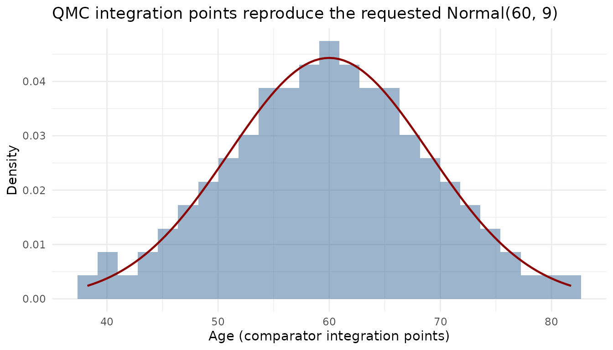

# Preparing data and integration points

Every mlumr analysis follows the same four-step pipeline. This vignette
covers the **family-agnostic** machinery, combining IPD and AgD and,
above all, the numerical integration that powers population adjustment.
The exact
[`set_ipd()`](https://choxos.github.io/mlumr/reference/set_ipd.md) /
[`set_agd()`](https://choxos.github.io/mlumr/reference/set_agd.md)
arguments for each outcome family are shown, with complete runnable
examples, in the per-outcome vignettes (see the reference table below).

1.  [`set_ipd()`](https://choxos.github.io/mlumr/reference/set_ipd.md),
    individual patient data (the index treatment)
2.  [`set_agd()`](https://choxos.github.io/mlumr/reference/set_agd.md)
    (or
    [`set_agd_surv()`](https://choxos.github.io/mlumr/reference/set_agd_surv.md)
    for survival), aggregate data (comparator)
3.  [`combine_data()`](https://choxos.github.io/mlumr/reference/combine_data.md),
    join them into one `mlumr_data` object
4.  [`add_integration()`](https://choxos.github.io/mlumr/reference/add_integration.md),
    quasi-Monte Carlo integration points (ML-UMR only)

## The pipeline (illustrated on a binary endpoint)

The four steps below build a complete `mlumr_data` object from a binary
IPD trial and a one-row aggregate comparator; the sections that follow
explain each piece (covariate naming, integration, correlation) in
detail:

``` r

library(mlumr)
set.seed(2026)

# IPD (index): one row per patient
trial_a <- data.frame(
  treatment = "Drug_A",
  response = rbinom(500, 1, 0.6),
  age_group = rbinom(500, 1, 0.4),
  sex = rbinom(500, 1, 0.55)
)
ipd <- set_ipd(trial_a, treatment = "treatment", outcome = "response",
               covariates = c("age_group", "sex"))

# AgD (comparator): one row per study, with covariate summaries
trial_b <- data.frame(
  treatment = "Drug_B", n_total = 400, n_events = 160,
  age_group_mean = 0.35, sex_prop = 0.50
)
agd <- set_agd(trial_b, treatment = "treatment",
               outcome_n = "n_total", outcome_r = "n_events",
               cov_means = c("age_group_mean", "sex_prop"),
               cov_types = c("binary", "binary"))

dat <- combine_data(ipd, agd)
dat
#> Unanchored Comparison Data (Binary)
#> ====================================
#> 
#> Index treatment (IPD): Drug_A 
#>   N = 500 
#>   Events = 303 (60.6%) 
#> 
#> Comparator treatment (AgD): Drug_B 
#>   N = 400 
#>   Events = 160 (40.0%) 
#> 
#> Covariates ( 2 ): age_group, sex 
#> Integration points: not yet added (use add_integration())
```

## Outcome-family input reference

The outcome arguments differ by family; everything else (covariates,
combining, integration) is identical. Each family has a complete worked
example.

| Family | [`set_ipd()`](https://choxos.github.io/mlumr/reference/set_ipd.md) outcome args | [`set_agd()`](https://choxos.github.io/mlumr/reference/set_agd.md) outcome args | Vignette |
|----|----|----|----|
| binomial | `outcome` (0/1) | `outcome_n`, `outcome_r` | [`vignette("binary-outcomes")`](https://choxos.github.io/mlumr/articles/binary-outcomes.md) |
| normal | `outcome`, `family = "normal"` | `outcome_mean`, `outcome_se` (+ `outcome_n`) | [`vignette("continuous-outcomes")`](https://choxos.github.io/mlumr/articles/continuous-outcomes.md) |
| poisson | `outcome`, `exposure`, `family = "poisson"` | `outcome_r`, `outcome_E` | [`vignette("count-outcomes")`](https://choxos.github.io/mlumr/articles/count-outcomes.md) |
| survival | `Surv`/`time`/`status`, `family = "survival"` | [`set_agd_surv()`](https://choxos.github.io/mlumr/reference/set_agd_surv.md): pseudo-IPD `time`/`status` | [`vignette("survival-outcomes")`](https://choxos.github.io/mlumr/articles/survival-outcomes.md) |

[`set_ipd()`](https://choxos.github.io/mlumr/reference/set_ipd.md)
validates that the outcome matches the family (binary 0/1; numeric for
normal; non-negative integer counts for Poisson; positive times for
survival) and drops rows with missing values (with a warning).

### Covariate naming and types

[`set_agd()`](https://choxos.github.io/mlumr/reference/set_agd.md)
strips `_mean` and `_prop` suffixes so AgD covariate names match the IPD
(`age_group_mean` → `age_group`, `sex_prop` → `sex`). Declare each
covariate as `"binary"` or `"continuous"` via `cov_types`; continuous
covariates also need a standard-deviation column in `cov_sds`.

### Scale conventions for aggregate summaries

For the **normal** family, `outcome_mean` and `outcome_se` must be on
the **original (arithmetic) scale**, the same scale as the IPD outcome,
even when fitting with `link = "log"`. Back-transform any geometric mean
or log-scale summary (propagating the SE by the delta method) before
calling
[`set_agd()`](https://choxos.github.io/mlumr/reference/set_agd.md). See
[`vignette("continuous-outcomes")`](https://choxos.github.io/mlumr/articles/continuous-outcomes.md).

## Integration points

ML-UMR adjusts for covariate imbalance by integrating the IPD-derived
outcome model over the comparator population’s covariate distribution.
mlumr represents that distribution by **Sobol quasi-Monte Carlo (QMC)**
integration points, correlated with a **Gaussian copula** so the joint
covariate structure is respected.

``` r

dat <- add_integration(
  dat,
  n_int = 64,
  age_group = distr(qbern, prob = age_group_mean),
  sex = distr(qbern, prob = sex_mean)
)
```

- **`n_int`**, number of points (powers of 2: 32, 64, 128, …). More
  points give better accuracy at the cost of slower fitting; check
  adequacy with
  [`check_integration()`](https://choxos.github.io/mlumr/reference/check_integration.md)
  (below).
- **[`distr()`](https://choxos.github.io/mlumr/reference/distr.md)**,
  wraps a quantile function whose parameters reference AgD summary
  columns. Use `qbern` (Bernoulli, supplied by mlumr) for binary
  covariates, `qnorm` for normal, `qgamma` for skewed positive
  covariates, and `qlogitnorm` for a covariate reported as a proportion
  on `(0, 1)`.

mlumr’s
[`qgamma()`](https://choxos.github.io/mlumr/reference/GammaDist.md) and
[`qlogitnorm()`](https://choxos.github.io/mlumr/reference/logitNormal.md)
accept a `mean` and `sd` on the natural scale in place of their native
parameters, so the moments can be taken from a published baseline table
without conversion. Both must be supplied together. A logit-normal
additionally requires `sd^2 < mean * (1 - mean)`, the bound any variable
on `(0, 1)` satisfies; a percentage must be rescaled to a proportion
first.

``` r

add_integration(
  dat, n_int = 64,
  age = distr(qbern, prob = age_mean),                  # binary
  bmi = distr(qnorm, mean = bmi_mean, sd = bmi_sd),     # continuous (normal)
  biomarker = distr(qgamma, mean = bio_mean, sd = bio_sd),  # right-skewed
  bsa = distr(qlogitnorm, mean = bsa_mean, sd = bsa_sd)     # proportion on (0, 1)
)
```

### Correlation handling

By default the covariate correlation is estimated from the IPD
(Spearman) and adjusted for the Gaussian copula. For binary and mixed
discrete/continuous pairs this copula adjustment is a **pragmatic
approximation**: the exact latent Gaussian correlation depends on the
marginal prevalences, which the current transform does not use. It is
adequate for most datasets, but if you have strong prior information, or
covariates with prevalences near 0/1, strong correlations, or many
covariates, supply your own matrix via `cor` and confirm the result is
stable with
[`check_integration()`](https://choxos.github.io/mlumr/reference/check_integration.md).

``` r

my_cor <- matrix(c(1, 0.3, 0.3, 1), 2, 2)
add_integration(dat, n_int = 64, cor = my_cor,
                age_group = distr(qbern, prob = age_group_mean),
                sex = distr(qbern, prob = sex_mean))

add_integration(dat, n_int = 64, cor_adjust = "none",  # no adjustment
                age_group = distr(qbern, prob = age_group_mean),
                sex = distr(qbern, prob = sex_mean))
```

### Inspecting the integration points

[`unnest_integration()`](https://choxos.github.io/mlumr/reference/unnest_integration.md)
expands the stored points to a data frame with one row per aggregate row
and integration point, one column per covariate, plus `.int_id` and
`.agd_row`, so you can inspect or plot the realized comparator
distribution directly:

``` r

head(unnest_integration(dat))     # one row per point, covariates in columns
#>   age_group sex .int_id .agd_row
#> 1         0   0       1        1
#> 2         1   0       2        1
#> 3         0   1       3        1
#> 4         0   0       4        1
#> 5         1   1       5        1
#> 6         0   0       6        1
```

``` r

check_integration(
  dat,
  age_group = distr(qbern, prob = age_group_mean),
  sex = distr(qbern, prob = sex_mean)
)
#> Integration check: n_int = 64 vs 128
#> Resolution heuristic, max relative difference: 0.0079
#> Resolution stable within the package's 1% heuristic.
#> Declared-target fidelity, max relative difference: 0.0156
#> Caution: grid moments differ from declared AgD moments by 1-5%.
#> Joint: max |cor(current) - cor(doubled)|: 0.0113
#> Joint resolution stable within the package's 0.05 heuristic.
#> Target (spearman): max |cor(doubled) - cor_target|: 0.0196
```

[`check_integration()`](https://choxos.github.io/mlumr/reference/check_integration.md)
compares the realized integration points against the requested marginals
and correlations and flags when `n_int` is too small, run it whenever
there are several or strongly correlated covariates.

### Visualizing the integration points

For a continuous covariate the quasi-Monte Carlo points should reproduce
the requested marginal. Here we build a small example with a continuous
`age` and overlay the integration points on the requested Normal
density:

``` r

set.seed(2026)
ipd_c <- data.frame(treatment = "Drug_A", response = rbinom(400, 1, 0.5),
                    age = rnorm(400, 55, 10))
agd_c <- data.frame(treatment = "Drug_B", n_total = 300, n_events = 120,
                    age_mean = 60, age_sd = 9)
dat_c <- combine_data(
  set_ipd(ipd_c, treatment = "treatment", outcome = "response", covariates = "age"),
  set_agd(agd_c, treatment = "treatment", outcome_n = "n_total",
          outcome_r = "n_events", cov_means = "age_mean", cov_sds = "age_sd",
          cov_types = "continuous"))
dat_c <- add_integration(dat_c, n_int = 128,
                         age = distr(qnorm, mean = age_mean, sd = age_sd))
pts <- unnest_integration(dat_c)

if (requireNamespace("ggplot2", quietly = TRUE)) {
  library(ggplot2)
  ggplot(pts, aes(age)) +
    geom_histogram(aes(y = after_stat(density)), bins = 25,
                   fill = "#3B6B9A", alpha = 0.5) +
    stat_function(fun = dnorm, args = list(mean = 60, sd = 9),
                  color = "darkred", linewidth = 0.8) +
    labs(x = "Age (comparator integration points)", y = "Density",
         title = "QMC integration points reproduce the requested Normal(60, 9)") +
    theme_minimal()
}
```



## Integration requirements for STC and naive

[`naive()`](https://choxos.github.io/mlumr/reference/naive.md) can be
called immediately after
[`combine_data()`](https://choxos.github.io/mlumr/reference/combine_data.md)
because it uses only the observed crude outcomes.
[`stc()`](https://choxos.github.io/mlumr/reference/stc.md) requires
integration points for nonlinear links, including binomial and Poisson
outcomes and normal-log models. Replacing a covariate distribution by
its mean before applying a nonlinear inverse link does not recover the
marginal outcome. Only the normal identity-link STC can use the
aggregate means directly; see
[`vignette("choosing-a-method")`](https://choxos.github.io/mlumr/articles/choosing-a-method.md).

``` r

dat_no_int <- combine_data(ipd, agd)
naive(dat_no_int)
#> Naive Unadjusted Indirect Comparison
#> =====================================
#> 
#> Treatments: Drug_A vs Drug_B 
#> 
#> Population basis: index-study outcome versus comparator-population outcome; no common standardized target.
#> 
#> Event rates:
#>   Index (IPD):      0.606 (303/500)
#>   Comparator (AgD): 0.400 (160/400)
#> 
#> Log Odds Ratio: 0.8360 (SE: 0.1371)
#> 95% CI: [0.5673, 1.1047]
#> 
#> All effect measures (95% CI):
#>   Log odds ratio                 0.8360 (SE 0.1371) [0.5673, 1.1047]
#>   Odds ratio                     2.3071 [1.7635, 3.0183]
#>   Risk difference                0.2060 (SE 0.0328) [0.1417, 0.2703]
#>   Risk ratio                     1.5150 [1.3180, 1.7414]
stc(dat)
#> Simulated Treatment Comparison (G-computation)
#> ===============================================
#> 
#> Treatments: Drug_A vs Drug_B 
#> 
#> Estimand population: comparator
#> Treating this as the index-population effect requires a separate effect-equality assumption; this calculation does not transport to the index population.
#> 
#> Marginalized P(Y=1|index trt, comp pop): 0.6025
#> Observed P(Y=1|comp trt, comp pop):      0.4000
#> 
#> Log Odds Ratio: 0.8213 (SE: 0.1383)
#> 95% CI: [0.5503, 1.0923]
#> 
#> All effect measures (95% CI):
#>   Log odds ratio                 0.8213 (SE 0.1383) [0.5503, 1.0923]
#>   Odds ratio                     2.2736 [1.7339, 2.9812]
#>   Risk difference                0.2025 (SE 0.0332) [0.1375, 0.2675]
#>   Risk ratio                     1.5062 [1.3091, 1.7331]
#> 
#> Outcome model coefficients:
#> (Intercept)   age_group         sex 
#>      0.3515      0.1693      0.0142
```
