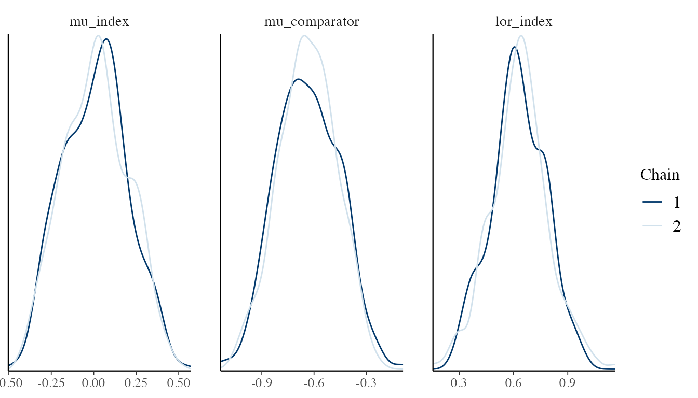
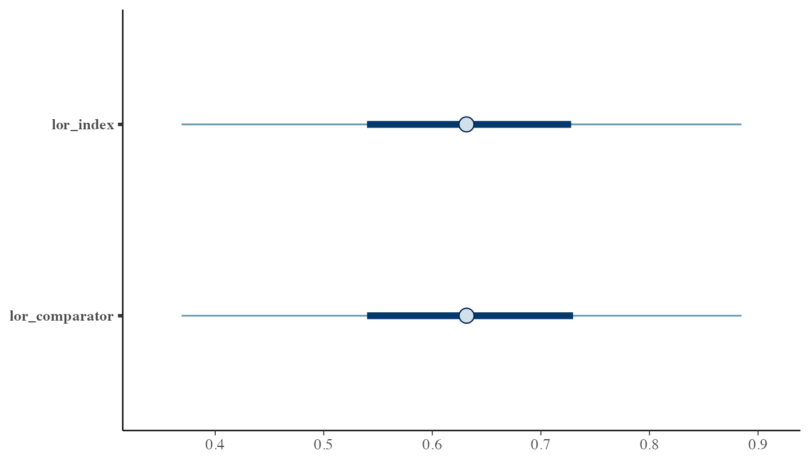

# Fitting ML-UMR Models

## Overview

The [`mlumr()`](https://choxos.github.io/mlumr/reference/mlumr.md)
function fits Bayesian multilevel unanchored meta-regression models
using Stan. The default backend is `rstan`; `cmdstanr` can be used when
it is installed and configured. Three outcome families are supported:
binary (binomial), continuous (normal), and count (Poisson). Two model
types are available for each family:

- **SPFA** (Shared Prognostic Factor Assumption): shared regression
  coefficients across treatments
- **Relaxed SPFA**: treatment-specific regression coefficients, allowing
  effect modification

## Model specification

### Binary outcomes (binomial)

The SPFA model assumes that covariates affect outcomes equally for both
treatments. The model is:

``` math
\text{logit}(P(Y_i = 1 | \text{Index})) = \mu_A + \mathbf{x}_i^T \boldsymbol{\beta}
```

``` math
\text{logit}(P(Y_j = 1 | \text{Comparator})) = \mu_B + \mathbf{x}_j^T \boldsymbol{\beta}
```

where $`\boldsymbol{\beta}`$ is **shared** across both treatments. The
AgD likelihood integrates over the comparator population covariate
distribution using QMC points.

The Relaxed model allows treatment-specific effects:

``` math
\text{logit}(P(Y_i = 1 | \text{Index})) = \mu_A + \mathbf{x}_i^T \boldsymbol{\beta}_A
```

``` math
\text{logit}(P(Y_j = 1 | \text{Comparator})) = \mu_B + \mathbf{x}_j^T \boldsymbol{\beta}_B
```

This captures **effect modification** when covariate effects differ
between treatments. The difference
$`\boldsymbol{\delta} = \boldsymbol{\beta}_A - \boldsymbol{\beta}_B`$
quantifies treatment-by-covariate interaction.

### Continuous outcomes (normal)

For continuous outcomes, the SPFA model is:

``` math
Y_i | \text{Index} \sim \text{Normal}(\mu_A + \mathbf{x}_i^T \boldsymbol{\beta}, \sigma^2)
```

The AgD likelihood uses the mean and standard error of the observed
outcome. The generated quantities include mean differences
(`delta_index`, `delta_comparator`) as the primary treatment effect
measure.

An additional `prior_sigma` parameter controls the prior on the residual
standard deviation $`\sigma`$. The default is a half-normal prior
induced by Stan’s `<lower=0>` constraint; half-Student-t and exponential
priors are also available through the prior constructors.

### Count outcomes (Poisson)

For count outcomes with exposure, the SPFA model uses a Poisson
likelihood with log link:

``` math
Y_i | \text{Index} \sim \text{Poisson}(\exp(\mu_A + \mathbf{x}_i^T \boldsymbol{\beta}) \cdot E_i)
```

where $`E_i`$ is the exposure (person-time). The AgD likelihood uses
log-sum-exp for numerical stability. The generated quantities include
rate ratios (`delta_index`, `delta_comparator`).

## Fitting models

The chunks below all use a small toy `dat` built from the same pipeline
as
[`vignette("data-preparation")`](https://choxos.github.io/mlumr/articles/data-preparation.md).
Run this setup chunk first so the subsequent fitting, summary,
prediction, and comparison calls have something to operate on.

``` r

library(mlumr)
set.seed(2026)

trial_a_data <- data.frame(
  trt      = "Drug_A",
  response = rbinom(300, 1, 0.55),
  age_cat  = rbinom(300, 1, 0.40),
  sex      = rbinom(300, 1, 0.55)
)
trial_b_data <- data.frame(
  trt           = "Drug_B",
  n_total       = 400,
  n_events      = 160,
  age_cat_mean  = 0.35,
  sex_mean      = 0.50
)

ipd <- set_ipd(trial_a_data, treatment = "trt", outcome = "response",
               covariates = c("age_cat", "sex"))
agd <- set_agd(trial_b_data, treatment = "trt",
               outcome_n = "n_total", outcome_r = "n_events",
               cov_means = c("age_cat_mean", "sex_mean"),
               cov_types = c("binary", "binary"))
dat <- combine_data(ipd, agd)
dat <- add_integration(dat, n_int = 64,
                       age_cat = distr(qbern, prob = age_cat_mean),
                       sex = distr(qbern, prob = sex_mean))
```

``` r

# SPFA model (default)
fit_spfa <- mlumr(
  dat, model = "spfa",
  chains = 2, iter = 500, warmup = 250,
  seed = 42, refresh = 0, verbose = FALSE
)

# Relaxed SPFA
fit_relaxed <- mlumr(
  dat, model = "relaxed",
  chains = 2, iter = 500, warmup = 250,
  seed = 43, refresh = 0, verbose = FALSE
)
```

### Controlling the sampler

``` r

fit <- mlumr(
  dat,
  model = "spfa",
  chains = 4,               # Number of MCMC chains
  iter = 4000,               # Total iterations per chain
  warmup = 2000,             # Warmup iterations
  seed = 42,                 # For reproducibility
  adapt_delta = 0.99,        # Increase for divergences
  max_treedepth = 15,        # Maximum tree depth
  refresh = 500              # Print progress every 500 iterations
)
```

The backend can be selected per fit. The code below runs the same small
demonstration model with each available engine and records elapsed
wall-clock time. `rstan` uses the model compiled into the installed R
package. The first `cmdstanr` call may include external executable
compilation or cache setup, so the table reports cold and warm
`cmdstanr` runs separately. For repeated analyses, the warm-cache
`cmdstanr` row is the more relevant comparison.

``` r

run_backend_timed <- function(engine, run, note, seed = 2026, ...) {
  start_time <- proc.time()[["elapsed"]]
  fit <- tryCatch(
    mlumr(
      dat,
      model = "spfa",
      engine = engine,
      chains = 2,
      iter = 300,
      warmup = 150,
      seed = seed,
      refresh = 0,
      verbose = FALSE,
      ...
    ),
    error = function(e) e
  )
  elapsed <- proc.time()[["elapsed"]] - start_time

  if (inherits(fit, "error")) {
    return(data.frame(
      run = run,
      engine = engine,
      status = "failed",
      elapsed_seconds = round(elapsed, 2),
      lor_comparator_mean = NA_real_,
      max_rhat = NA_real_,
      min_ess = NA_real_,
      note = conditionMessage(fit),
      stringsAsFactors = FALSE
    ))
  }

  lor_comp <- marginal_effects(fit, effect = "lor", population = "comparator")
  data.frame(
    run = run,
    engine = engine,
    status = "ran",
    elapsed_seconds = round(elapsed, 2),
    lor_comparator_mean = round(lor_comp$mean, 3),
    max_rhat = round(max(fit$summary$Rhat, na.rm = TRUE), 3),
    min_ess = round(min(fit$summary$n_eff, na.rm = TRUE), 1),
    note = note,
    stringsAsFactors = FALSE
  )
}

cmdstanr_ready <- requireNamespace("cmdstanr", quietly = TRUE) &&
  isTRUE(tryCatch({
    nzchar(cmdstanr::cmdstan_path())
  }, error = function(e) FALSE))

backend_speed <- run_backend_timed(
  engine = "rstan",
  run = "rstan",
  note = "Package-compiled model, already used above"
)

if (cmdstanr_ready) {
  backend_speed <- rbind(
    backend_speed,
    run_backend_timed(
      engine = "cmdstanr",
      run = "cmdstanr_cold",
      note = "First call; may include compile/cache setup"
    ),
    run_backend_timed(
      engine = "cmdstanr",
      run = "cmdstanr_warm",
      note = "Second call; executable/cache already available"
    ),
    run_backend_timed(
      engine = "cmdstanr",
      run = "cmdstanr_warm_parallel",
      note = "Warm cache with two parallel chains",
      parallel_chains = 2
    )
  )
} else {
  backend_speed <- rbind(
    backend_speed,
    data.frame(
      run = "cmdstanr",
      engine = "cmdstanr",
      status = "skipped",
      elapsed_seconds = NA_real_,
      lor_comparator_mean = NA_real_,
      max_rhat = NA_real_,
      min_ess = NA_real_,
      note = "cmdstanr or CmdStan is not available in this R session",
      stringsAsFactors = FALSE
    )
  )
}

backend_speed
#>                      run   engine status elapsed_seconds lor_comparator_mean
#> 1                  rstan    rstan    ran            0.76               0.632
#> 2          cmdstanr_cold cmdstanr failed            0.84                  NA
#> 3          cmdstanr_warm cmdstanr failed            0.61                  NA
#> 4 cmdstanr_warm_parallel cmdstanr failed            0.58                  NA
#>   max_rhat min_ess
#> 1    1.003    76.1
#> 2       NA      NA
#> 3       NA      NA
#> 4       NA      NA
#>                                                                               note
#> 1                                       Package-compiled model, already used above
#> 2 An error occured during compilation! See the message above for more information.
#> 3 An error occured during compilation! See the message above for more information.
#> 4 An error occured during compilation! See the message above for more information.
```

For production analyses, choose the backend based on your local
toolchain, diagnostics, and workflow. `cmdstanr` is often faster after
the executable is compiled, especially with parallel chains and longer
runs, but this is not guaranteed for tiny demonstration fits. In short
examples, compilation, process startup, and CSV readback can dominate
the timing. Posterior estimates should be similar up to Monte Carlo
error when the same model, data, priors, and sampler settings are used.

### Setting priors

By default, weakly informative `Normal(0, 10)` priors are used for
intercepts and `Normal(0, 2.5)` priors are used for regression
coefficients. Normal, Student-t, and Cauchy priors are available for
intercepts and regression coefficients. For normal-family residual
standard deviations, `prior_sigma` also supports an exponential prior.

``` r

fit <- mlumr(
  dat,
  model = "spfa",
  prior_intercept = prior_normal(0, 10),   # Default
  prior_beta = prior_normal(0, 2.5)        # More informative for betas
)
```

Per-covariate beta priors and autoscaling are supported:

``` r

fit <- mlumr(
  dat,
  model = "spfa",
  prior_beta = list(
    prior_normal(0, 2.5, autoscale = TRUE),
    prior_normal(0, 1.5, autoscale = TRUE)
  )
)
```

Inspect the priors actually passed to Stan, including autoscaled beta
scales:

``` r

prior_summary(fit)
```

## Inspecting results

### Print and summary

``` r

# Quick overview
print(fit_spfa)
#> ML-UMR Fit
#> ==========
#> 
#> Model: SPFA (Shared Prognostic Factors) 
#> Family: Binary 
#> Link: logit 
#> Engine: rstan 
#> Treatments:
#>   Index (IPD): Drug_A 
#>   Comparator (AgD): Drug_B 
#> 
#> Data:
#>   IPD: n = 300 observations
#>   AgD: 1 rows
#>   Covariates: 2 
#>   Integration points: 64 
#> 
#> Sampling:
#>   Chains: 2 
#>   Iterations: 500 (warmup: 250 )
#> 
#> Key Parameters:
#>        variable        mean         sd        2.5%      97.5%      Rhat
#>        mu_index  0.01040724 0.19159214 -0.33074665  0.3815756 1.0072054
#>   mu_comparator -0.63607867 0.17006929 -0.95953531 -0.3209510 1.0154031
#>       lor_index  0.62933865 0.15292754  0.31988979  0.9268537 0.9964877
#>  lor_comparator  0.62968799 0.15303636  0.31997526  0.9284606 0.9964885
#>        rd_index  0.15534209 0.03716764  0.07954897  0.2274495 0.9964327
#>   rd_comparator  0.15531861 0.03719440  0.07955894  0.2276036 0.9964324
#> 
#> Use summary() for full results

# Detailed summary
summary(fit_spfa)
#> ML-UMR Model Summary
#> ====================
#> 
#> Model: SPFA 
#> Family: Binary 
#> Link: logit 
#> Engine: rstan 
#> Treatments: Drug_A (IPD) vs Drug_B (AgD)
#> 
#> MCMC Diagnostics:
#>   Divergent transitions: 0 
#>   Max treedepth hits: 0 
#>   Max Rhat: 1.016 
#>   Min ESS: 149 
#> 
#> Intercepts (logit scale):
#>       variable        mean        sd       2.5%      97.5%     Rhat
#>       mu_index  0.01040724 0.1915921 -0.3307466  0.3815756 1.007205
#>  mu_comparator -0.63607867 0.1700693 -0.9595353 -0.3209510 1.015403
#> 
#> Regression Coefficients:
#>  variable       mean        sd       2.5%     97.5%      Rhat
#>   beta[1] -0.1538366 0.2480568 -0.6437745 0.3240322 0.9976325
#>   beta[2]  0.5748965 0.2306527  0.1285506 1.0311792 1.0164810
#> 
#> Marginal Treatment Effects:
#>   Log Odds Ratios:
#>        variable      mean        sd      2.5%     97.5%
#>       lor_index 0.6293387 0.1529275 0.3198898 0.9268537
#>  lor_comparator 0.6296880 0.1530364 0.3199753 0.9284606
#>   Risk Differences:
#>       variable      mean         sd       2.5%     97.5%
#>       rd_index 0.1553421 0.03716764 0.07954897 0.2274495
#>  rd_comparator 0.1553186 0.03719440 0.07955894 0.2276036
#>   Risk Ratios:
#>       variable     mean        sd     2.5%    97.5%
#>       rr_index 1.390010 0.1108687 1.182237 1.622135
#>  rr_comparator 1.394113 0.1115285 1.182954 1.627734
```

### Marginal treatment effects

The main quantities of interest are population-level treatment effects,
marginalized over the covariate distribution:

``` r

# All effects in both populations
marginal_effects(fit_spfa)
#>         variable effect population      mean         sd       q2.5       q50
#> 1      lor_index    LOR      Index 0.6293387 0.15292754 0.31988979 0.6314306
#> 2 lor_comparator    LOR Comparator 0.6296880 0.15303636 0.31997526 0.6315472
#> 3       rd_index     RD      Index 0.1553421 0.03716764 0.07954897 0.1559863
#> 4  rd_comparator     RD Comparator 0.1553186 0.03719440 0.07955894 0.1559871
#> 5       rr_index     RR      Index 1.3900103 0.11086865 1.18223749 1.3820488
#> 6  rr_comparator     RR Comparator 1.3941131 0.11152855 1.18295444 1.3875143
#>       q97.5
#> 1 0.9268537
#> 2 0.9284606
#> 3 0.2274495
#> 4 0.2276036
#> 5 1.6221352
#> 6 1.6277336

# Log odds ratios only
marginal_effects(fit_spfa, effect = "lor")
#>         variable effect population      mean        sd      q2.5       q50
#> 1      lor_index    LOR      Index 0.6293387 0.1529275 0.3198898 0.6314306
#> 2 lor_comparator    LOR Comparator 0.6296880 0.1530364 0.3199753 0.6315472
#>       q97.5
#> 1 0.9268537
#> 2 0.9284606

# In index population only
marginal_effects(fit_spfa, effect = "lor", population = "index")
#>    variable effect population      mean        sd      q2.5       q50     q97.5
#> 1 lor_index    LOR      Index 0.6293387 0.1529275 0.3198898 0.6314306 0.9268537

# Full posterior draws (for custom summaries)
lor_draws <- marginal_effects(fit_spfa, effect = "lor", summary = FALSE)
head(lor_draws)
#>   lor_index lor_comparator
#> 1 0.5434681      0.5434656
#> 2 0.6593035      0.6593200
#> 3 0.6041779      0.6041931
#> 4 0.5589187      0.5589707
#> 5 0.5902156      0.5903818
#> 6 0.6826545      0.6834941
```

### Absolute predictions

``` r

# Predicted probabilities P(Y=1) for each treatment in each population
predict(fit_spfa, population = "both")
#>   treatment population      mean         sd      q2.5       q50     q97.5
#> 1    Drug_A      Index 0.5592762 0.02940887 0.5012966 0.5608810 0.6149849
#> 2    Drug_B      Index 0.4039341 0.02639029 0.3510900 0.4043648 0.4546752
#> 3    Drug_A Comparator 0.5548165 0.02979489 0.4966729 0.5562745 0.6116150
#> 4    Drug_B Comparator 0.3994979 0.02578193 0.3471624 0.4008205 0.4495810

# On logit scale
predict(fit_spfa, type = "link")
#>   treatment population       mean        sd         q2.5        q50      q97.5
#> 1    Drug_A      Index  0.2453897 0.1227781  0.005129096  0.2513628  0.4787069
#> 2    Drug_B      Index -0.4010963 0.1125463 -0.633384613 -0.3989238 -0.1908146
#> 3    Drug_A Comparator  0.2270086 0.1238128 -0.013268543  0.2311069  0.4612541
#> 4    Drug_B Comparator -0.4194773 0.1106674 -0.650951196 -0.4130421 -0.2071555

# Full posterior draws
pred_draws <- predict(fit_spfa, summary = FALSE)
head(pred_draws)
#>   p_index_index p_comparator_index p_index_comparator p_comparator_comparator
#> 1     0.5568814          0.4219061          0.5486799               0.4138366
#> 2     0.5956300          0.4324127          0.5866531               0.4233165
#> 3     0.5553231          0.4056505          0.5477135               0.3982513
#> 4     0.5650387          0.4262221          0.5562769               0.4175339
#> 5     0.5619349          0.4155187          0.5605865               0.4141492
#> 6     0.5573371          0.3888158          0.5563852               0.3877001
```

### Conditional predictions and effects

[`predict()`](https://rdrr.io/r/stats/predict.html) and
[`marginal_effects()`](https://choxos.github.io/mlumr/reference/marginal_effects.md)
report population-averaged quantities. Use
[`conditional_predict()`](https://choxos.github.io/mlumr/reference/conditional_predict.md)
and
[`conditional_effects()`](https://choxos.github.io/mlumr/reference/conditional_effects.md)
when the estimand is a specific covariate profile rather than the index
or comparator population.

``` r

profiles <- data.frame(
  age_cat = c(0, 1),
  sex = c(0, 1)
)

# Absolute event probabilities at each profile
conditional_predict(fit_spfa, newdata = profiles)
#>   profile treatment      mean         sd      q2.5       q50     q97.5
#> 1       1    Drug_A 0.5025687 0.04753315 0.4180597 0.5043933 0.5942529
#> 2       1    Drug_B 0.3471282 0.03832938 0.2769713 0.3450643 0.4204440
#> 3       2    Drug_A 0.6050757 0.05110535 0.5000981 0.6070703 0.7008318
#> 4       2    Drug_B 0.4471030 0.05517446 0.3474700 0.4456127 0.5561979

# Conditional link-scale, risk-difference, and risk-ratio effects
conditional_effects(fit_spfa, newdata = profiles)
#>   profile      effect      mean         sd       q2.5       q50     q97.5
#> 1       1 LINK_EFFECT 0.6464859 0.15616833 0.32990456 0.6495544 0.9672391
#> 2       1          RD 0.1554404 0.03773287 0.07976107 0.1566759 0.2325119
#> 3       1          RR 1.4559709 0.13074055 1.20739771 1.4571420 1.7272788
#> 4       2 LINK_EFFECT 0.6464859 0.15616833 0.32990456 0.6495544 0.9672391
#> 5       2          RD 0.1579727 0.03782635 0.08062131 0.1592673 0.2364590
#> 6       2          RR 1.3636326 0.11529619 1.17088201 1.3491895 1.6183026
```

For SPFA binary models, the conditional link-scale effect is constant
across profiles because the shared beta cancels on the fitted link
scale. Risk differences and risk ratios can still vary by profile
because they depend on the absolute baseline probabilities.

## Model comparison

Compare SPFA and Relaxed models using DIC:

``` r

compare_models(fit_spfa, fit_relaxed)
#> 
#> Model Comparison (DIC)
#> ======================
#> 
#>         Model    DIC   pD Delta_DIC
#>  Relaxed SPFA 419.68 3.88      0.00
#>          SPFA 420.17 4.05      0.48
#> 
#> Lower DIC = better fit. Delta_DIC > 5 is a rough heuristic for
#> meaningful difference, not a formally calibrated threshold.
#> DIC should not be the sole basis for model selection.
```

You can also compute DIC individually:

``` r

dic_spfa <- calculate_dic(fit_spfa)
print(dic_spfa)
#> DIC for ML-UMR Model
#> ====================
#> 
#> Model: SPFA 
#> DIC: 420.17 
#> pD: 4.05 
#> D_bar: 416.11
```

## MCMC diagnostics

The package automatically warns about:

- Divergent transitions (increase `adapt_delta`)
- Maximum treedepth hits (increase `max_treedepth`)
- High Rhat values (\> 1.01, run more iterations)
- Low ESS (\< 400, run more iterations)

Check diagnostics manually:

``` r

# Diagnostics stored in the fit object
fit_spfa$diagnostics$n_divergent
#> [1] 0
fit_spfa$diagnostics$n_max_treedepth
#> [1] 0

# Rhat and ESS from the summary table
max(fit_spfa$summary$Rhat, na.rm = TRUE)
#> [1] 1.016481
min(fit_spfa$summary$n_eff, na.rm = TRUE)
#> [1] 148.6844
```

For visual diagnostics, use the bayesplot package:

``` r

library(bayesplot)
pars <- c("mu_index", "mu_comparator", "lor_index")
draws_array <- rstan::extract(fit_spfa$stanfit, pars = pars, permuted = FALSE)
mcmc_dens_overlay(draws_array, pars = pars)
```



``` r

mcmc_intervals(as.matrix(fit_spfa$draws[, c("lor_index", "lor_comparator")]))
```



## Troubleshooting

### Divergent transitions

Increase `adapt_delta` closer to 1:

``` r

fit <- mlumr(dat, adapt_delta = 0.99)
```

### Slow convergence

Increase iterations and warmup:

``` r

fit <- mlumr(dat, iter = 8000, warmup = 4000)
```

### Identifiability in Relaxed model

The Relaxed model has more parameters. With only one AgD row, the
comparator-specific coefficients may be weakly identified. The package
warns about this. Consider:

- Using the SPFA model if effect modification is not expected
- Providing multiple AgD subgroups
- Using more informative priors for betas
- Running
  [`prior_sensitivity()`](https://choxos.github.io/mlumr/reference/prior_sensitivity.md)
  to assess how strongly relaxed-model conclusions depend on the beta
  prior

``` r

prior_sensitivity(fit_relaxed, prior_beta_scales = c(1, 2.5, 5, 10))
```
