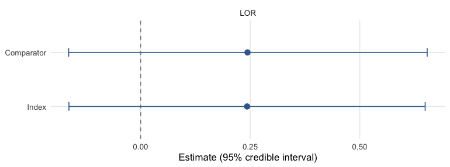

``` r
library(mlumr)
library(ggplot2)
options(mc.cores = parallel::detectCores())
```

This vignette is a complete worked example of an **unanchored** indirect
comparison for a **binary** endpoint, using plaque-psoriasis trial data bundled
with mlumr (`psoriasis_ipd` / `psoriasis_agd`, copied from the GPL-3 `multinma`
package [@multinma]). It is the unanchored, two-study analogue of multinma's
`plaque_psoriasis` ML-NMR example
[@Phillippo2020]. For the shared data-preparation machinery see
`vignette("data-preparation")`; for sampler/prior/diagnostic detail see
`vignette("fitting-and-diagnostics")`; for how to choose between methods see
`vignette("choosing-a-method")`.

> **About these data.** `psoriasis_ipd` / `psoriasis_agd` are copied *verbatim*
> from `multinma`; they were not re-simulated for mlumr. multinma's patient
> records are themselves **simulated** to resemble the published UNCOVER-2
> [@Griffiths2015] and FIXTURE [@Langley2014] trials. mlumr bundles **one arm
> from each trial**: ixekizumab Q4W from UNCOVER-2 and secukinumab 300 mg from
> FIXTURE. Both trials also randomized patients to **placebo and etanercept**,
> and those arms are **deliberately omitted** here. Keeping them would connect
> the two trials through a common comparator and make an *anchored* comparison
> possible, which is not the problem this vignette is about. The unanchored
> framing is a construction for illustration; the section *Checking against the
> anchored comparison* below puts the omitted arms back to use.

## The clinical question

We want the relative efficacy of two interleukin inhibitors on **PASI 75**
response (≥ 75% improvement in the Psoriasis Area and Severity Index) at week
12, when:

* **Index (IPD).** We hold individual patient data for **ixekizumab Q4W**
  (`IXE_Q4W`) from the UNCOVER-2 trial [@Griffiths2015].
* **Comparator (AgD).** Only published aggregate data are available for
  **secukinumab 300 mg** (`SEC_300`) from the FIXTURE trial [@Langley2014].

The two trials share no common arm, so the comparison is **unanchored** and
relies on the shared-effect-modifier / conditional-constancy assumptions
discussed in `vignette("introduction")`. ML-UMR adjusts for cross-trial
differences in prognostic factors by standardizing the IPD model to the
comparator population (and vice versa).

## The ML-UMR model

On the index IPD, ML-UMR fits an individual-level logistic regression for the
probability of PASI 75 response,
$$\operatorname{logit}\Pr(y_{ik}=1\mid x_i)=\mu_k+x_i^\top\beta_k,$$
where $\mu_k$ is a treatment-specific intercept and $\beta_k$ the vector of
prognostic-factor coefficients. The aggregate comparator does not contribute
patient rows; instead its likelihood is the individual model **integrated over
the comparator covariate distribution** $f_{\text{AgD}}(x)$ implied by the
published moments,
$$\bar p_k=\Pr(Y=1\mid \text{AgD population})=\int\operatorname{logit}^{-1}(\mu_k+x^\top\beta_k)\,f_{\text{AgD}}(x)\,dx,$$
which mlumr approximates with quasi-Monte Carlo integration points (see *Setting
up the ML-UMR data*). This is the same population-adjustment device as ML-NMR
[@Phillippo2020], specialized to the unanchored two-study case.

Two variants differ only in how the prognostic effects are shared across
treatments:

* **SPFA** (shared prognostic factors) assumes $\beta_{\text{index}}=\beta_{\text{comparator}}=\beta$, the conditional-constancy / shared-effect-modifier assumption.
* **Relaxed** frees them, $\beta_{\text{index}}\neq\beta_{\text{comparator}}$, allowing effect modification at the cost of identifiability (the comparator coefficients are informed only by the single AgD likelihood term).

Population-standardized treatment effects are formed by averaging the
$\operatorname{logit}^{-1}$ predictions over a target population and contrasting
the treatments, yielding effects in **both** the index and comparator
populations.

SPFA is the unanchored analogue of the shared-effect-modifier assumption used in
*anchored* comparisons, but it is a **stronger** assumption, so transportability
is correspondingly harder to justify [@ChandlerIshak2025]. A useful consequence,
established by simulation [@ChandlerIshak2025]: the **comparator-population**
effect is robust, recovered with little bias even when SPFA is violated, because
the prognostic coefficients are anchored by the index IPD, whereas the
**index-population** effect is biased if SPFA is wrongly imposed under strong
effect modification. (When the estimand is confined to the comparator population,
ML-UMR reduces to unanchored STC.)


``` r
library(mlumr)
library(ggplot2)

# IPD + AgD bundled with mlumr (copied from multinma's plaque_psoriasis, GPL-3).
data("psoriasis_ipd")
data("psoriasis_agd")

covs <- c("age", "bsa", "weight", "prevsys")   # adjustment set for this example

# --- Index IPD: UNCOVER-2, ixekizumab Q4W -----------------------------------
ipd <- psoriasis_ipd
ipd$bsa     <- ipd$bsa / 100      # body-surface area: % -> proportion
ipd$prevsys <- as.integer(ipd$prevsys)   # previous systemic therapy (0/1)
ipd <- ipd[ipd$study == "UNCOVER-2" & ipd$treatment == "IXE_Q4W", ]
ipd <- ipd[stats::complete.cases(ipd[, c("pasi75", covs)]), ]

# --- Comparator AgD: FIXTURE, secukinumab 300 mg ----------------------------
agd <- psoriasis_agd
agd$bsa_mean    <- agd$bsa_mean / 100
agd$bsa_sd      <- agd$bsa_sd / 100
agd$prevsys_mean <- agd$prevsys_prop          # already a proportion (0-1)
agd <- agd[agd$study == "FIXTURE" & agd$treatment == "SEC_300", ]
```

A glimpse of the individual patient data (one row per patient) and the single
aggregate comparator row:


``` r
knitr::kable(head(ipd[, c("study", "treatment", "pasi75", covs)]),
   caption = "Index IPD (UNCOVER-2, ixekizumab Q4W), first rows")
```


Table: Index IPD (UNCOVER-2, ixekizumab Q4W), first rows

|study     |treatment | pasi75| age|  bsa| weight| prevsys|
|:---------|:---------|------:|---:|----:|------:|-------:|
|UNCOVER-2 |IXE_Q4W   |      1|  49| 0.25|   88.7|       1|
|UNCOVER-2 |IXE_Q4W   |      1|  33| 0.29|   96.3|       1|
|UNCOVER-2 |IXE_Q4W   |      1|  25| 0.40|   93.6|       1|
|UNCOVER-2 |IXE_Q4W   |      0|  60| 0.20|  112.0|       1|
|UNCOVER-2 |IXE_Q4W   |      1|  49| 0.20|  119.3|       0|
|UNCOVER-2 |IXE_Q4W   |      1|  58| 0.16|   92.0|       1|


``` r
knitr::kable(agd[, c("study", "treatment", "pasi75_r", "pasi75_n",
           "age_mean", "bsa_mean", "weight_mean", "prevsys_mean")],
   caption = "Comparator AgD (FIXTURE, secukinumab 300 mg)")
```


Table: Comparator AgD (FIXTURE, secukinumab 300 mg)

|study   |treatment | pasi75_r| pasi75_n| age_mean| bsa_mean| weight_mean| prevsys_mean|
|:-------|:---------|--------:|--------:|--------:|--------:|-----------:|------------:|
|FIXTURE |SEC_300   |      249|      323|     44.5|    0.343|          83|         0.63|


## Covariate balance

The whole point of population adjustment is that the two trial populations
differ on prognostic factors. Comparing the index sample means against the
published comparator means shows the imbalance we must adjust for:


``` r
balance <- data.frame(
  Covariate  = c("Age (years)", "Body-surface area (prop.)",
                 "Weight (kg)", "Previous systemic (prop.)"),
  Index_IXE  = c(mean(ipd$age), mean(ipd$bsa), mean(ipd$weight), mean(ipd$prevsys)),
  Comparator_SEC = c(agd$age_mean, agd$bsa_mean, agd$weight_mean, agd$prevsys_mean)
)
knitr::kable(balance, caption = "Prognostic-factor balance: index vs comparator population")
```


Table: Prognostic-factor balance: index vs comparator population

|Covariate                 |  Index_IXE| Comparator_SEC|
|:-------------------------|----------:|--------------:|
|Age (years)               | 45.7275362|         44.500|
|Body-surface area (prop.) |  0.2761159|          0.343|
|Weight (kg)               | 94.0605797|         83.000|
|Previous systemic (prop.) |  0.6782609|          0.630|


## Setting up the ML-UMR data

`set_ipd()` takes the patient-level data; `set_agd()` takes the comparator
event count (`outcome_r`), sample size (`outcome_n`), and covariate summaries.
Covariate column suffixes (`_mean`, `_sd`) are stripped to match the IPD names.


``` r
ipd_obj <- set_ipd(ipd, treatment = "treatment", outcome = "pasi75", covariates = covs)

agd_obj <- set_agd(agd, treatment = "treatment",
                   outcome_n = "pasi75_n", outcome_r = "pasi75_r",
                   cov_means = c("age_mean", "bsa_mean", "weight_mean", "prevsys_mean"),
                   cov_sds   = c("age_sd", "bsa_sd", "weight_sd", NA),
                   cov_types = c("continuous", "continuous", "continuous", "binary"))

dat <- combine_data(ipd_obj, agd_obj)
dat
#> Unanchored Comparison Data (Binary)
#> ====================================
#> 
#> Index treatment (IPD): IXE_Q4W 
#>   N = 345 
#>   Events = 267 (77.4%) 
#> 
#> Comparator treatment (AgD): SEC_300 
#>   N = 323 
#>   Events = 249 (77.1%) 
#> 
#> Covariates ( 4 ): age, bsa, weight, prevsys 
#> Integration points: not yet added (use add_integration())
```

The comparator covariate distribution is represented by quasi-Monte Carlo
integration points drawn from each covariate's marginal, correlated via a
Gaussian copula calibrated from the IPD. The marginals are the ones multinma's
own plaque-psoriasis example uses: gammas for the right-skewed age and weight,
a logit-normal for body-surface area (a proportion, so it must stay inside
`(0, 1)`), and a Bernoulli for previous systemic therapy. We use a modest
`n_int = 64` here so the vignette builds quickly; a real analysis would use
several hundred or more (see `vignette("data-preparation")`).


``` r
dat <- add_integration(
  dat, n_int = 64,
  # Marginals follow multinma's own plaque-psoriasis example: gamma for the
  # right-skewed continuous covariates, logit-normal for body surface area
  # (a proportion), Bernoulli for the binary one. mlumr's qgamma() and
  # qlogitnorm() accept a mean and sd directly, so the published baseline
  # table can be used as printed.
  age     = distr(qgamma,     mean = age_mean,    sd = age_sd),
  bsa     = distr(qlogitnorm, mean = bsa_mean,    sd = bsa_sd),
  weight  = distr(qgamma,     mean = weight_mean, sd = weight_sd),
  prevsys = distr(qbern,      prob = prevsys_mean)
)
```

`check_integration()` confirms the quasi-Monte Carlo points reproduce the
requested covariate moments, run it whenever covariates are correlated or
`n_int` is small:


``` r
check_integration(
  dat,
  age     = distr(qgamma,     mean = age_mean,    sd = age_sd),
  bsa     = distr(qlogitnorm, mean = bsa_mean,    sd = bsa_sd),
  weight  = distr(qgamma,     mean = weight_mean, sd = weight_sd),
  prevsys = distr(qbern,      prob = prevsys_mean)
)
#> Integration check: n_int = 64 vs 128
#> Marginals -- max relative difference: 0.0310
#> Caution: 1-5%% marginal relative difference. Consider increasing n_int.
#> Joint -- max |cor(current) - cor(doubled)|: 0.1025
#> Warning: pairwise correlations differ by > 0.05 between resolutions.
#> Target (spearman) -- max |cor(doubled) - cor_target|: 0.0390
```

## Frequentist benchmarks

The unadjusted (naive) comparison ignores the covariate imbalance; STC adjusts
for it by parametric G-computation. Both are fast and serve as reference points.


``` r
res_naive <- naive(dat)
res_stc   <- stc(dat)
res_naive
#> Naive Unadjusted Indirect Comparison
#> =====================================
#> 
#> Treatments: IXE_Q4W vs SEC_300 
#> 
#> Event rates:
#>   Index (IPD):      0.774 (267/345)
#>   Comparator (AgD): 0.771 (249/323)
#> 
#> Log Odds Ratio: 0.0172 (SE: 0.1846)
#> 95% CI: [-0.3448, 0.3791]
#> 
#> All effect measures (95% CI):
#>   Log odds ratio                 0.0172 (SE 0.1846) [-0.3448, 0.3791]
#>   Odds ratio                     1.0173 [0.7084, 1.4609]
#>   Risk difference                0.0030 (SE 0.0325) [-0.0606, 0.0666]
#>   Risk ratio                     1.0039 [0.9245, 1.0901]
res_stc
#> Simulated Treatment Comparison (G-computation)
#> ===============================================
#> 
#> Treatments: IXE_Q4W vs SEC_300 
#> 
#> Marginalized P(Y=1|index trt, comp pop): 0.8106
#> Observed P(Y=1|comp trt, comp pop):      0.7709
#> 
#> Log Odds Ratio: 0.2403 (SE: 0.2029)
#> 95% CI: [-0.1575, 0.6380]
#> 
#> All effect measures (95% CI):
#>   Log odds ratio                 0.2403 (SE 0.2029) [-0.1575, 0.6380]
#>   Odds ratio                     1.2716 [0.8543, 1.8928]
#>   Risk difference                0.0397 (SE 0.0332) [-0.0255, 0.1048]
#>   Risk ratio                     1.0515 [0.9683, 1.1418]
#> 
#> Outcome model coefficients:
#> (Intercept)         age         bsa      weight     prevsys 
#>      4.3879     -0.0404      0.0676     -0.0139      0.1003
```

## Fitting the ML-UMR models

The binomial family supports `"logit"` (default), `"probit"`, and `"cloglog"`
links. We fit both the shared-prognostic-factor model (**SPFA**) and the
**relaxed** model (treatment-specific prognostic effects, allowing effect
modification). Because age is on a ~50-unit scale, `autoscale = TRUE` keeps the
coefficient prior's contribution on a common SD scale. The numerical scale is
still an application-specific choice and should be checked predictively.


``` r
fit_spfa <- mlumr(dat, model = "spfa", link = "logit",
                  prior_beta = prior_normal(0, 2.5, autoscale = TRUE),
                  chains = 4, iter = 2000, warmup = 1000,
                  seed = 2026, refresh = 0)
#> Running MCMC with 4 parallel chains...
#> 
#> Chain 1 finished in 2.0 seconds.
#> Chain 4 finished in 1.9 seconds.
#> Chain 3 finished in 2.1 seconds.
#> Chain 2 finished in 2.2 seconds.
#> 
#> All 4 chains finished successfully.
#> Mean chain execution time: 2.0 seconds.
#> Total execution time: 2.5 seconds.

fit_relaxed <- mlumr(dat, model = "relaxed", link = "logit",
                     prior_beta = prior_normal(0, 2.5, autoscale = TRUE),
                     chains = 4, iter = 2000, warmup = 1000,
                     seed = 2026, refresh = 0)
#> Running MCMC with 4 parallel chains...
#> 
#> Chain 2 finished in 10.4 seconds.
#> Chain 1 finished in 12.7 seconds.
#> Chain 3 finished in 13.0 seconds.
#> Chain 4 finished in 12.9 seconds.
#> 
#> All 4 chains finished successfully.
#> Mean chain execution time: 12.2 seconds.
#> Total execution time: 13.1 seconds.

summary(fit_spfa)
#> ML-UMR Model Summary
#> ====================
#> 
#> Model: SPFA 
#> Family: Binary 
#> Link: logit 
#> Engine: cmdstanr 
#> Treatments: IXE_Q4W (IPD) vs SEC_300 (AgD)
#> 
#> MCMC Diagnostics:
#>   Divergent transitions: 0 
#>   Max treedepth hits: 0 
#>   Max Rhat: 1.004 
#>   Min ESS: 1626 
#> 
#> Intercepts (logit scale):
#>       variable     mean        sd      2.5%    97.5%     Rhat
#>       mu_index 1.456032 0.1585342 1.1588052 1.771057 1.001716
#>  mu_comparator 1.193006 0.1510081 0.8984091 1.495718 1.000437
#> 
#> Regression Coefficients:
#>       variable        mean          sd        2.5%        97.5%     Rhat
#>      beta[age] -0.04142623 0.010977362 -0.06363061 -0.020512870 1.000944
#>      beta[bsa]  0.09918916 0.745150032 -1.31097336  1.654219025 1.001327
#>   beta[weight] -0.01416714 0.006554276 -0.02724947 -0.001708739 1.000400
#>  beta[prevsys]  0.09711935 0.287967633 -0.47427496  0.638432173 1.000120
#> 
#> Marginal Treatment Effects:
#>   Log Odds Ratios:
#>        variable      mean        sd       2.5%     97.5%
#>       lor_index 0.2429309 0.2058044 -0.1636367 0.6492656
#>  lor_comparator 0.2438600 0.2066924 -0.1641550 0.6538689
#>   Risk Differences:
#>       variable       mean         sd        2.5%     97.5%
#>       rd_index 0.04561572 0.03878394 -0.02904194 0.1225446
#>  rd_comparator 0.03983098 0.03373852 -0.02773046 0.1065781
#>   Risk Ratios:
#>       variable     mean         sd      2.5%    97.5%
#>       rr_index 1.064697 0.05616386 0.9624723 1.181290
#>  rr_comparator 1.052683 0.04514840 0.9648882 1.145201
```

### Priors

These fits use $\mu_k\sim\mathrm{N}(0,10^2)$ for the intercepts and
$\beta\sim\mathrm{N}(0,2.5^2)$ for the coefficients, the latter **autoscaled**
by each covariate's standard deviation. Autoscaling puts contributions on a
common SD scale; it does not establish that 2.5 is appropriate for a particular
endpoint. `prior_summary()` shows exactly what was passed to Stan, including
the autoscaled scales:


``` r
prior_summary(fit_spfa)
#> Priors for ML-UMR Fit
#> =====================
#> 
#> Intercepts (mu_index, mu_comparator):
#>   normal(0, 10)
#>   (package default, mlumr 0.2.0)
#> 
#> Regression coefficients (beta):
#>   Family: normal
#>  coefficient mean  scale autoscaled   sd_x
#>          age    0  0.196       TRUE 12.784
#>          bsa    0 14.055       TRUE  0.178
#>       weight    0  0.120       TRUE 20.794
#>      prevsys    0  5.344       TRUE  0.468
#>   (scale = user_scale / sd_x for autoscaled rows)
```

The data are far more informative than the priors, the posterior intercepts are
much tighter than the $\mathrm{N}(0,10)$ prior:


``` r
plot_prior_posterior(fit_spfa, pars = c("mu_index", "mu_comparator"))
```

<div class="figure" style="text-align: center">

<p class="caption">plot of chunk prior-post</p>
</div>

### Handling quasi-complete separation

With small or sparse binary data, rare events, or a covariate that almost
perfectly predicts the outcome, the maximum-likelihood logistic fit can diverge
(*quasi-complete separation*), and a flat or very wide prior lets the posterior
chase it to implausibly large coefficients. A proper, substantively calibrated
coefficient prior regularizes separated directions. Gelman et al. [-@Gelman2008]
propose a Cauchy prior after a particular predictor scaling; a moderate
Student-t is often easier to sample, but neither family makes 2.5 universally
appropriate. No separate model is needed: the same `prior_beta` argument
accepts a Student-t (or Cauchy) prior:


``` r
# Student-t coefficients (df 3-7 is a robust default), autoscaled as above:
fit_sep <- mlumr(dat, model = "spfa",
                 prior_beta = prior_student_t(df = 5, 0, 2.5, autoscale = TRUE))
# prior_cauchy(0, 2.5) is the df = 1 special case (heaviest tails).
```

Use prior-predictive checks to set plausible scales and `prior_sensitivity()` to
report how the result changes across the scales examined.

### Convergence

`mlumr()` warns automatically about divergences, treedepth saturation, high
$\hat R$, and low effective sample size. They are clean here:


``` r
data.frame(
  n_divergent  = fit_spfa$diagnostics$n_divergent,
  max_treedepth = fit_spfa$diagnostics$n_max_treedepth,
  max_Rhat     = round(max(fit_spfa$summary$Rhat, na.rm = TRUE), 3),
  min_ESS      = round(min(fit_spfa$summary$n_eff, na.rm = TRUE))
)
#>   n_divergent max_treedepth max_Rhat min_ESS
#> 1           0             0    1.004    1626
```

## Treatment effects

`marginal_effects()` reports three population-standardized binary effect
measures in each population: the **log odds ratio** (`LOR`), the **risk
difference** (`RD`), and the **risk ratio** (`RR`). Because ML-UMR targets
*both* populations, you get a population-specific effect for each.


``` r
me_spfa <- marginal_effects(fit_spfa, effect = "all")
knitr::kable(me_spfa, caption = "SPFA population-standardized effects (IXE_Q4W vs SEC_300)")
```


Table: SPFA population-standardized effects (IXE_Q4W vs SEC_300)

|variable       |effect |population |      mean|        sd|       q2.5|       q50|     q97.5|
|:--------------|:------|:----------|---------:|---------:|----------:|---------:|---------:|
|lor_index      |LOR    |Index      | 0.2429309| 0.2058044| -0.1636367| 0.2459725| 0.6492656|
|lor_comparator |LOR    |Comparator | 0.2438600| 0.2066924| -0.1641550| 0.2465905| 0.6538689|
|rd_index       |RD     |Index      | 0.0456157| 0.0387839| -0.0290419| 0.0456861| 0.1225446|
|rd_comparator  |RD     |Comparator | 0.0398310| 0.0337385| -0.0277305| 0.0402706| 0.1065781|
|rr_index       |RR     |Index      | 1.0646970| 0.0561639|  0.9624723| 1.0624852| 1.1812900|
|rr_comparator  |RR     |Comparator | 1.0526825| 0.0451484|  0.9648882| 1.0520700| 1.1452014|


A forest plot makes the value of adjustment visible, on the **log odds
ratio**. ML-UMR is shown in **both** target populations. The
**index population** is normally the decision-relevant one for HTA, since
cost-effectiveness models are built for the population a reimbursement
decision is about, which is usually the index trial's
[@ChandlerIshakTransport]. STC is standardized to the comparator population;
the naive contrast is not standardized to either population. Showing the
comparator ML-UMR row provides the like-for-like STC comparison.


``` r
me_spfa_b <- marginal_effects(fit_spfa, effect = "lor", population = "both")
me_rel_b  <- marginal_effects(fit_relaxed, effect = "lor", population = "both")
# One row per (model, population); `pop()` pulls the requested one.
pop <- function(d, which) d[d$population == which, ]
forest_df <- data.frame(
  label = c("Naive (unstandardized)", "STC (comparator)",
            "ML-UMR SPFA (index)", "ML-UMR SPFA (comparator)",
            "ML-UMR relaxed (index)", "ML-UMR relaxed (comparator)"),
  est = c(res_naive$link_effect, res_stc$link_effect,
          pop(me_spfa_b, "Index")$mean, pop(me_spfa_b, "Comparator")$mean,
          pop(me_rel_b, "Index")$mean, pop(me_rel_b, "Comparator")$mean),
  lo  = c(res_naive$ci_lower, res_stc$ci_lower,
          pop(me_spfa_b, "Index")$q2.5, pop(me_spfa_b, "Comparator")$q2.5,
          pop(me_rel_b, "Index")$q2.5, pop(me_rel_b, "Comparator")$q2.5),
  hi  = c(res_naive$ci_upper, res_stc$ci_upper,
          pop(me_spfa_b, "Index")$q97.5, pop(me_spfa_b, "Comparator")$q97.5,
          pop(me_rel_b, "Index")$q97.5, pop(me_rel_b, "Comparator")$q97.5)
)
mlumr_forest(forest_df, ref_line = 0,
             x = "Log odds ratio",
             title = "PASI 75: ixekizumab vs secukinumab",
             subtitle = "Unadjusted vs population-adjusted, in both target populations")
```

<div class="figure" style="text-align: center">

<p class="caption">plot of chunk forest</p>
</div>

The full set of standardized effects in both populations, as a table:


``` r
knitr::kable(marginal_effects(fit_relaxed, effect = "all", population = "both"),
   caption = "Relaxed-model standardized effects, both populations")
```


Table: Relaxed-model standardized effects, both populations

|variable       |effect |population |      mean|        sd|       q2.5|       q50|     q97.5|
|:--------------|:------|:----------|---------:|---------:|----------:|---------:|---------:|
|lor_index      |LOR    |Index      | 0.0060900| 0.6019682| -1.1167811| 0.0148098| 1.1380890|
|lor_comparator |LOR    |Comparator | 0.2437978| 0.2033377| -0.1454519| 0.2464298| 0.6432549|
|rd_index       |RD     |Index      | 0.0157195| 0.1059826| -0.1452645| 0.0026297| 0.2443535|
|rd_comparator  |RD     |Comparator | 0.0398935| 0.0332571| -0.0251425| 0.0406807| 0.1045699|
|rr_index       |RR     |Index      | 1.0427156| 0.1662701|  0.8380489| 1.0034479| 1.4532960|
|rr_comparator  |RR     |Comparator | 1.0527739| 0.0445464|  0.9686698| 1.0528289| 1.1433087|


The population-standardized log odds ratios, in both populations, plot straight
from `marginal_effects()` with its `plot()` method (point estimate and 95%
credible interval, faceted by measure):


``` r
plot(marginal_effects(fit_spfa, effect = "lor"))
```

<div class="figure" style="text-align: center">

<p class="caption">plot of chunk posterior</p>
</div>

## Absolute predictions

Absolute predicted response probabilities for each treatment in each population,
as a table and as a plot. `plot()` on a `predict()` result draws the
point-intervals directly, with the two populations distinguished by color:


``` r
knitr::kable(predict(fit_spfa, population = "both", type = "response"),
   caption = "Standardized PASI 75 response probabilities")
```


Table: Standardized PASI 75 response probabilities

|treatment |population |      mean|        sd|      q2.5|       q50|     q97.5|
|:---------|:----------|---------:|---------:|---------:|---------:|---------:|
|IXE_Q4W   |Index      | 0.7738115| 0.0222147| 0.7291134| 0.7743846| 0.8151820|
|SEC_300   |Index      | 0.7281957| 0.0318568| 0.6634756| 0.7292301| 0.7882981|
|IXE_Q4W   |Comparator | 0.8103198| 0.0241473| 0.7610089| 0.8117656| 0.8533010|
|SEC_300   |Comparator | 0.7704888| 0.0234794| 0.7216666| 0.7709953| 0.8153665|


``` r
plot(predict(fit_spfa, population = "both", type = "response"))
```

<div class="figure" style="text-align: center">

<p class="caption">plot of chunk predict-plot</p>
</div>

## Conditional effects

Conditional effects evaluate the contrast at specific covariate profiles rather
than averaging over a population, useful for checking whether the effect is
plausibly constant across the prognostic range (the SPFA assumption) or varies
with the covariates:


``` r
profiles <- data.frame(age = c(40, 55, 70), bsa = c(0.15, 0.30, 0.45),
                       weight = c(7.5, 9.0, 11.0), prevsys = c(0, 1, 1))
knitr::kable(conditional_effects(fit_spfa, newdata = profiles),
   caption = "Conditional log odds ratios at three covariate profiles")
```


Table: Conditional log odds ratios at three covariate profiles

| profile|effect      |      mean|        sd|       q2.5|       q50|     q97.5|
|-------:|:-----------|---------:|---------:|----------:|---------:|---------:|
|       1|LINK_EFFECT | 0.2630262| 0.2239716| -0.1729783| 0.2636715| 0.7089039|
|       1|RD          | 0.0161457| 0.0169085| -0.0167018| 0.0147952| 0.0556351|
|       1|RR          | 1.0180881| 0.0200311|  0.9811304| 1.0159245| 1.0662065|
|       2|LINK_EFFECT | 0.2630262| 0.2239716| -0.1729783| 0.2636714| 0.7089039|
|       2|RD          | 0.0243758| 0.0234659| -0.0228272| 0.0238640| 0.0721420|
|       2|RR          | 1.0288030| 0.0295617|  0.9720738| 1.0270368| 1.0922750|
|       3|LINK_EFFECT | 0.2630262| 0.2239716| -0.1729783| 0.2636714| 0.7089039|
|       3|RD          | 0.0373960| 0.0346560| -0.0325699| 0.0371830| 0.1075276|
|       3|RR          | 1.0502054| 0.0519139|  0.9547235| 1.0465803| 1.1652331|


## Model comparison

Compare SPFA against the relaxed model with leave-one-out cross-validation and
DIC. A markedly better relaxed fit would *suggest* effect modification, but the
comparator coefficients are weakly identified from a single AgD row, so treat it
as suggestive and check `prior_sensitivity()` (see
`vignette("fitting-and-diagnostics")`).


``` r
compare_models(SPFA = fit_spfa, Relaxed = fit_relaxed, criterion = "loo")
#> 
#> Model Comparison (LOO)
#> ======================
#> 
#>    model elpd_diff se_diff p_worse       diag_diff      diag_elpd
#>     SPFA       0.0     0.0      NA                 1 k_psis > 0.7
#>  Relaxed      -0.1     0.1    0.92 |elpd_diff| < 4 1 k_psis > 0.7
#> 
#> elpd_diff is the difference in expected log pointwise predictive
#> density vs the best model. se_diff > 2 is the conventional threshold
#> for a meaningful difference (|elpd_diff| > 4 * se_diff is stronger).
compare_models(SPFA = fit_spfa, Relaxed = fit_relaxed, criterion = "dic")
#> 
#> Model Comparison (DIC)
#> ======================
#> 
#>    Model    DIC   pD Delta_DIC
#>  Relaxed 368.42 6.08      0.00
#>     SPFA 368.53 6.23      0.11
#> 
#> Lower DIC = better fit. Delta_DIC > 5 is a rough heuristic for
#> meaningful difference, not a formally calibrated threshold.
#> DIC should not be the sole basis for model selection.
```

## Checking against the anchored comparison

The unanchored framing of this vignette is a construction. UNCOVER-2 and
FIXTURE both randomized patients to **placebo** and to **etanercept**, and the
analysis above discards those arms. Because they are still present in the source
data, we can do something a genuine unanchored analysis never can: check the
answer against the anchored one. `multinma` is a `Suggests` here, used only to
reach the arms mlumr does not bundle.


``` r
data("plaque_psoriasis_ipd", package = "multinma")
data("plaque_psoriasis_agd", package = "multinma")

u2 <- plaque_psoriasis_ipd[plaque_psoriasis_ipd$studyc == "UNCOVER-2", ]
u2$bsa <- u2$bsa / 100
u2$weight <- u2$weight / 10
u2$prevsys <- as.integer(u2$prevsys)
fx <- plaque_psoriasis_agd[plaque_psoriasis_agd$studyc == "FIXTURE", ]
fx$bsa_mean <- fx$bsa_mean / 100
fx$bsa_sd <- fx$bsa_sd / 100
fx$weight_mean <- fx$weight_mean / 10
fx$weight_sd <- fx$weight_sd / 10
fx$prevsys <- fx$prevsys / 100

# Conditional constancy is the assumption ML-UMR cannot test from the unanchored
# data alone. With the discarded arms it becomes testable: fit the outcome model
# in an arm both trials share, transport it to the FIXTURE population, and
# compare against what FIXTURE actually reported for that same arm.
set.seed(2026)
transport_check <- function(arm) {
  ip <- u2[u2$trtc == arm, ]
  ip <- ip[stats::complete.cases(ip[, c("pasi75", covs)]), ]
  m <- glm(pasi75 ~ age + bsa + weight + prevsys, binomial, data = ip)
  ag <- fx[fx$trtc == arm, ]
  n <- 5e4
  nd <- data.frame(age = rnorm(n, ag$age_mean, ag$age_sd),
                   bsa = rnorm(n, ag$bsa_mean, ag$bsa_sd),
                   weight = rnorm(n, ag$weight_mean, ag$weight_sd),
                   prevsys = rbinom(n, 1, ag$prevsys))
  data.frame(Arm = arm,
             `UNCOVER-2 observed` = mean(ip$pasi75),
             `Transported to FIXTURE` = mean(predict(m, nd, type = "response")),
             `FIXTURE observed` = ag$pasi75_r / ag$pasi75_n,
             check.names = FALSE)
}
knitr::kable(do.call(rbind, lapply(c("PBO", "ETN"), transport_check)), digits = 3,
   caption = "Conditional-constancy check on the two arms this example discards")
```


Table: Conditional-constancy check on the two arms this example discards

|Arm | UNCOVER-2 observed| Transported to FIXTURE| FIXTURE observed|
|:---|------------------:|----------------------:|----------------:|
|PBO |              0.024|                  0.028|            0.049|
|ETN |              0.395|                  0.467|            0.440|


The etanercept row carries the information: a model fitted in UNCOVER-2's
etanercept arm predicts FIXTURE's etanercept response to within about three
percentage points of what FIXTURE reported. Conditional constancy is not exactly
true, but it is close enough here that the unanchored machinery has a chance.
(Placebo response is near zero in both trials and discriminates little.)

Now the anchored answers. Both trials contain etanercept, so two anchored
estimates are available. The first is a **Bucher** indirect comparison: take each
trial's own within-trial log odds ratio against etanercept and subtract. For two
studies and one common comparator that is exactly what a fixed-effect NMA
returns.


``` r
lor <- function(r1, n1, r0, n0)
  c(est = log(r1 / (n1 - r1)) - log(r0 / (n0 - r0)),
    se  = sqrt(1 / r1 + 1 / (n1 - r1) + 1 / r0 + 1 / (n0 - r0)))

u2_tab <- table(u2$trtc[!is.na(u2$pasi75)], u2$pasi75[!is.na(u2$pasi75)])
lor_u2 <- lor(u2_tab["IXE_Q4W", "1"], sum(u2_tab["IXE_Q4W", ]),
              u2_tab["ETN", "1"],     sum(u2_tab["ETN", ]))
lor_fx <- lor(fx$pasi75_r[fx$trtc == "SEC_300"], fx$pasi75_n[fx$trtc == "SEC_300"],
              fx$pasi75_r[fx$trtc == "ETN"],     fx$pasi75_n[fx$trtc == "ETN"])
anchored <- unname(c(lor_u2["est"] - lor_fx["est"],
                     sqrt(lor_u2["se"]^2 + lor_fx["se"]^2)))
anchored_ci <- anchored[1] + c(-1.96, 1.96) * anchored[2]
```

The second is a population-adjusted **ML-NMR** fitted with `multinma` on the same
two trials, the anchored method ML-UMR is adapted from. We fit it twice: with the
covariates as prognostic factors only, and with the full
`~ (covariates) * .trt` interaction that multinma's own plaque-psoriasis example
uses. That example has five studies; this sub-network has two, and effect
modification is not identifiable from two studies. Both are reported below so the
difference is visible rather than asserted. Note also that once covariates
interact with treatment the contrast becomes population-specific, so `multinma`
returns one estimate per study; both are reported below, matching the
index/comparator pair reported for ML-UMR.


``` r
keep_u2 <- u2[u2$trtc %in% c("ETN", "IXE_Q4W"), ]
keep_u2 <- keep_u2[stats::complete.cases(keep_u2[, c("pasi75", covs)]), ]
keep_u2$prevsys <- as.numeric(keep_u2$prevsys)
keep_fx <- fx[fx$trtc %in% c("ETN", "SEC_300"), ]

net <- multinma::combine_network(
  multinma::set_ipd(keep_u2, study = studyc, trt = trtc, r = pasi75),
  multinma::set_agd_arm(keep_fx, study = studyc, trt = trtc,
                        r = pasi75_r, n = pasi75_n))
net <- multinma::add_integration(net,
  age     = multinma::distr(multinma::qgamma, mean = age_mean, sd = age_sd),
  bsa     = multinma::distr(multinma::qlogitnorm, mean = bsa_mean, sd = bsa_sd),
  weight  = multinma::distr(multinma::qgamma, mean = weight_mean, sd = weight_sd),
  prevsys = multinma::distr(multinma::qbern, prob = prevsys),
  n_int = 64)

nmr_fit <- function(form) {
  multinma::nma(net, trt_effects = "fixed", link = "logit", regression = form,
                prior_intercept = multinma::normal(0, 10),
                prior_trt = multinma::normal(0, 10),
                prior_reg = multinma::normal(0, 2.5),
                QR = TRUE, chains = 4, iter = 2000, warmup = 1000,
                seed = 2026, refresh = 0)
}

# Prognostic factors only: the anchored analogue of the SPFA model above.
fit_nmr <- nmr_fit(~ age + bsa + weight + prevsys)

# Full interaction, the specification multinma's own plaque-psoriasis example
# uses: the anchored analogue of the relaxed model. multinma has five studies
# to identify these interactions; this sub-network has two.
fit_nmr_em <- nmr_fit(~ (age + bsa + weight + prevsys) * .trt)

# multinma reports SEC_300 vs IXE_Q4W; flip to match this vignette's direction.
nmr_contrast <- function(f, study = NULL) {
  d <- as.data.frame(multinma::relative_effects(f, all_contrasts = TRUE)$summary)
  d <- d[grepl("SEC_300", d$parameter) & grepl("IXE_Q4W", d$parameter), ]
  # Once covariates interact with treatment the contrast is population-specific,
  # so multinma returns one row per study: UNCOVER-2 is the index population and
  # FIXTURE the comparator, the same pair ML-UMR reports.
  if (nrow(d) > 1 && !is.null(study)) d <- d[grepl(study, d$parameter), ]
  d[1, ]
}
nmr      <- nmr_contrast(fit_nmr)
nmr_em_i <- nmr_contrast(fit_nmr_em, study = "UNCOVER-2")
nmr_em_c <- nmr_contrast(fit_nmr_em, study = "FIXTURE")

# ML-UMR is reported in both target populations so the anchored rows, which
# are comparator-population estimands, can be read against a like-for-like row.
me_spfa_i <- pop(me_spfa_b, "Index")
me_spfa_c <- pop(me_spfa_b, "Comparator")
me_rel_i  <- pop(me_rel_b, "Index")
me_rel_c  <- pop(me_rel_b, "Comparator")

knitr::kable(data.frame(
  Method = c("Naive (unadjusted)", "STC (G-computation)",
             "ML-UMR SPFA (prognostic only)",
             "ML-UMR SPFA (prognostic only)",
             "ML-UMR relaxed (effect modification)",
             "ML-UMR relaxed (effect modification)",
             "Anchored: Bucher / fixed-effect NMA",
             "Anchored: ML-NMR, prognostic only",
             "Anchored: ML-NMR, with * .trt (multinma's own model)",
             "Anchored: ML-NMR, with * .trt (multinma's own model)"),
  Anchored = c("no", "no", "no", "no", "no", "no", "yes", "yes", "yes", "yes"),
  Population = c("comparator", "comparator", "index", "comparator",
                 "index", "comparator", "not population-specific",
                 "not population-specific", "index", "comparator"),
  LOR   = c(res_naive$link_effect, res_stc$link_effect,
            me_spfa_i$mean, me_spfa_c$mean, me_rel_i$mean, me_rel_c$mean,
            anchored[1], -nmr$mean, -nmr_em_i$mean, -nmr_em_c$mean),
  `2.5%`  = c(res_naive$ci_lower, res_stc$ci_lower,
              me_spfa_i$q2.5, me_spfa_c$q2.5, me_rel_i$q2.5, me_rel_c$q2.5,
              anchored_ci[1], -nmr[["97.5%"]],
              -nmr_em_i[["97.5%"]], -nmr_em_c[["97.5%"]]),
  `97.5%` = c(res_naive$ci_upper, res_stc$ci_upper,
              me_spfa_i$q97.5, me_spfa_c$q97.5, me_rel_i$q97.5, me_rel_c$q97.5,
              anchored_ci[2], -nmr[["2.5%"]],
              -nmr_em_i[["2.5%"]], -nmr_em_c[["2.5%"]]),
  check.names = FALSE), digits = 3,
  caption = "Unanchored estimates against the anchored references, in both target populations (log odds ratio, IXE_Q4W vs SEC_300)")
```


Table: Unanchored estimates against the anchored references, in both target populations (log odds ratio, IXE_Q4W vs SEC_300)

|Method                                               |Anchored |Population              |     LOR|    2.5%|  97.5%|
|:----------------------------------------------------|:--------|:-----------------------|-------:|-------:|------:|
|Naive (unadjusted)                                   |no       |comparator              |   0.017|  -0.345|  0.379|
|STC (G-computation)                                  |no       |comparator              |   0.240|  -0.157|  0.638|
|ML-UMR SPFA (prognostic only)                        |no       |index                   |   0.243|  -0.164|  0.649|
|ML-UMR SPFA (prognostic only)                        |no       |comparator              |   0.244|  -0.164|  0.654|
|ML-UMR relaxed (effect modification)                 |no       |index                   |   0.006|  -1.117|  1.138|
|ML-UMR relaxed (effect modification)                 |no       |comparator              |   0.244|  -0.145|  0.643|
|Anchored: Bucher / fixed-effect NMA                  |yes      |not population-specific |   0.208|  -0.265|  0.682|
|Anchored: ML-NMR, prognostic only                    |yes      |not population-specific |   0.155|  -0.358|  0.650|
|Anchored: ML-NMR, with * .trt (multinma's own model) |yes      |index                   |  -8.166| -21.505|  0.367|
|Anchored: ML-NMR, with * .trt (multinma's own model) |yes      |comparator              | -10.634| -26.899| -1.496|


Read the last two rows with care, and read them as a warning rather than a
result. The `* .trt` specification is the one multinma's own plaque-psoriasis
example uses, but that example has **five** studies to identify the
interactions. This sub-network has two, and two studies cannot separate a
treatment effect from a covariate-by-treatment interaction. The fits run,
report, and produce numbers with enormous intervals; that is non-identification
wearing the clothes of an estimate. Reporting them in both populations makes the
point sharper than a single row could: the index and comparator values are
separated by more than two log odds ratios, when a well-identified contrast
barely moves between populations. They are included precisely so their width and
their disagreement can be compared against the rows above.

Setting those rows aside, the two identified anchored estimates agree with each
other, and the SPFA model agrees with both of them in **both** populations.
Everything that adjusts for the covariate imbalance lands in a narrow band of
log odds ratios, while the naive comparison sits roughly 0.2 away from all of
them. That is what population adjustment is supposed to buy, and it is only
checkable because this example was built by cutting a connected network apart.

The relaxed model is the instructive exception, and it is only visible because
both populations are shown. Its comparator-population estimate sits in the same
narrow band as everything else, but its index-population estimate collapses back
toward the naive value with an interval spanning more than two log odds ratios.
Nothing about the data changed between those two rows: the comparator
coefficients are identified by a single aggregate row, and the index-population
estimand extrapolates them across the IPD covariate distribution. A reader shown
only the comparator row would conclude the relaxed model was fine here.

One detail worth noticing: the unanchored interval is *narrower* than either
anchored one. That is not extra information, it is the shared-prognostic-factor
assumption doing work that randomization does in the anchored analyses. The
interval is conditional on an assumption the anchored estimates do not need, so a
tighter unanchored interval should never be read as a better answer.

## Interpretation

* The **naive** log odds ratio mixes the treatment contrast with between-study
  differences, including prognostic-factor imbalance.
* In this example **STC** and **ML-UMR SPFA** both standardize over the named
  covariates and broadly agree. ML-UMR reports posterior uncertainty and effects
  in *both* populations, which matters when the decision population is not the
  comparator's.
* The **relaxed** model relaxes the shared-effect assumption but pays for it in
  precision here, because the comparator-specific coefficients lean on one
  aggregate row.

> **Data provenance.** `psoriasis_ipd` / `psoriasis_agd` are bundled with mlumr,
> copied verbatim from the GPL-3 `multinma` package [@multinma]
> (`plaque_psoriasis_ipd` / `plaque_psoriasis_agd`), which provides simulated IPD
> resembling the UNCOVER-2 [@Griffiths2015] and FIXTURE [@Langley2014] trials.
> This unanchored two-study framing is for illustration; the trials were not
> designed for a head-to-head indirect comparison.

## References
