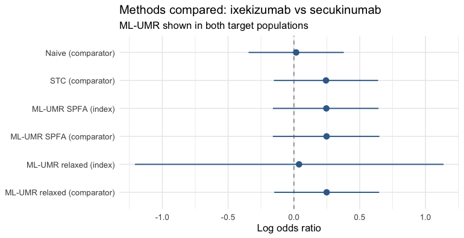
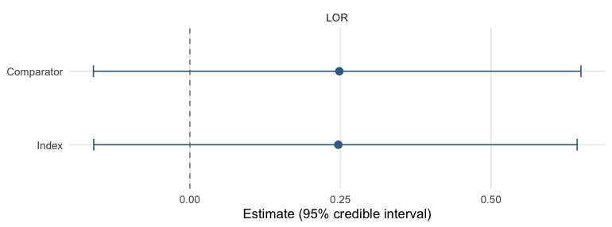

``` r
library(mlumr)
library(ggplot2)
options(mc.cores = parallel::detectCores())
```

Unanchored indirect comparisons rest on strong, partly untestable assumptions,
so running several methods and comparing them is itself a sensitivity analysis.
mlumr offers four estimators behind one data interface; this vignette explains
what each assumes, how to compare them, and which to report. For the mechanics of
fitting see `vignette("fitting-and-diagnostics")`; for family-specific worked
examples see the per-outcome vignettes. We illustrate with the real
plaque-psoriasis binary endpoint (PASI 75; UNCOVER-2 ixekizumab vs FIXTURE
secukinumab) [@Griffiths2015; @Langley2014].

| Method | Adjustment | Framework | Key assumption | Target population |
|--------|-----------|-----------|----------------|-------------------|
| Naive | none | frequentist | populations exchangeable | none (unstandardized contrast) |
| STC | one-arm outcome regression (G-computation) | frequentist | correct, applicable IPD outcome model | comparator |
| ML-UMR SPFA | joint Bayesian model | Bayesian | shared prognostic effects (SPFA) | index *and* comparator |
| ML-UMR relaxed | joint Bayesian model | Bayesian | correct + identified treatment-specific effects | index *and* comparator |

The naive estimate is an unadjusted contrast of two samples rather than an
effect standardized to any population. `stc()` standardizes the index-treatment
outcome to the comparator population and contrasts it with the observed
comparator outcome there. It does not standardize either treatment to the index
population. Treating that comparator-population effect as the index or decision
target requires a separate effect-equality assumption [@TSD18;
@ChandlerIshakTransport]. ML-UMR explicitly standardizes both treatment models
to each reported target. Its validity still depends on the fitted outcome model,
overlap, and the stated cross-treatment assumptions.

## A shared dataset

All four estimators run from the same `mlumr_data` object, so we build it once,
the plaque-psoriasis PASI 75 endpoint (UNCOVER-2 ixekizumab vs FIXTURE
secukinumab) with three prognostic covariates:


``` r
library(mlumr)
data("psoriasis_ipd")   # bundled with mlumr (from multinma, GPL-3)
data("psoriasis_agd")

covs <- c("age", "bsa", "weight")
ipd <- psoriasis_ipd
ipd$bsa <- ipd$bsa / 100; ipd$weight <- ipd$weight / 10
ipd <- ipd[ipd$study == "UNCOVER-2" & ipd$treatment == "IXE_Q4W", ]
ipd <- ipd[stats::complete.cases(ipd[, c("pasi75", covs)]), ]

agd <- psoriasis_agd
agd$bsa_mean <- agd$bsa_mean / 100; agd$bsa_sd <- agd$bsa_sd / 100
agd$weight_mean <- agd$weight_mean / 10; agd$weight_sd <- agd$weight_sd / 10
agd <- agd[agd$study == "FIXTURE" & agd$treatment == "SEC_300", ]

dat <- combine_data(
  set_ipd(ipd, treatment = "treatment", outcome = "pasi75", covariates = covs),
  set_agd(agd, treatment = "treatment", outcome_n = "pasi75_n", outcome_r = "pasi75_r",
          cov_means = c("age_mean", "bsa_mean", "weight_mean"),
          cov_sds   = c("age_sd", "bsa_sd", "weight_sd"),
          cov_types = c("continuous", "continuous", "continuous")))
dat <- add_integration(dat, n_int = 64,
  age    = distr(qnorm,  mean = age_mean, sd = age_sd),
  bsa    = distr(qnorm,  mean = bsa_mean, sd = bsa_sd),
  weight = distr(qgamma, shape = weight_mean^2 / weight_sd^2,
                 rate = weight_mean / weight_sd^2))
```

## Naive and STC

The **naive** estimate compares crude outcomes with no covariate adjustment. It
serves as a benchmark, and it is biased when the two studies differ on
prognostic covariates or on other determinants of the outcome; a difference in
the distribution of a variable unrelated to the outcome does not by itself
induce bias. **STC** fits an
outcome regression on the IPD and predicts outcomes under the index treatment
in the comparator population by G-computation. The response-scale averaging
follows Ren et al.'s one-arm unanchored STC and the marginalization order used
by Remiro-Azocar et al. [@Ren2024; @RemiroAzocar2022]. The non-survival
delta-method SE is conditional on the supplied
integration grid and reported covariate summaries; it does not reproduce Ren et
al.'s bootstrap of both the IPD fit and reconstructed target distribution.


``` r
res_naive <- naive(dat)
res_stc   <- stc(dat)
res_naive
#> Naive Unadjusted Indirect Comparison
#> =====================================
#> 
#> Treatments: IXE_Q4W vs SEC_300 
#> 
#> Event rates:
#>   Index (IPD):      0.774 (267/345)
#>   Comparator (AgD): 0.771 (249/323)
#> 
#> Log Odds Ratio: 0.0172 (SE: 0.1846)
#> 95% CI: [-0.3448, 0.3791]
#> 
#> All effect measures (95% CI):
#>   Log odds ratio                 0.0172 (SE 0.1846) [-0.3448, 0.3791]
#>   Odds ratio                     1.0173 [0.7084, 1.4609]
#>   Risk difference                0.0030 (SE 0.0325) [-0.0606, 0.0666]
#>   Risk ratio                     1.0039 [0.9245, 1.0901]
res_stc
#> Simulated Treatment Comparison (G-computation)
#> ===============================================
#> 
#> Treatments: IXE_Q4W vs SEC_300 
#> 
#> Marginalized P(Y=1|index trt, comp pop): 0.8111
#> Observed P(Y=1|comp trt, comp pop):      0.7709
#> 
#> Log Odds Ratio: 0.2438 (SE: 0.2023)
#> 95% CI: [-0.1527, 0.6403]
#> 
#> All effect measures (95% CI):
#>   Log odds ratio                 0.2438 (SE 0.2023) [-0.1527, 0.6403]
#>   Odds ratio                     1.2761 [0.8584, 1.8970]
#>   Risk difference                0.0402 (SE 0.0331) [-0.0247, 0.1051]
#>   Risk ratio                     1.0522 [0.9692, 1.1422]
#> 
#> Outcome model coefficients:
#> (Intercept)         age         bsa      weight 
#>      4.4675     -0.0400      0.0848     -0.1430
```

## ML-UMR (SPFA and relaxed)

The two Bayesian models share the same data interface and differ only in whether
the prognostic coefficients are shared across treatments (SPFA) or allowed to be
treatment-specific (relaxed, permitting effect modification):


``` r
fit_spfa <- mlumr(dat, model = "spfa",
                  prior_beta = prior_normal(0, 2.5, autoscale = TRUE),
                  chains = 4, iter = 2000, warmup = 1000, seed = 2026, refresh = 0)
#> Running MCMC with 4 parallel chains...
#> 
#> Chain 1 finished in 0.4 seconds.
#> Chain 2 finished in 0.4 seconds.
#> Chain 3 finished in 0.4 seconds.
#> Chain 4 finished in 0.4 seconds.
#> 
#> All 4 chains finished successfully.
#> Mean chain execution time: 0.4 seconds.
#> Total execution time: 0.5 seconds.
fit_relaxed <- mlumr(dat, model = "relaxed",
                     prior_beta = prior_normal(0, 2.5, autoscale = TRUE),
                     chains = 4, iter = 2000, warmup = 1000, seed = 2026, refresh = 0)
#> Running MCMC with 4 parallel chains...
#> 
#> Chain 3 finished in 2.0 seconds.
#> Chain 2 finished in 2.0 seconds.
#> Chain 1 finished in 2.3 seconds.
#> Chain 4 finished in 2.4 seconds.
#> 
#> All 4 chains finished successfully.
#> Mean chain execution time: 2.2 seconds.
#> Total execution time: 2.6 seconds.
```

## A comparison table

All four methods, on the **log odds ratio**. ML-UMR is reported in **both**
target populations. STC has a comparator-population estimand by construction;
naive has no single standardized target and is labeled accordingly. Neither has
an index-population row to show. The **index**
population is normally the decision-relevant one for HTA, because
cost-effectiveness models are built for the population a reimbursement decision
is about, which is usually the index trial's [@ChandlerIshakTransport]; the
comparator rows are the like-for-like comparison against naive and STC.


``` r
me_spfa <- marginal_effects(fit_spfa, effect = "lor", population = "both")
me_rel  <- marginal_effects(fit_relaxed, effect = "lor", population = "both")
# One row per (model, population); `pop()` pulls the requested one.
pop <- function(d, which) d[d$population == which, ]
comparison <- data.frame(
  Method = c("Naive", "STC", "ML-UMR SPFA", "ML-UMR SPFA",
             "ML-UMR relaxed", "ML-UMR relaxed"),
  Population = c("unstandardized", "comparator", "index", "comparator",
                 "index", "comparator"),
  LOR      = c(res_naive$link_effect, res_stc$link_effect,
               pop(me_spfa, "Index")$mean, pop(me_spfa, "Comparator")$mean,
               pop(me_rel, "Index")$mean, pop(me_rel, "Comparator")$mean),
  CI_lower = c(res_naive$ci_lower, res_stc$ci_lower,
               pop(me_spfa, "Index")$q2.5, pop(me_spfa, "Comparator")$q2.5,
               pop(me_rel, "Index")$q2.5, pop(me_rel, "Comparator")$q2.5),
  CI_upper = c(res_naive$ci_upper, res_stc$ci_upper,
               pop(me_spfa, "Index")$q97.5, pop(me_spfa, "Comparator")$q97.5,
               pop(me_rel, "Index")$q97.5, pop(me_rel, "Comparator")$q97.5)
)
knitr::kable(comparison, caption = "PASI 75 log odds ratio by method, in both target populations")
```


Table: PASI 75 log odds ratio by method, in both target populations

|Method         |Population |       LOR|   CI_lower|  CI_upper|
|:--------------|:----------|---------:|----------:|---------:|
|Naive          |comparator | 0.0171520| -0.3447542| 0.3790582|
|STC            |comparator | 0.2438031| -0.1526731| 0.6402793|
|ML-UMR SPFA    |index      | 0.2464405| -0.1596581| 0.6430433|
|ML-UMR SPFA    |comparator | 0.2482089| -0.1601546| 0.6494108|
|ML-UMR relaxed |index      | 0.0390127| -1.2088992| 1.1371928|
|ML-UMR relaxed |comparator | 0.2489060| -0.1495779| 0.6477850|


``` r
forest_df <- with(comparison,
  data.frame(label = paste0(Method, " (", Population, ")"),
             est = LOR, lo = CI_lower, hi = CI_upper))
mlumr_forest(forest_df, ref_line = 0,
             x = "Log odds ratio",
             title = "Methods compared: ixekizumab vs secukinumab",
             subtitle = "ML-UMR shown in both target populations")
```

<div class="figure" style="text-align: center">

<p class="caption">plot of chunk forest</p>
</div>

The same ML-UMR posteriors straight from `marginal_effects()`, whose `plot()`
method shows both populations by default:


``` r
plot(marginal_effects(fit_spfa, effect = "lor"))
```

<div class="figure" style="text-align: center">

<p class="caption">plot of chunk posterior-both</p>
</div>

## Interpreting the differences

- **Naive vs STC**, the gap reflects the combined effects of standardization,
  outcome-model specification, and the different target definitions. Agreement
  does not establish exchangeability, and disagreement is not attributable to
  one covariate without further analysis.
- **STC vs ML-UMR SPFA**, both use the named covariates, but they fit different
  likelihoods and make different cross-treatment assumptions. Similarity is a
  useful benchmark, not an expected mathematical identity. ML-UMR reports
  explicitly standardized effects in both populations.
- **SPFA vs relaxed**, the relaxed model frees prognostic effects to differ by
  treatment (`delta_beta`); a markedly different effect *may* signal effect
  modification, but the comparator coefficients are weakly identified with sparse
  AgD, so check `delta_beta` and `prior_sensitivity()`.
- **Index vs comparator within the relaxed model**, note how much wider the
  index-population interval is than the comparator one in the table above. The
  comparator coefficients are informed by a single aggregate row, and the
  index-population estimand extrapolates them over the IPD covariate
  distribution, so the width is the identification problem showing itself. Under
  SPFA the two populations agree closely instead, because the coefficients are
  shared and anchored by the IPD.

## Model comparison

Information criteria compare approximate predictive fit; they do not validate
SPFA, effect modification, or transportability. We compare SPFA against the
relaxed model by leave-one-out cross-validation and DIC:


``` r
compare_models(SPFA = fit_spfa, Relaxed = fit_relaxed, criterion = "loo")
#> 
#> Model Comparison (LOO)
#> ======================
#> 
#>    model elpd_diff se_diff p_worse       diag_diff      diag_elpd
#>  Relaxed       0.0     0.0      NA                 1 k_psis > 0.7
#>     SPFA      -0.5     0.4    0.88 |elpd_diff| < 4 1 k_psis > 0.7
#> 
#> elpd_diff is the difference in expected log pointwise predictive
#> density vs the best model. se_diff > 2 is the conventional threshold
#> for a meaningful difference (|elpd_diff| > 4 * se_diff is stronger).
compare_models(SPFA = fit_spfa, Relaxed = fit_relaxed)   # DIC-based (the default)
#> 
#> Model Comparison (DIC)
#> ======================
#> 
#>    Model    DIC   pD Delta_DIC
#>  Relaxed 366.23 4.88      0.00
#>     SPFA 366.57 5.15      0.35
#> 
#> Lower DIC = better fit. Delta_DIC > 5 is a rough heuristic for
#> meaningful difference, not a formally calibrated threshold.
#> DIC should not be the sole basis for model selection.
```

LOO/WAIC are preferred over DIC where available; treat a better-fitting relaxed
model as *suggestive* of effect modification, not proof, corroborate with
`delta_beta`, prior sensitivity, and clinical plausibility. Treat these as
*approximate* fit diagnostics rather than exact predictive scores: each
aggregate-data row enters the pointwise log-likelihood as a single independent
observation, so LOO/WAIC do not reflect the grouped (study-level) structure of
the comparator evidence and can be optimistic when the AgD is clustered.

## Decision guide

1. **Is there a common comparator arm?** If the two trials share an arm, run an
   *anchored* analysis instead: a network meta-analysis, or ML-NMR via
   `multinma` when the populations differ. Randomization is doing work there
   that nothing below replaces. Reserve ML-UMR for evidence that is genuinely
   unanchored. `vignette("binary-outcomes")` and `vignette("survival-outcomes")`
   each end by restoring the common arm their example discards and checking the
   unanchored answer against two anchored ones, a Bucher indirect comparison and
   an ML-NMR fitted with `multinma`, each in both a prognostic-only and a
   treatment-interaction form.
2. **Are the two populations exchangeable on prognostic factors?** Similar
   reported marginal means are weak evidence for this: higher moments, the
   dependence between covariates, and unreported prognostic variables all
   matter, and none is visible in a baseline table. Treat the naive estimate as
   a benchmark rather than a candidate primary analysis unless exchangeability
   is defensible on substantive grounds.
3. **Is the SPFA plausible?** If it is the prespecified scientific assumption,
   ML-UMR SPFA can be the primary analysis and the relaxed model can probe that
   assumption. If uncertain, fit both. Before reading anything
   into a disagreement, check that the relaxed model is identified, with
   `check_identification()` on the data (binomial, normal, and poisson; it
   refuses survival, where a reconstructed curve is not a scalar subgroup
   summary) and `prior_sensitivity()` on the fit.
   Where the aggregate evidence is weak, a divergence between the two is
   evidence about identification, not about effect modification, and the relaxed
   index-population estimate belongs in a sensitivity analysis.
4. **Presentation.** Choose the estimator that is scientifically defensible
   first, then adapt how it is presented. Where a frequentist summary is
   expected, STC can be reported alongside ML-UMR rather than in place of it.

Always report the naive estimate as a benchmark, and report ML-UMR diagnostics
(divergences, Rhat, ESS) alongside the estimates.

## References
