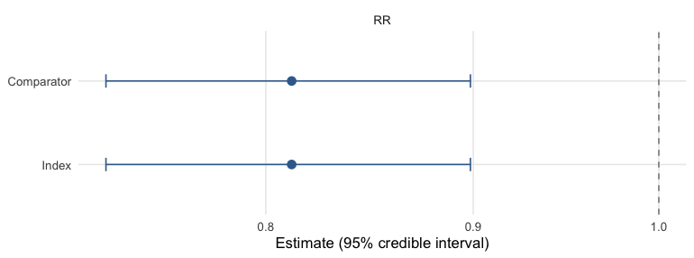
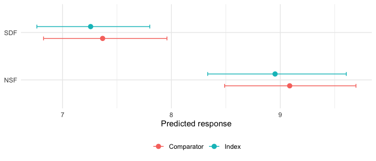

``` r
library(mlumr)
library(ggplot2)
options(mc.cores = parallel::detectCores())
```

This vignette is a complete worked example of an **unanchored** indirect
comparison for a **continuous** endpoint, using mlumr's bundled `shoulder_ipd`
and `shoulder_agd` example data. It is the continuous-outcome analogue of
`vignette("binary-outcomes")`; for the shared data-preparation machinery see
`vignette("data-preparation")`, for sampler/prior/diagnostic detail see
`vignette("fitting-and-diagnostics")`, and for how to choose between methods see
`vignette("choosing-a-method")`.

> **Simulated data.** `shoulder_ipd` / `shoulder_agd` are *simulated* (not real
> patient records): they are generated with the `synthpop` package (sequential
> CART) [@Nowok2016] from the FIMPACT 10-year shoulder trial [@Fimpact2025]
> (dataset CC BY 4.0), preserving its covariate and covariate-outcome
> relationships (fidelity validated with the `syntheticdata` package), much as
> `multinma` builds its own example data. The two trial arms are treated as
> separate single-arm sources to illustrate an unanchored comparison; in a real
> ML-UMR application the comparator would come from a different study.

## The clinical question

We want the relative efficacy of two treatments for subacromial shoulder pain on
**pain on activity** (a visual analogue scale, VAS 0-100, lower = better) at 24
months, when:

* **Index (IPD).** We hold individual patient data for **arthroscopic subacromial
  decompression** (`ASD`).
* **Comparator (AgD).** Only published aggregate data are available for
  **exercise therapy** (`ET`): an arm mean, its standard error, and a
  baseline-characteristics table.

The two arms come from single-arm sources with no common comparator, so the
comparison is **unanchored** and relies on the conditional-constancy /
shared-prognostic-factor assumptions discussed in `vignette("introduction")`.
ML-UMR adjusts for cross-trial differences in prognostic factors by standardizing
the IPD model to the comparator population (and vice versa).

## The ML-UMR model

On the index IPD, ML-UMR fits a linear (identity-link) model for the mean
outcome,
$$\mathbb{E}[y_{ik}\mid x_i]=\mu_k+x_i^\top\beta_k,\qquad y_{ik}\sim\mathrm{N}(\mu_k+x_i^\top\beta_k,\ \sigma^2),$$
where $\mu_k$ is a treatment-specific intercept and $\beta_k$ the vector of
prognostic-factor coefficients. The aggregate comparator does not contribute
patient rows; instead its likelihood is the individual model **integrated over
the comparator covariate distribution** $f_{\text{AgD}}(x)$ implied by the
published moments,
$$\bar\theta_k=\mathbb{E}[Y\mid \text{AgD population}]=\int(\mu_k+x^\top\beta_k)\,f_{\text{AgD}}(x)\,dx,$$
which mlumr approximates with quasi-Monte Carlo integration points (see *Setting
up the ML-UMR data*). This is the same population-adjustment device as ML-NMR
[@Phillippo2020], specialized to the unanchored two-study case.

Two variants differ only in how the prognostic effects are shared across
treatments:

* **SPFA** (shared prognostic factors) assumes $\beta_{\text{index}}=\beta_{\text{comparator}}=\beta$, the conditional-constancy / shared-effect-modifier assumption.
* **Relaxed** frees them, $\beta_{\text{index}}\neq\beta_{\text{comparator}}$, allowing effect modification at the cost of identifiability (the comparator coefficients are informed only by the single AgD likelihood term).

Because the identity link is linear, the mean difference is **collapsible**:
the integral above passes through the linear predictor unchanged, so under SPFA
the index- and comparator-population effects *coincide* and differ only under
genuine effect modification (the relaxed model). This is the simplest family in
mlumr precisely because no aggregation bias arises from a nonlinear link
(contrast the log odds ratio in `vignette("binary-outcomes")`).


``` r
library(mlumr)
library(ggplot2)

data("shoulder_ipd")     # index IPD (ASD), bundled with mlumr
data("shoulder_agd")     # comparator AgD (ET)

covariates <- c("age", "baseline_vas")   # baseline pain is the key prognostic
```

A glimpse of the index IPD (one row per patient) and the single aggregate
comparator row:


``` r
knitr::kable(head(shoulder_ipd), caption = "Index IPD (ASD), first rows")
```


Table: Index IPD (ASD), first rows

|study   |treatment | subject|  age| sex| baseline_vas| pain_vas_activity|
|:-------|:---------|-------:|----:|---:|------------:|-----------------:|
|FIMPACT |ASD       |       1| 47.5|   0|           76|                10|
|FIMPACT |ASD       |       2| 57.0|   0|           38|                 0|
|FIMPACT |ASD       |       3| 57.0|   0|           85|                 0|
|FIMPACT |ASD       |       4| 44.0|   1|           52|                 0|
|FIMPACT |ASD       |       5| 50.5|   0|           87|                 8|
|FIMPACT |ASD       |       6| 44.0|   0|           86|                69|


``` r
knitr::kable(shoulder_agd[, c("treatment", "n", "y_mean", "y_se",
                              "age_mean", "baseline_vas_mean")],
   caption = "Comparator AgD (ET)")
```


Table: Comparator AgD (ET)

|treatment |   n|   y_mean|     y_se| age_mean| baseline_vas_mean|
|:---------|---:|--------:|--------:|--------:|-----------------:|
|ET        | 153| 25.24837| 2.386471| 50.02288|          74.59477|


## Covariate balance

Population adjustment is motivated by the fact that the two trial populations differ
on prognostic factors. Comparing the index sample means against the published
comparator means shows the imbalance we must adjust for, here baseline pain is
the key prognostic factor and the outcome we are comparing:


``` r
balance <- data.frame(
  Covariate = c("Pain VAS on activity (24m)", "Age (years)", "Baseline pain VAS"),
  Index_ASD = c(mean(shoulder_ipd$pain_vas_activity), mean(shoulder_ipd$age),
                mean(shoulder_ipd$baseline_vas)),
  Comparator_ET = c(shoulder_agd$y_mean, shoulder_agd$age_mean,
                    shoulder_agd$baseline_vas_mean)
)
knitr::kable(balance, caption = "Prognostic-factor balance: index vs comparator population")
```


Table: Prognostic-factor balance: index vs comparator population

|Covariate                  | Index_ASD| Comparator_ET|
|:--------------------------|---------:|-------------:|
|Pain VAS on activity (24m) |  16.65306|      25.24837|
|Age (years)                |  49.62925|      50.02288|
|Baseline pain VAS          |  66.93878|      74.59477|


## Setting up the ML-UMR data

For a continuous IPD outcome use `set_ipd()` with `family = "normal"` and the
outcome column; `set_agd()` takes the comparator arm mean (`outcome_mean`), its
standard error (`outcome_se`), the sample size, and the covariate summaries.
Covariate column suffixes (`_mean`, `_sd`) are stripped to match the IPD names.


``` r
ipd <- set_ipd(shoulder_ipd, treatment = "treatment", outcome = "pain_vas_activity",
               family = "normal", covariates = covariates)
agd <- set_agd(shoulder_agd, treatment = "treatment", family = "normal",
               outcome_n = "n", outcome_mean = "y_mean", outcome_se = "y_se",
               cov_means = c("age_mean", "baseline_vas_mean"),
               cov_sds   = c("age_sd", "baseline_vas_sd"),
               cov_types = c("continuous", "continuous"))
dat <- combine_data(ipd, agd)
dat
#> Unanchored Comparison Data (Continuous)
#> ====================================
#> 
#> Index treatment (IPD): ASD 
#>   N = 147 
#>   Mean outcome = 16.653 (SD = 22.971)
#> 
#> Comparator treatment (AgD): ET 
#>   N = 153 
#>   Mean outcome = 25.248, SE = 2.386
#> 
#> Covariates ( 2 ): age, baseline_vas 
#> Integration points: not yet added (use add_integration())
```

The comparator covariate distribution is represented by quasi-Monte Carlo
integration points drawn from each covariate's marginal (here normals for age and
baseline VAS), correlated via a Gaussian copula calibrated from the IPD. We use a
modest `n_int = 64` here so the vignette builds quickly; a real analysis would use
several hundred or more (see `vignette("data-preparation")`).


``` r
dat <- add_integration(dat, n_int = 64,
                       age          = distr(qnorm, mean = age_mean, sd = age_sd),
                       baseline_vas = distr(qnorm, mean = baseline_vas_mean,
                                            sd = baseline_vas_sd))
```

`check_integration()` confirms the quasi-Monte Carlo points reproduce the
requested covariate moments, run it whenever covariates are correlated or
`n_int` is small:


``` r
check_integration(
  dat,
  age          = distr(qnorm, mean = age_mean, sd = age_sd),
  baseline_vas = distr(qnorm, mean = baseline_vas_mean, sd = baseline_vas_sd)
)
#> Integration check: n_int = 64 vs 128
#> Resolution heuristic, max relative difference: 0.0311
#> Caution: 1-5% marginal relative difference. Consider increasing n_int.
#> Declared-target fidelity, max relative difference: 0.0611
#> Warning: grid moments differ from declared AgD moments by >5%.
#> Joint: max |cor(current) - cor(doubled)|: 0.0161
#> Joint resolution stable within the package's 0.05 heuristic.
#> Target (spearman): max |cor(doubled) - cor_target|: 0.0005
```

## Frequentist benchmarks

The unadjusted (naive) comparison ignores the covariate imbalance; STC adjusts
for it by parametric G-computation. Both are fast and serve as reference points.
For the identity link STC and the naive mean difference share the outcome scale.
Their gap reflects standardization plus outcome-model assumptions; it is not by
itself an estimate of bias removed by adjustment.


``` r
res_naive <- naive(dat)
res_stc   <- stc(dat)
res_naive
#> Naive Unadjusted Indirect Comparison
#> =====================================
#> 
#> Treatments: ASD vs ET 
#> 
#> Population basis: index-study outcome versus comparator-population outcome; no common standardized target.
#> 
#> Mean outcomes:
#>   Index (IPD):      16.6531
#>   Comparator (AgD): 25.2484
#> 
#> Mean Difference: -8.5953 (SE: 3.0471)
#> 95% CI: [-14.5675, -2.6231]
#> 
#> All effect measures (95% CI):
#>   Mean difference               -8.5953 (SE 3.0471) [-14.5675, -2.6231]
res_stc
#> Simulated Treatment Comparison (G-computation)
#> ===============================================
#> 
#> Treatments: ASD vs ET 
#> 
#> Estimand population: comparator
#> Treating this as the index-population effect requires a separate effect-equality assumption; this calculation does not transport to the index population.
#> 
#> Marginalized E[Y|index trt, comp pop]: 17.5278
#> Observed E[Y|comp trt, comp pop]:      25.2484
#> 
#> Mean Difference: -7.7206 (SE: 3.0863)
#> 95% CI: [-13.7696, -1.6715]
#> 
#> All effect measures (95% CI):
#>   Mean difference               -7.7206 (SE 3.0863) [-13.7696, -1.6715]
#> 
#> Outcome model coefficients:
#>  (Intercept)          age baseline_vas 
#>      28.6735      -0.4126       0.1263
```

## Fitting the ML-UMR models

For the normal family the canonical link is `identity`, so coefficients are on
the outcome scale. We fit both the shared-prognostic-factor model (**SPFA**) and
the **relaxed** model (treatment-specific prognostic effects). A weakly
informative, **autoscaled** coefficient prior keeps the prior comparable across
covariates of different magnitudes (age in years vs VAS in points); the relaxed
model uses a slightly tighter prior and a higher `adapt_delta` because its
comparator-specific coefficients lean on one aggregate row.


``` r
fit_spfa <- mlumr(dat, model = "spfa", link = "identity",
                  prior_beta = prior_normal(0, 1, autoscale = TRUE),
                  chains = 4, iter = 2000, warmup = 1000, seed = 2026, refresh = 0)
#> Running MCMC with 4 parallel chains...
#> Chain 1 finished in 0.2 seconds.
#> Chain 2 finished in 0.2 seconds.
#> Chain 3 finished in 0.2 seconds.
#> Chain 4 finished in 0.2 seconds.
#> 
#> All 4 chains finished successfully.
#> Mean chain execution time: 0.2 seconds.
#> Total execution time: 0.4 seconds.
fit_relaxed <- mlumr(dat, model = "relaxed", link = "identity",
                     prior_beta = prior_normal(0, 0.75, autoscale = TRUE),
                     chains = 4, iter = 2000, warmup = 1000,
                     adapt_delta = 0.95, seed = 2026, refresh = 0)
#> Running MCMC with 4 parallel chains...
#> Chain 1 finished in 0.2 seconds.
#> Chain 2 finished in 0.2 seconds.
#> Chain 3 finished in 0.2 seconds.
#> Chain 4 finished in 0.3 seconds.
#> 
#> All 4 chains finished successfully.
#> Mean chain execution time: 0.2 seconds.
#> Total execution time: 0.5 seconds.
summary(fit_spfa)
#> ML-UMR Model Summary
#> ====================
#> 
#> Model: SPFA 
#> Family: Continuous (Normal) 
#> Link: identity 
#> Engine: cmdstanr 
#> Treatments: ASD (IPD) vs ET (AgD)
#> 
#> MCMC Diagnostics:
#>   Divergent transitions: 0 
#>   Max treedepth hits: 0 
#>   Max Rhat: 1.003 
#>   Min ESS: 1784 
#> 
#> Intercepts (identity scale):
#>       variable     mean       sd     2.5%    97.5%      Rhat
#>       mu_index 16.39765 1.554853 13.39949 19.46955 0.9996826
#>  mu_comparator 23.73745 2.326425 19.14315 28.25807 1.0015131
#> 
#> Residual SD:
#>  variable     mean        sd     2.5%    97.5%    Rhat
#>     sigma 19.31608 0.8400657 17.77657 21.01361 1.00044
#> 
#> Regression Coefficients:
#>            variable        mean         sd        2.5%      97.5%     Rhat
#>           beta[age] -0.10683877 0.12288363 -0.34473485 0.13307642 1.003099
#>  beta[baseline_vas]  0.03353613 0.03278562 -0.03157499 0.09890869 1.000255
#> 
#> Marginal Treatment Effects:
#>   Mean Differences:
#>          variable      mean       sd      2.5%     97.5%
#>       delta_index -7.339791 2.812236 -12.87713 -1.918224
#>  delta_comparator -7.339791 2.812236 -12.87713 -1.918224
```

### Priors

These fits use $\mu_k\sim\mathrm{N}(0,10^2)$ for the intercepts, autoscaled
$\beta\sim\mathrm{N}(0,1^2)$ for the coefficients, and a half-normal prior on
the residual standard deviation $\sigma$ (a `normal()` prior truncated at zero
by the `<lower=0>` constraint). These are starting choices whose suitability
depends on the outcome and covariate scales. `prior_summary()` shows exactly
what was passed to Stan, including the autoscaled coefficient scales:


``` r
prior_summary(fit_spfa)
#> Priors for ML-UMR Fit
#> =====================
#> 
#> Intercepts (mu_index, mu_comparator):
#>   normal(0, 10)
#>   (package default, mlumr 0.1.0.9000)
#> 
#> Regression coefficients (beta):
#>   Family: normal
#>   coefficient mean scale autoscaled   sd_x
#>           age    0 0.143       TRUE  7.012
#>  baseline_vas    0 0.039       TRUE 25.524
#>   (scale = user_scale / sd_x for autoscaled rows)
#> 
#> Residual SD (sigma, half-distribution via <lower=0>):
#>   normal(0, 2.5)
#>   (package default, mlumr 0.1.0.9000)
```

The data are substantially more informative than the priors, the posterior intercepts are
much tighter than the $\mathrm{N}(0,10)$ prior:


``` r
plot_prior_posterior(fit_spfa, pars = c("mu_index", "mu_comparator"))
```

<div class="figure" style="text-align: center">

<p class="caption">plot of chunk prior-post</p>
</div>

### Aggregate-data scale conventions

For the **normal** family `outcome_mean` and `outcome_se` must be on the
**original (arithmetic) scale**, the same scale as the IPD outcome. If a
published comparator reports a *geometric* mean, a mean on the log scale, or a
change-from-baseline on a transformed scale, back-transform it (propagating the
standard error by the delta method) before calling `set_agd()`. Passing a
log-scale summary while fitting on the identity link silently biases the
comparator likelihood. The residual likelihood here is Gaussian, so an influential
observation in the IPD can pull the fit. A heavier-tailed prior on the
coefficients does not address this: the prior governs the coefficients, not the
residual distribution, and a heavier tail permits larger coefficients rather
than suppressing them. mlumr's normal family provides no heavy-tailed residual
distribution, so identify influential observations directly, report their
effect on the estimate, and use `prior_sensitivity()` only for what it measures,
namely sensitivity to the coefficient prior.

### Convergence

`mlumr()` warns automatically about divergences, treedepth saturation, high
$\hat R$, and low effective sample size. They are clean here:


``` r
data.frame(
  n_divergent  = fit_spfa$diagnostics$n_divergent,
  max_treedepth = fit_spfa$diagnostics$n_max_treedepth,
  max_Rhat     = round(max(fit_spfa$summary$Rhat, na.rm = TRUE), 3),
  min_ESS      = round(min(fit_spfa$summary$n_eff, na.rm = TRUE))
)
#>   n_divergent max_treedepth max_Rhat min_ESS
#> 1           0             0    1.003    1784
```

## Treatment effects

For a continuous outcome the population-standardized effect is the **mean
difference** (MD), reported in both populations. Because the MD is collapsible
and SPFA shares one $\beta$ across treatments, the standardized contrast reduces
to $\mu_{\text{index}}-\mu_{\text{comparator}}$, which contains no covariates at
all. The index- and comparator-population values are therefore **identical**,
draw for draw, not merely close:


``` r
knitr::kable(marginal_effects(fit_spfa), caption = "SPFA standardized mean difference (ASD vs ET)")
```


Table: SPFA standardized mean difference (ASD vs ET)

|variable         |effect |population |      mean|       sd|      q2.5|       q50|     q97.5|
|:----------------|:------|:----------|---------:|--------:|---------:|---------:|---------:|
|delta_index      |MD     |Index      | -7.339791| 2.812236| -12.87713| -7.315141| -1.918224|
|delta_comparator |MD     |Comparator | -7.339791| 2.812236| -12.87713| -7.315141| -1.918224|


A forest plot makes the value of adjustment visible, on the **mean
difference**. ML-UMR is shown in **both** target populations. The **index**
population is normally the decision-relevant one for HTA, since
cost-effectiveness models are built for the population a reimbursement decision
is about, which is usually the index trial's [@ChandlerIshakTransport]; the
STC is standardized to the comparator population. The naive contrast is not
standardized to either population.
The two SPFA rows coincide exactly, for the algebraic reason just given; the
**relaxed** rows do separate, because freeing $\beta$ by treatment puts the
covariate distribution back into the contrast. That gap is effect modification,
not aggregation bias.


``` r
md_spfa <- marginal_effects(fit_spfa, population = "both")
md_rel  <- marginal_effects(fit_relaxed, population = "both")
# One row per (model, population); `pop()` pulls the requested one.
pop <- function(d, which) d[d$population == which, ]
forest_df <- data.frame(
  label = c("Naive (unstandardized)", "STC (comparator)",
            "ML-UMR SPFA (index)", "ML-UMR SPFA (comparator)",
            "ML-UMR relaxed (index)", "ML-UMR relaxed (comparator)"),
  est = c(res_naive$estimate, res_stc$estimate,
          pop(md_spfa, "Index")$mean, pop(md_spfa, "Comparator")$mean,
          pop(md_rel, "Index")$mean, pop(md_rel, "Comparator")$mean),
  lo  = c(res_naive$ci_lower, res_stc$ci_lower,
          pop(md_spfa, "Index")$q2.5, pop(md_spfa, "Comparator")$q2.5,
          pop(md_rel, "Index")$q2.5, pop(md_rel, "Comparator")$q2.5),
  hi  = c(res_naive$ci_upper, res_stc$ci_upper,
          pop(md_spfa, "Index")$q97.5, pop(md_spfa, "Comparator")$q97.5,
          pop(md_rel, "Index")$q97.5, pop(md_rel, "Comparator")$q97.5)
)
mlumr_forest(forest_df, ref_line = 0,
             x = "Mean difference in pain VAS on activity",
             title = "Shoulder pain on activity: ASD vs ET",
             subtitle = "Unadjusted vs population-adjusted, in both target populations")
```

<div class="figure" style="text-align: center">

<p class="caption">plot of chunk forest</p>
</div>

Both models' standardized mean differences in both populations, as a table:


``` r
knitr::kable(rbind(cbind(Model = "SPFA", md_spfa),
                   cbind(Model = "Relaxed", md_rel)),
   caption = "Standardized mean difference (ASD vs ET), both models and both populations")
```


Table: Standardized mean difference (ASD vs ET), both models and both populations

|Model   |variable         |effect |population |      mean|       sd|      q2.5|       q50|     q97.5|
|:-------|:----------------|:------|:----------|---------:|--------:|---------:|---------:|---------:|
|SPFA    |delta_index      |MD     |Index      | -7.339791| 2.812236| -12.87713| -7.315141| -1.918224|
|SPFA    |delta_comparator |MD     |Comparator | -7.339791| 2.812236| -12.87713| -7.315141| -1.918224|
|Relaxed |delta_index      |MD     |Index      | -7.628174| 2.809615| -12.92160| -7.636032| -1.984512|
|Relaxed |delta_comparator |MD     |Comparator | -7.495459| 2.808160| -12.93281| -7.525174| -1.878736|


The standardized mean difference in both populations, plotted straight from
`marginal_effects()` with its `plot()` method:


``` r
plot(marginal_effects(fit_spfa))
```

<div class="figure" style="text-align: center">

<p class="caption">plot of chunk posterior-areas</p>
</div>

## Absolute predictions

Absolute predicted mean outcomes for each treatment in each population, as a
table and as a plot (the two populations distinguished by color):


``` r
knitr::kable(predict(fit_spfa, population = "both", type = "response"),
   caption = "Standardized mean pain VAS by treatment")
```


Table: Standardized mean pain VAS by treatment

|treatment |population |     mean|       sd|     q2.5|      q50|    q97.5|
|:---------|:----------|--------:|--------:|--------:|--------:|--------:|
|ASD       |Index      | 16.28816| 1.549135| 13.25747| 16.29186| 19.30458|
|ET        |Index      | 23.62795| 2.337895| 19.02009| 23.61606| 28.15978|
|ASD       |Comparator | 16.52086| 1.569065| 13.48628| 16.52336| 19.58286|
|ET        |Comparator | 23.86065| 2.322947| 19.27713| 23.85931| 28.36018|


``` r
plot(predict(fit_spfa, population = "both", type = "response"))
```

<div class="figure" style="text-align: center">

<p class="caption">plot of chunk predict-plot</p>
</div>

## Conditional effects

Conditional effects evaluate the contrast at specific covariate profiles rather
than averaging over a population, useful for checking whether the effect is
plausibly constant across the prognostic range (the SPFA assumption) or varies
with baseline pain:


``` r
profiles <- data.frame(age = c(45, 55, 65), baseline_vas = c(50, 70, 90))
knitr::kable(conditional_effects(fit_spfa, newdata = profiles),
   caption = "Conditional mean differences at three covariate profiles")
```


Table: Conditional mean differences at three covariate profiles

| profile|effect |      mean|       sd|      q2.5|       q50|     q97.5|
|-------:|:------|---------:|--------:|---------:|---------:|---------:|
|       1|MD     | -7.339791| 2.812236| -12.87713| -7.315141| -1.918224|
|       2|MD     | -7.339791| 2.812236| -12.87713| -7.315141| -1.918224|
|       3|MD     | -7.339791| 2.812236| -12.87713| -7.315141| -1.918224|


## Model comparison

Compare SPFA against the relaxed model with leave-one-out cross-validation and
DIC. A markedly better relaxed fit would *suggest* effect modification, but the
comparator coefficients are weakly identified from a single AgD row, so treat it
as suggestive and check `prior_sensitivity()` (see
`vignette("fitting-and-diagnostics")`).


``` r
compare_models(SPFA = fit_spfa, Relaxed = fit_relaxed, criterion = "loo")
#> 
#> Model Comparison (LOO)
#> ======================
#> 
#>    model elpd_diff se_diff p_worse       diag_diff      diag_elpd
#>     SPFA       0.0     0.0      NA                 1 k_psis > 0.7
#>  Relaxed      -1.0     0.7    0.90 |elpd_diff| < 4 1 k_psis > 0.7
#> 
#> elpd_diff is the difference in expected log pointwise predictive
#> density vs the best model. se_diff > 2 is the conventional threshold
#> for a meaningful difference (|elpd_diff| > 4 * se_diff is stronger).
compare_models(SPFA = fit_spfa, Relaxed = fit_relaxed, criterion = "dic")
#> 
#> Model Comparison (DIC)
#> ======================
#> 
#>    Model     DIC    pD Delta_DIC
#>     SPFA 1367.72 16.28      0.00
#>  Relaxed 1369.13 16.88      1.41
#> 
#> Lower DIC = better fit. Delta_DIC > 5 is a rough heuristic for
#> meaningful difference, not a formally calibrated threshold.
#> DIC should not be the sole basis for model selection.
```

## Interpretation

* The **naive** mean difference mixes the treatment contrast with between-study
  differences, including the baseline-pain imbalance.
* In this example **STC** and **ML-UMR SPFA** both standardize over the named
  covariates and broadly agree. ML-UMR reports posterior uncertainty and effects
  in *both* populations, which matters when the decision population is not the
  comparator's.
* The **relaxed** model frees the shared-effect assumption but pays for it in
  precision here, because the comparator-specific coefficients lean on one
  aggregate row.
* Lower pain favors ASD here, but the explicit cost of the unanchored regime is
  wider intervals, since within-trial randomization is discarded. When the
  evidence network is connected (a shared comparator exists), prefer an anchored
  network meta-analysis; reserve ML-UMR for genuinely unanchored evidence.

> **Data provenance.** `shoulder_ipd` / `shoulder_agd` are simulated (mlumr's own
> work, GPL-3), generated with `synthpop` (sequential CART) [@Nowok2016] from the
> FIMPACT 10-year shoulder trial [@Fimpact2025] (dataset CC BY 4.0) while
> preserving its covariate-outcome relationships; they are not real patient data.
> See `data-raw/simulate_external_data.R`.

## References
