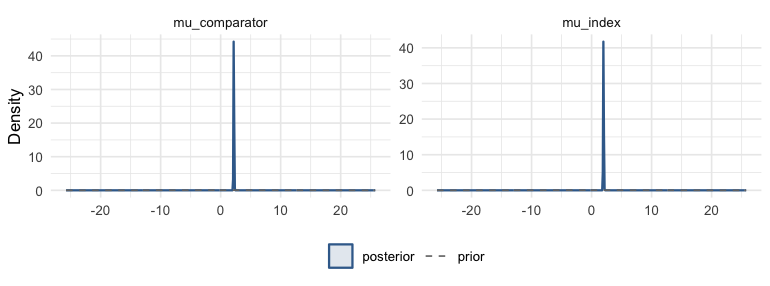
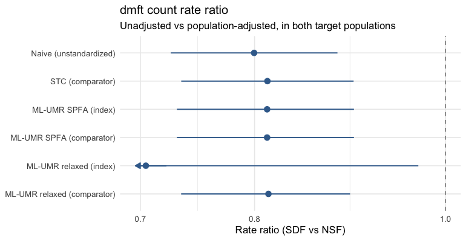
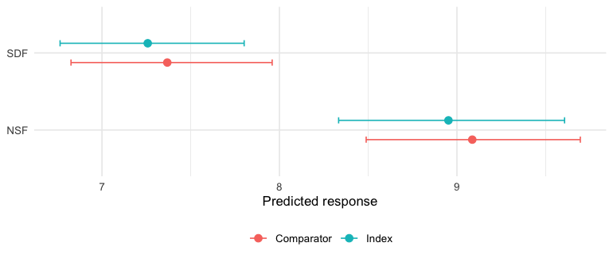

``` r
library(mlumr)
library(ggplot2)
options(mc.cores = parallel::detectCores())
```

This vignette is a complete worked example of an **unanchored** indirect
comparison for a **count** endpoint, using mlumr's bundled `caries_ipd` and
`caries_agd` example data. It is the count-outcome analogue of
`vignette("binary-outcomes")`; for the shared data-preparation machinery see
`vignette("data-preparation")`, for sampler/prior/diagnostic detail see
`vignette("fitting-and-diagnostics")`, and for how to choose between methods see
`vignette("choosing-a-method")`.

> **Simulated data.** `caries_ipd` / `caries_agd` are *simulated* (not real
> patient records): they are generated with the `synthpop` package (sequential
> CART) [@Nowok2016] from a silver-diamine-fluoride vs nano-silver-fluoride
> dental caries trial [@Ammar2025] (CC BY 4.0), preserving its covariate
> relationships (fidelity validated with the `syntheticdata` package), much as
> `multinma` builds its own example data. Because dmft was a balanced *baseline*
> characteristic in that trial, a plausible caries-arresting effect for SDF was
> imposed so the worked example has a meaningful treatment contrast. The two arms
> are treated as separate single-arm sources to illustrate an unanchored
> comparison.

## The clinical question

We want the relative efficacy of two topical agents on the **dmft count**
(decayed, missing and filled teeth) in young children, when:

* **Index (IPD).** We hold individual patient data for **silver diamine
  fluoride** (`SDF`), one count per child with a follow-up exposure.
* **Comparator (AgD).** Only published aggregate data are available for
  **nano-silver fluoride** (`NSF`): a total event count, total exposure, and a
  baseline-characteristics table.

The two arms come from single-arm sources with no common comparator, so the
comparison is **unanchored** and relies on the conditional-constancy /
shared-prognostic-factor assumptions discussed in `vignette("introduction")`.
ML-UMR adjusts for cross-trial differences in prognostic factors by standardizing
the IPD model to the comparator population (and vice versa).

## The ML-UMR model

On the index IPD, ML-UMR fits a Poisson regression for the count with a log link
and a log-exposure offset,
$$\log\mathbb{E}[y_{ik}\mid x_i]=\log T_i+\mu_k+x_i^\top\beta_k,$$
so $\mu_k$ and $\beta_k$ live on the **log-rate** scale (here there is one row
per child, so the exposure $T_i$ is constant). The aggregate comparator does not
contribute patient rows; instead its likelihood is the individual rate
**integrated over the comparator covariate distribution** $f_{\text{AgD}}(x)$
implied by the published moments,
$$\bar\lambda_k=\mathbb{E}[\lambda\mid \text{AgD population}]=\int\exp(\mu_k+x^\top\beta_k)\,f_{\text{AgD}}(x)\,dx,$$
which mlumr approximates with quasi-Monte Carlo integration points (see *Setting
up the ML-UMR data*). This is the same population-adjustment device as ML-NMR
[@Phillippo2020], specialized to the unanchored two-study case.

Two variants differ only in how the prognostic effects are shared across
treatments:

* **SPFA** (shared prognostic factors) assumes $\beta_{\text{index}}=\beta_{\text{comparator}}=\beta$, the conditional-constancy / shared-effect-modifier assumption.
* **Relaxed** frees them, $\beta_{\text{index}}\neq\beta_{\text{comparator}}$, allowing effect modification at the cost of identifiability (the comparator coefficients are informed only by the single AgD likelihood term).

The population-standardized contrast is the **rate ratio**
$\mathrm{RR}=\bar\lambda_{\text{index}}/\bar\lambda_{\text{comparator}}$
(null = 1), reported in both populations.


``` r
library(mlumr)
library(ggplot2)

data("caries_ipd")     # index IPD (SDF), bundled with mlumr
data("caries_agd")     # comparator AgD (NSF)

covariates <- c("age", "log_cfu")   # age carries the prognostic signal here

knitr::kable(data.frame(
  Arm = c("Index (SDF, IPD)", "Comparator (NSF, AgD)"),
  Children = c(nrow(caries_ipd), caries_agd$n),
  Total_dmft = c(sum(caries_ipd$dmft), caries_agd$r),
  Mean_dmft = c(mean(caries_ipd$dmft), caries_agd$r / caries_agd$E)
), caption = "dmft counts (index IPD vs comparator AgD)")
```


Table: dmft counts (index IPD vs comparator AgD)

|Arm                   | Children| Total_dmft| Mean_dmft|
|:---------------------|--------:|----------:|---------:|
|Index (SDF, IPD)      |      103|        748|  7.262136|
|Comparator (NSF, AgD) |       97|        881|  9.082474|


A glimpse of the index IPD (one row per child):


``` r
knitr::kable(head(caries_ipd), caption = "Index IPD (SDF), first rows")
```


Table: Index IPD (SDF), first rows

|study      |treatment | subject| age| gender| log_cfu| dmft| exposure|
|:----------|:---------|-------:|---:|------:|-------:|----:|--------:|
|Ammar 2025 |SDF       |       1| 3.9|      0|   10.82|    5|        1|
|Ammar 2025 |SDF       |       2| 4.5|      1|   11.51|   10|        1|
|Ammar 2025 |SDF       |       3| 4.0|      0|   11.51|   11|        1|
|Ammar 2025 |SDF       |       4| 5.5|      0|   10.82|   10|        1|
|Ammar 2025 |SDF       |       5| 4.0|      0|   11.16|    6|        1|
|Ammar 2025 |SDF       |       6| 4.0|      1|   11.51|    9|        1|


## Covariate balance

Population adjustment is motivated by the fact that the two trial populations differ
on prognostic factors. Comparing the index sample means against the published
comparator means shows the imbalance we must adjust for, here baseline bacterial
load (`log_cfu`) is the covariate the two arms are most imbalanced on:


``` r
balance <- data.frame(
  Covariate     = c("Age (years)", "Baseline bacterial load (log CFU)"),
  Index_SDF     = c(mean(caries_ipd$age), mean(caries_ipd$log_cfu)),
  Comparator_NSF = c(caries_agd$age_mean, caries_agd$log_cfu_mean)
)
knitr::kable(balance, caption = "Prognostic-factor balance: index vs comparator population")
```


Table: Prognostic-factor balance: index vs comparator population

|Covariate                         | Index_SDF| Comparator_NSF|
|:---------------------------------|---------:|--------------:|
|Age (years)                       |  4.793204|       4.660825|
|Baseline bacterial load (log CFU) |  9.904466|      11.031650|


## Setting up the ML-UMR data

For a Poisson IPD outcome use `set_ipd()` with `family = "poisson"`, the count,
and an `exposure` column; `set_agd()` takes the comparator total count
(`outcome_r`), total exposure (`outcome_E`), and the covariate summaries.
Covariate column suffixes (`_mean`, `_sd`) are stripped to match the IPD names.


``` r
ipd <- set_ipd(caries_ipd, treatment = "treatment", outcome = "dmft",
               family = "poisson", exposure = "exposure",
               covariates = covariates)
agd <- set_agd(caries_agd, treatment = "treatment", family = "poisson",
               outcome_r = "r", outcome_E = "E",
               cov_means = c("age_mean", "log_cfu_mean"),
               cov_sds   = c("age_sd", "log_cfu_sd"),
               cov_types = c("continuous", "continuous"))
dat <- combine_data(ipd, agd)
dat
#> Unanchored Comparison Data (Count)
#> ====================================
#> 
#> Index treatment (IPD): SDF 
#>   N = 103 
#>   Total events = 748, Total exposure = 103.0
#> 
#> Comparator treatment (AgD): NSF 
#>   Total events = 881, Total exposure = 97.0
#> 
#> Covariates ( 2 ): age, log_cfu 
#> Integration points: not yet added (use add_integration())
```

The comparator covariate distribution is represented by quasi-Monte Carlo
integration points drawn from each covariate's marginal (here normals for age and
log CFU), correlated via a Gaussian copula calibrated from the IPD. We use a
modest `n_int = 64` here so the vignette builds quickly; a real analysis would use
several hundred or more (see `vignette("data-preparation")`).


``` r
dat <- add_integration(dat, n_int = 64,
                       age     = distr(qnorm, mean = age_mean, sd = age_sd),
                       log_cfu = distr(qnorm, mean = log_cfu_mean, sd = log_cfu_sd))
```

`check_integration()` confirms the quasi-Monte Carlo points reproduce the
requested covariate moments, run it whenever covariates are correlated or
`n_int` is small:


``` r
check_integration(
  dat,
  age     = distr(qnorm, mean = age_mean, sd = age_sd),
  log_cfu = distr(qnorm, mean = log_cfu_mean, sd = log_cfu_sd)
)
#> Integration check: n_int = 64 vs 128
#> Resolution heuristic, max relative difference: 0.0122
#> Caution: 1-5% marginal relative difference. Consider increasing n_int.
#> Declared-target fidelity, max relative difference: 0.0373
#> Caution: grid moments differ from declared AgD moments by 1-5%.
#> Joint: max |cor(current) - cor(doubled)|: 0.0347
#> Joint resolution stable within the package's 0.05 heuristic.
#> Target (spearman): max |cor(doubled) - cor_target|: 0.0095
```

## Frequentist benchmarks

The unadjusted (naive) comparison ignores the covariate imbalance; STC adjusts
for it by parametric G-computation. Both are fast and serve as reference points.
Both return estimates on the **log-rate** (link) scale, so we exponentiate them
to the rate-ratio scale when plotting alongside the Bayesian effects below.


``` r
res_naive <- naive(dat)
res_stc   <- stc(dat)
res_naive
#> Naive Unadjusted Indirect Comparison
#> =====================================
#> 
#> Treatments: SDF vs NSF 
#> 
#> Population basis: index-study outcome versus comparator-population outcome; no common standardized target.
#> 
#> Rates:
#>   Index (IPD):      7.2621
#>   Comparator (AgD): 9.0825
#> 
#> Log Rate Ratio: -0.2237 (SE: 0.0497)
#> 95% CI: [-0.3211, -0.1262]
#> 
#> All effect measures (95% CI):
#>   Log rate ratio                -0.2237 (SE 0.0497) [-0.3211, -0.1262]
#>   Rate ratio                     0.7996 [0.7253, 0.8814]
#>   Rate difference               -1.8203 (SE 0.4051) [-2.6144, -1.0263]
res_stc
#> Simulated Treatment Comparison (G-computation)
#> ===============================================
#> 
#> Treatments: SDF vs NSF 
#> 
#> Estimand population: comparator
#> Treating this as the index-population effect requires a separate effect-equality assumption; this calculation does not transport to the index population.
#> 
#> Marginalized rate (index trt, comp pop): 7.3761
#> Observed rate (comp trt, comp pop):      9.0825
#> 
#> Log Rate Ratio: -0.2081 (SE: 0.0514)
#> 95% CI: [-0.3089, -0.1074]
#> 
#> All effect measures (95% CI):
#>   Log rate ratio                -0.2081 (SE 0.0514) [-0.3089, -0.1074]
#>   Rate ratio                     0.8121 [0.7343, 0.8982]
#>   Rate difference               -1.7064 (SE 0.4191) [-2.5279, -0.8850]
#> 
#> Outcome model coefficients:
#> (Intercept)         age     log_cfu 
#>      2.5358     -0.1158     -0.0002
```

## Fitting the ML-UMR models

For the Poisson family the canonical link is `log` and the likelihood uses
`log(exposure)` as the offset, so coefficients are on the log-rate scale. We fit
both the shared-prognostic-factor model (**SPFA**) and the **relaxed** model
(treatment-specific prognostic effects). An **autoscaled** coefficient prior
puts covariate contributions on a common SD scale; its numerical width still
requires substantive and prior-predictive checking. The relaxed model uses a
tighter prior and a higher `adapt_delta`
because its comparator-specific coefficients lean on one aggregate row.


``` r
fit_spfa <- mlumr(dat, model = "spfa", link = "log",
                  prior_beta = prior_normal(0, 1, autoscale = TRUE),
                  chains = 4, iter = 2000, warmup = 1000, seed = 2026, refresh = 0)
#> Running MCMC with 4 parallel chains...
#> 
#> Chain 1 finished in 0.2 seconds.
#> Chain 2 finished in 0.2 seconds.
#> Chain 3 finished in 0.2 seconds.
#> Chain 4 finished in 0.1 seconds.
#> 
#> All 4 chains finished successfully.
#> Mean chain execution time: 0.2 seconds.
#> Total execution time: 0.5 seconds.
fit_relaxed <- mlumr(dat, model = "relaxed", link = "log",
                     prior_beta = prior_normal(0, 0.5, autoscale = TRUE),
                     chains = 4, iter = 2000, warmup = 1000,
                     adapt_delta = 0.95, seed = 2026, refresh = 0)
#> Running MCMC with 4 parallel chains...
#> 
#> Chain 1 finished in 0.5 seconds.
#> Chain 2 finished in 0.5 seconds.
#> Chain 3 finished in 0.5 seconds.
#> Chain 4 finished in 0.4 seconds.
#> 
#> All 4 chains finished successfully.
#> Mean chain execution time: 0.5 seconds.
#> Total execution time: 0.7 seconds.
summary(fit_spfa)
#> ML-UMR Model Summary
#> ====================
#> 
#> Model: SPFA 
#> Family: Count (Poisson) 
#> Link: log 
#> Engine: cmdstanr 
#> Treatments: SDF (IPD) vs NSF (AgD)
#> 
#> MCMC Diagnostics:
#>   Divergent transitions: 0 
#>   Max treedepth hits: 0 
#>   Max Rhat: 1.003 
#>   Min ESS: 1628 
#> 
#> Intercepts (log scale):
#>       variable     mean         sd     2.5%    97.5%     Rhat
#>       mu_index 1.983608 0.03730084 1.911364 2.058515 1.000358
#>  mu_comparator 2.193447 0.03447661 2.124377 2.260211 1.000289
#> 
#> Regression Coefficients:
#>       variable          mean         sd        2.5%       97.5%      Rhat
#>      beta[age] -1.167336e-01 0.05075941 -0.21546825 -0.01812022 0.9998555
#>  beta[log_cfu] -3.220407e-05 0.01262969 -0.02415036  0.02528450 0.9999284
#> 
#> Marginal Treatment Effects:
#>   Rate Ratios:
#>          variable      mean         sd      2.5%     97.5%
#>       delta_index 0.8118294 0.04253929 0.7305854 0.8985652
#>  delta_comparator 0.8118294 0.04253929 0.7305854 0.8985652
```

### Priors

These fits use $\mu_k\sim\mathrm{N}(0,10^2)$ for the intercepts and autoscaled
$\beta\sim\mathrm{N}(0,1^2)$ for the coefficients. On the log scale this
coefficient prior permits a wide range of rate ratios per covariate SD, but
that observation does not calibrate it for this application. `prior_summary()`
shows exactly what was passed to Stan; prior-predictive checks and sensitivity
analyses determine whether the scales are suitable:


``` r
prior_summary(fit_spfa)
#> Priors for ML-UMR Fit
#> =====================
#> 
#> Intercepts (mu_index, mu_comparator):
#>   normal(0, 10)
#>   (package default, mlumr 0.1.0.9000)
#> 
#> Regression coefficients (beta):
#>   Family: normal
#>  coefficient mean scale autoscaled  sd_x
#>          age    0 1.296       TRUE 0.772
#>      log_cfu    0 0.315       TRUE 3.171
#>   (scale = user_scale / sd_x for autoscaled rows)
```

The data are substantially more informative than the priors, the posterior intercepts are
much tighter than the $\mathrm{N}(0,10)$ prior:


``` r
plot_prior_posterior(fit_spfa, pars = c("mu_index", "mu_comparator"))
```

<div class="figure" style="text-align: center">

<p class="caption">plot of chunk prior-post</p>
</div>

### The log link and aggregation bias

The log link is **nonlinear**, so the aggregate rate is *not* the rate at the
mean covariate. By Jensen's inequality
$\mathbb{E}[\exp(\mu+x^\top\beta)]\neq\exp(\mu+\bar x^\top\beta)$, so "plugging in"
the comparator covariate means would bias the aggregate-level likelihood. ML-UMR
instead integrates $\exp(\mu+x^\top\beta)$ over the QMC points (the integral
above), evaluated with a numerically stable log-sum-exp so that large linear
predictors do not overflow. This is the count analogue of the logit
nonlinearity in `vignette("binary-outcomes")`, and it is exactly why the
integration machinery (rather than mean-covariate plug-in) is needed.

### Overdispersion

The Poisson model assumes the count mean equals its variance. Caries counts are
often **overdispersed** (variance > mean, e.g. from unmodeled clustering), in
which case the Poisson intervals are optimistically narrow. mlumr's count family
is Poisson and has no dispersion parameter. Diagnose it conditionally. Comparing
`var(dmft)` against `mean(dmft)` answers a different question: a Poisson
regression gives every subject its own fitted mean, so the marginal variance
exceeds the marginal mean whenever the covariates explain anything, even when
the model is exactly right. Fit the same regression with
`glm(family = poisson)` on the IPD and compare its sum of squared Pearson
residuals against the residual degrees of freedom; a ratio well above 1 is the
evidence that matters. Where it is large, say that the reported intervals
understate uncertainty. Do not call them a guaranteed lower bound: that follows
for extra dispersion around a correct mean model, and a misspecified mean can
move an interval either way. Prespecified
prognostic covariates may explain part of the excess variation, but they are not
a correction for it, and neither the naive contrast nor Poisson STC adjusts for
residual overdispersion; both inherit the same assumption. Material
overdispersion calls for a dispersion-aware model outside mlumr.

### Convergence

`mlumr()` warns automatically about divergences, treedepth saturation, high
$\hat R$, and low effective sample size. They are clean here:


``` r
data.frame(
  n_divergent  = fit_spfa$diagnostics$n_divergent,
  max_treedepth = fit_spfa$diagnostics$n_max_treedepth,
  max_Rhat     = round(max(fit_spfa$summary$Rhat, na.rm = TRUE), 3),
  min_ESS      = round(min(fit_spfa$summary$n_eff, na.rm = TRUE))
)
#>   n_divergent max_treedepth max_Rhat min_ESS
#> 1           0             0    1.003    1628
```

## Treatment effects

For a Poisson outcome the population-standardized effect is the **rate ratio**
(RR; null = 1), reported in both populations:


``` r
knitr::kable(marginal_effects(fit_spfa), caption = "SPFA standardized rate ratio (SDF vs NSF)")
```


Table: SPFA standardized rate ratio (SDF vs NSF)

|variable         |effect |population |      mean|        sd|      q2.5|       q50|     q97.5|
|:----------------|:------|:----------|---------:|---------:|---------:|---------:|---------:|
|delta_index      |RR     |Index      | 0.8118294| 0.0425393| 0.7305854| 0.8107814| 0.8985652|
|delta_comparator |RR     |Comparator | 0.8118294| 0.0425393| 0.7305854| 0.8107814| 0.8985652|


A forest plot makes the value of adjustment visible. It uses a log axis (null
at 1); the frequentist `naive`/`stc` estimates are on the log-rate scale, so we
exponentiate them onto the rate-ratio scale. ML-UMR is shown in **both** target
populations. The **index** population is normally the decision-relevant one for
HTA, since cost-effectiveness models are built for the population a
reimbursement decision is about, which is usually the index trial's
[@ChandlerIshakTransport]. STC is standardized to the comparator population;
the naive contrast is not standardized to either population. The log link is
nonlinear, but the marginal
rate still factorizes as
$\mathbb{E}[\exp(\mu_k+x^\top\beta)]=\exp(\mu_k)\,\mathbb{E}[\exp(x^\top\beta)]$,
and under SPFA the shared second factor **cancels in the ratio**. So the two
SPFA rows coincide exactly, just as the mean difference does; only the relaxed
model, which gives each treatment its own $\beta$, separates the populations.
This is a property of the multiplicative model, not of collapsibility in
general: the log odds ratio in `vignette("binary-outcomes")` has no such
factorization and genuinely differs between populations under SPFA.


``` r
rr_spfa <- marginal_effects(fit_spfa, population = "both")
rr_rel  <- marginal_effects(fit_relaxed, population = "both")
# One row per (model, population); `pop()` pulls the requested one.
pop <- function(d, which) d[d$population == which, ]
forest_df <- data.frame(
  label = c("Naive (unstandardized)", "STC (comparator)",
            "ML-UMR SPFA (index)", "ML-UMR SPFA (comparator)",
            "ML-UMR relaxed (index)", "ML-UMR relaxed (comparator)"),
  est = c(exp(res_naive$estimate), exp(res_stc$estimate),
          pop(rr_spfa, "Index")$mean, pop(rr_spfa, "Comparator")$mean,
          pop(rr_rel, "Index")$mean, pop(rr_rel, "Comparator")$mean),
  lo  = c(exp(res_naive$ci_lower), exp(res_stc$ci_lower),
          pop(rr_spfa, "Index")$q2.5, pop(rr_spfa, "Comparator")$q2.5,
          pop(rr_rel, "Index")$q2.5, pop(rr_rel, "Comparator")$q2.5),
  hi  = c(exp(res_naive$ci_upper), exp(res_stc$ci_upper),
          pop(rr_spfa, "Index")$q97.5, pop(rr_spfa, "Comparator")$q97.5,
          pop(rr_rel, "Index")$q97.5, pop(rr_rel, "Comparator")$q97.5)
)
mlumr_forest(forest_df, ref_line = 1, log_x = TRUE,
             x = "Rate ratio (SDF vs NSF)",
             title = "dmft count rate ratio",
             subtitle = "Unadjusted vs population-adjusted, in both target populations")
```

<div class="figure" style="text-align: center">

<p class="caption">plot of chunk forest</p>
</div>

Both models' standardized rate ratios in both populations, as a table:


``` r
knitr::kable(rbind(cbind(Model = "SPFA", rr_spfa),
                   cbind(Model = "Relaxed", rr_rel)),
   caption = "Standardized rate ratio (SDF vs NSF), both models and both populations")
```


Table: Standardized rate ratio (SDF vs NSF), both models and both populations

|Model   |variable         |effect |population |      mean|        sd|      q2.5|       q50|     q97.5|
|:-------|:----------------|:------|:----------|---------:|---------:|---------:|---------:|---------:|
|SPFA    |delta_index      |RR     |Index      | 0.8118294| 0.0425393| 0.7305854| 0.8107814| 0.8985652|
|SPFA    |delta_comparator |RR     |Comparator | 0.8118294| 0.0425393| 0.7305854| 0.8107814| 0.8985652|
|Relaxed |delta_index      |RR     |Index      | 0.7045293| 0.2060315| 0.1850435| 0.7620821| 0.9688017|
|Relaxed |delta_comparator |RR     |Comparator | 0.8130829| 0.0412464| 0.7341966| 0.8116482| 0.8945281|


The standardized rate ratio in both populations, plotted straight from
`marginal_effects()` with its `plot()` method (the null line sits at 1 for a
ratio measure):


``` r
plot(marginal_effects(fit_spfa))
```

<div class="figure" style="text-align: center">

<p class="caption">plot of chunk posterior-areas</p>
</div>

## Absolute predictions

Absolute predicted expected counts for each treatment in each population, as a
table and as a plot (the two populations distinguished by color):


``` r
knitr::kable(predict(fit_spfa, population = "both", type = "response"),
   caption = "Standardized expected dmft by treatment")
```


Table: Standardized expected dmft by treatment

|treatment |population |     mean|        sd|     q2.5|      q50|    q97.5|
|:---------|:----------|--------:|---------:|--------:|--------:|--------:|
|SDF       |Index      | 7.257886| 0.2673108| 6.764054| 7.253321| 7.801189|
|NSF       |Index      | 8.952150| 0.3214413| 8.333397| 8.941752| 9.606489|
|SDF       |Comparator | 7.368066| 0.2892304| 6.825620| 7.362935| 7.959001|
|NSF       |Comparator | 9.086437| 0.3036569| 8.488564| 9.080402| 9.695144|


``` r
plot(predict(fit_spfa, population = "both", type = "response"))
```

<div class="figure" style="text-align: center">

<p class="caption">plot of chunk predict-plot</p>
</div>

## Conditional effects

Conditional effects evaluate the contrast at specific covariate profiles rather
than averaging over a population, useful for checking whether the rate ratio is
plausibly constant across the prognostic range (the SPFA assumption) or varies
with baseline bacterial load:


``` r
profiles <- data.frame(age = c(4, 5, 6), log_cfu = c(9, 11, 13))
knitr::kable(conditional_effects(fit_spfa, newdata = profiles),
   caption = "Conditional rate ratios at three covariate profiles")
```


Table: Conditional rate ratios at three covariate profiles

| profile|effect |      mean|        sd|      q2.5|       q50|     q97.5|
|-------:|:------|---------:|---------:|---------:|---------:|---------:|
|       1|RR     | 0.8118294| 0.0425393| 0.7305854| 0.8107814| 0.8985653|
|       2|RR     | 0.8118294| 0.0425393| 0.7305854| 0.8107814| 0.8985653|
|       3|RR     | 0.8118294| 0.0425393| 0.7305854| 0.8107814| 0.8985653|


## Model comparison

Compare SPFA against the relaxed model with leave-one-out cross-validation and
DIC. A markedly better relaxed fit would *suggest* effect modification, but the
comparator coefficients are weakly identified from a single AgD row, so treat it
as suggestive and check `prior_sensitivity()` (see
`vignette("fitting-and-diagnostics")`).


``` r
compare_models(SPFA = fit_spfa, Relaxed = fit_relaxed, criterion = "loo")
#> 
#> Model Comparison (LOO)
#> ======================
#> 
#>    model elpd_diff se_diff p_worse       diag_diff      diag_elpd
#>  Relaxed       0.0     0.0      NA                 1 k_psis > 0.7
#>     SPFA      -0.3     0.2    0.95 |elpd_diff| < 4 1 k_psis > 0.7
#> 
#> elpd_diff is the difference in expected log pointwise predictive
#> density vs the best model. se_diff > 2 is the conventional threshold
#> for a meaningful difference (|elpd_diff| > 4 * se_diff is stronger).
compare_models(SPFA = fit_spfa, Relaxed = fit_relaxed, criterion = "dic")
#> 
#> Model Comparison (DIC)
#> ======================
#> 
#>    Model    DIC   pD Delta_DIC
#>  Relaxed 518.62 4.07      0.00
#>     SPFA 518.77 4.09      0.14
#> 
#> Lower DIC = better fit. Delta_DIC > 5 is a rough heuristic for
#> meaningful difference, not a formally calibrated threshold.
#> DIC should not be the sole basis for model selection.
```

## Interpretation

* The **naive** rate ratio mixes the treatment contrast with between-study
  differences, including baseline bacterial-load imbalance.
* In this example **STC** and **ML-UMR SPFA** both standardize over the named
  covariates and broadly agree. ML-UMR reports posterior uncertainty and effects
  in *both* populations, which matters when the decision population is not the
  comparator's.
* The **relaxed** model frees the shared-effect assumption but pays for it in
  precision here, because the comparator-specific coefficients lean on one
  aggregate row.
* A rate ratio below 1 favors SDF (fewer affected teeth) here. Use an anchored
  network meta-analysis when the network is connected; reserve ML-UMR for the
  unanchored case, accepting wider intervals as the price of discarding
  within-trial randomization.

> **Data provenance.** `caries_ipd` / `caries_agd` are simulated (mlumr's own
> work, GPL-3), generated with `synthpop` (sequential CART) [@Nowok2016] from a
> silver-diamine-fluoride vs nano-silver-fluoride dental caries trial
> [@Ammar2025] (CC BY 4.0) while preserving its covariate relationships, with a
> plausible SDF treatment effect imposed for illustration; they are not real
> patient data. See `data-raw/simulate_external_data.R`.

## References
