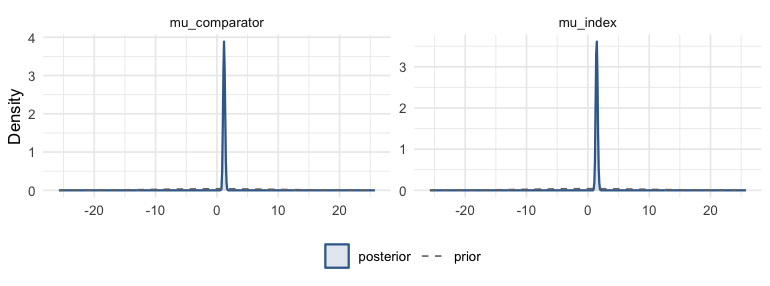
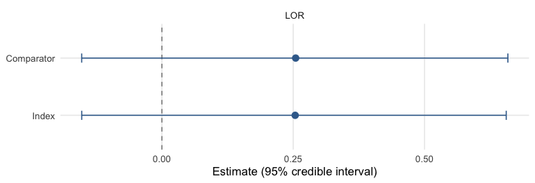
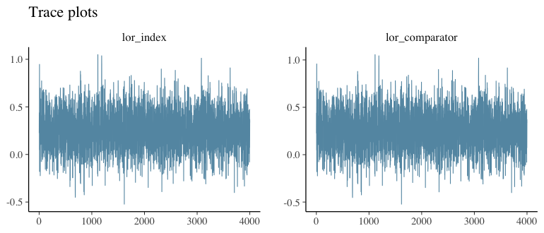

``` r
library(mlumr)
library(ggplot2)
options(mc.cores = parallel::detectCores())
```

This vignette covers the mechanics of fitting an ML-UMR model with `mlumr()`:
sampler control, backends, priors, inspecting a fit, and MCMC diagnostics. It is
family-agnostic, we illustrate with the real plaque-psoriasis binary example
from `vignette("binary-outcomes")`, but the workflow is identical for
continuous, count, and survival outcomes. For *which* method to report, see
`vignette("choosing-a-method")`.

`mlumr()` fits two model variants by Stan: `model = "spfa"` (shared
prognostic-factor coefficients) and `model = "relaxed"` (treatment-specific
coefficients, allowing effect modification). The default backend is `rstan`;
`cmdstanr` is an optional alternative. The sampler messages, timings and
`Engine:` line shown throughout this vignette were produced with `cmdstanr`,
which `vignettes/precompile.R` selects, so running the same code with the
defaults prints rstan's equivalents instead.

## A model to work with

We reuse the plaque-psoriasis binary example, a compact ML-UMR fit that the rest
of this vignette inspects, tunes, and diagnoses (the data preparation is covered
in `vignette("binary-outcomes")`):


``` r
library(mlumr)
data("psoriasis_ipd")   # bundled with mlumr (from multinma, GPL-3)
data("psoriasis_agd")

covs <- c("age", "bsa", "weight")
ipd <- psoriasis_ipd
ipd$bsa <- ipd$bsa / 100          # body-surface area: % -> proportion
ipd <- ipd[ipd$study == "UNCOVER-2" & ipd$treatment == "IXE_Q4W", ]
ipd <- ipd[stats::complete.cases(ipd[, c("pasi75", covs)]), ]

agd <- psoriasis_agd
agd$bsa_mean <- agd$bsa_mean / 100; agd$bsa_sd <- agd$bsa_sd / 100
agd <- agd[agd$study == "FIXTURE" & agd$treatment == "SEC_300", ]

dat <- combine_data(
  set_ipd(ipd, treatment = "treatment", outcome = "pasi75", covariates = covs),
  set_agd(agd, treatment = "treatment", outcome_n = "pasi75_n", outcome_r = "pasi75_r",
          cov_means = c("age_mean", "bsa_mean", "weight_mean"),
          cov_sds   = c("age_sd", "bsa_sd", "weight_sd"),
          cov_types = c("continuous", "continuous", "continuous")))
dat <- add_integration(dat, n_int = 64,
  age    = distr(qgamma,     mean = age_mean,    sd = age_sd),
  bsa    = distr(qlogitnorm, mean = bsa_mean,    sd = bsa_sd),
  weight = distr(qgamma,     mean = weight_mean, sd = weight_sd))

fit <- mlumr(dat, model = "spfa",
             prior_beta = prior_normal(0, 2.5, autoscale = TRUE),
             chains = 4, iter = 2000, warmup = 1000, seed = 2026, refresh = 0)
#> Running MCMC with 4 parallel chains...
#> 
#> Chain 1 finished in 0.8 seconds.
#> Chain 2 finished in 0.8 seconds.
#> Chain 3 finished in 0.8 seconds.
#> Chain 4 finished in 0.8 seconds.
#> 
#> All 4 chains finished successfully.
#> Mean chain execution time: 0.8 seconds.
#> Total execution time: 1.1 seconds.
```

## Controlling the sampler

All sampler controls are arguments to `mlumr()`. For a production analysis use
more chains and iterations than the short settings above:


``` r
fit <- mlumr(
  dat, model = "spfa",
  chains = 4,            # number of MCMC chains
  iter = 4000,           # total iterations per chain
  warmup = 2000,         # warmup iterations
  seed = 2026,           # reproducibility
  adapt_delta = 0.99,    # raise toward 1 to remove divergences
  max_treedepth = 15,    # raise if treedepth is saturated
  refresh = 500          # progress printing (0 = silent)
)
```

## Backend selection

`rstan` (default) uses the model compiled into the installed package.
`cmdstanr` is an optional backend, selected per fit or globally with
`mlumr_engine("cmdstanr")`:


``` r
fit_cmd <- mlumr(dat, model = "spfa", engine = "cmdstanr", seed = 2026, refresh = 0)
```

`cmdstanr` is often faster once compiled, especially with parallel chains and
long runs. Posterior estimates agree up to Monte Carlo error.

## Priors

The defaults, `prior_normal(0, 10)` for intercepts and
`prior_normal(0, 2.5)` for regression coefficients, are generic starting
values rather than calibrated choices for every family and outcome scale.
**Autoscaling** divides a coefficient prior's location and scale by each
covariate's SD so its intended contribution is preserved when predictors use
different units. Inspect the priors actually passed to Stan, including
autoscaled scales, with `prior_summary()`:


``` r
prior_summary(fit)
#> Priors for ML-UMR Fit
#> =====================
#> 
#> Intercepts (mu_index, mu_comparator):
#>   normal(0, 10)
#>   (package default, mlumr 0.1.0.9000)
#> 
#> Regression coefficients (beta):
#>   Family: normal
#>  coefficient mean  scale autoscaled   sd_x
#>          age    0  0.196       TRUE 12.784
#>          bsa    0 14.055       TRUE  0.178
#>       weight    0  0.120       TRUE 20.794
#>   (scale = user_scale / sd_x for autoscaled rows)
```

Overlaying the prior on the posterior shows how much the data have updated each
parameter, the intercepts move sharply away from their $\mathrm{N}(0,10)$ prior:


``` r
plot_prior_posterior(fit, pars = c("mu_index", "mu_comparator"))
```

<div class="figure" style="text-align: center">

<p class="caption">plot of chunk prior-post</p>
</div>

## Inspecting a fit

`print()` gives a one-line description of the model; `summary()` tabulates the
posterior for every parameter (point estimate, credible interval, and the
per-parameter convergence diagnostics):


``` r
print(fit)
#> ML-UMR Fit
#> ==========
#> 
#> Model: SPFA (Shared Prognostic Factors) 
#> Family: Binary 
#> Link: logit 
#> Engine: cmdstanr 
#> Treatments:
#>   Index (IPD): IXE_Q4W 
#>   Comparator (AgD): SEC_300 
#> 
#> Data:
#>   IPD: n = 345 observations
#>   AgD: 1 rows
#>   Covariates: 3 
#>   Integration points: 64 
#> 
#> Sampling:
#>   Chains: 4 
#>   Iterations: 2000 (warmup: 1000 )
#> 
#> Key Parameters:
#>        variable       mean         sd        2.5%     97.5%      Rhat
#>        mu_index 1.44618427 0.15636550  1.15196094 1.7651909 0.9995392
#>   mu_comparator 1.17260184 0.15224510  0.88731421 1.4799876 1.0000963
#>       lor_index 0.25377673 0.20530813 -0.15266887 0.6555978 1.0012879
#>  lor_comparator 0.25466793 0.20617373 -0.15273282 0.6587242 1.0013579
#>        rd_index 0.04763409 0.03873935 -0.02809253 0.1234016 1.0017769
#>   rd_comparator 0.04156580 0.03362521 -0.02554187 0.1053535 1.0015519
#> 
#> Use summary() for full results
summary(fit)
#> ML-UMR Model Summary
#> ====================
#> 
#> Model: SPFA 
#> Family: Binary 
#> Link: logit 
#> Engine: cmdstanr 
#> Treatments: IXE_Q4W (IPD) vs SEC_300 (AgD)
#> 
#> MCMC Diagnostics:
#>   Divergent transitions: 0 
#>   Max treedepth hits: 0 
#>   Max Rhat: 1.004 
#>   Min ESS: 1890 
#> 
#> Intercepts (logit scale):
#>       variable     mean        sd      2.5%    97.5%      Rhat
#>       mu_index 1.446184 0.1563655 1.1519609 1.765191 0.9995392
#>  mu_comparator 1.172602 0.1522451 0.8873142 1.479988 1.0000963
#> 
#> Regression Coefficients:
#>      variable        mean          sd        2.5%        97.5%      Rhat
#>     beta[age] -0.04072437 0.010852931 -0.06213992 -0.020515311 1.0013211
#>     beta[bsa]  0.09474860 0.738994077 -1.31835682  1.580247738 1.0015116
#>  beta[weight] -0.01462932 0.006335175 -0.02729679 -0.002487916 0.9998753
#> 
#> Marginal Treatment Effects:
#>   Log Odds Ratios:
#>        variable      mean        sd       2.5%     97.5%
#>       lor_index 0.2537767 0.2053081 -0.1526689 0.6555978
#>  lor_comparator 0.2546679 0.2061737 -0.1527328 0.6587242
#>   Risk Differences:
#>       variable       mean         sd        2.5%     97.5%
#>       rd_index 0.04763409 0.03873935 -0.02809253 0.1234016
#>  rd_comparator 0.04156580 0.03362521 -0.02554187 0.1053535
#>   Risk Ratios:
#>       variable     mean         sd      2.5%    97.5%
#>       rr_index 1.067584 0.05630268 0.9641510 1.183359
#>  rr_comparator 1.054985 0.04509862 0.9677899 1.144179
```

Population-averaged effects, absolute predictions, and the raw posterior draws
are available from `marginal_effects()` and `predict()` (the available measures
and prediction types depend on the family, see the per-outcome vignettes):


``` r
knitr::kable(marginal_effects(fit, effect = "lor"), caption = "Marginal log odds ratios")
```


Table: Marginal log odds ratios

|variable       |effect |population |      mean|        sd|       q2.5|       q50|     q97.5|
|:--------------|:------|:----------|---------:|---------:|----------:|---------:|---------:|
|lor_index      |LOR    |Index      | 0.2537767| 0.2053081| -0.1526689| 0.2538476| 0.6555978|
|lor_comparator |LOR    |Comparator | 0.2546679| 0.2061737| -0.1527328| 0.2545148| 0.6587242|


Both return **both** target populations by default, the index and the
comparator, which is what separates ML-UMR from the frequentist benchmarks:


``` r
knitr::kable(predict(fit, type = "response"),
   caption = "Standardized response probabilities, both populations")
```


Table: Standardized response probabilities, both populations

|treatment |population |      mean|        sd|      q2.5|       q50|     q97.5|
|:---------|:----------|---------:|---------:|---------:|---------:|---------:|
|IXE_Q4W   |Index      | 0.7744589| 0.0220586| 0.7290820| 0.7750439| 0.8165154|
|SEC_300   |Index      | 0.7268248| 0.0314643| 0.6626042| 0.7277590| 0.7862674|
|IXE_Q4W   |Comparator | 0.8120690| 0.0234368| 0.7639743| 0.8132213| 0.8551468|
|SEC_300   |Comparator | 0.7705032| 0.0241048| 0.7232535| 0.7706705| 0.8155886|


## MCMC diagnostics

`mlumr()` automatically warns about divergent transitions, treedepth
saturation, high Rhat (> 1.01), and low ESS (< 400). Inspect them directly:


``` r
fit$diagnostics$n_divergent
#> [1] 0
fit$diagnostics$n_max_treedepth
#> [1] 0
max(fit$summary$Rhat, na.rm = TRUE)
#> [1] 1.003758
min(fit$summary$n_eff, na.rm = TRUE)
#> [1] 1890.414
```

Posterior intervals for the key effects come straight from `marginal_effects()`
and its `plot()` method:


``` r
plot(marginal_effects(fit, effect = "lor"))
```

<div class="figure" style="text-align: center">

<p class="caption">plot of chunk intervals</p>
</div>

For convergence diagnostics on the raw draws, `bayesplot` works directly on
`fit$draws`, here trace plots of the same parameters:


``` r
bayesplot::mcmc_trace(fit$draws, pars = c("lor_index", "lor_comparator")) +
  ggplot2::labs(title = "Trace plots")
```

<div class="figure" style="text-align: center">

<p class="caption">plot of chunk trace</p>
</div>

## Prior sensitivity

`prior_sensitivity()` refits across a grid of `prior_beta` scales, holding every
other model setting fixed, so any movement in the summaries is attributable to
the prior alone. The fit used here is the SPFA model built above, where the
coefficients are identified by the IPD and the sweep is expected to be flat:


``` r
prior_sensitivity(fit, prior_beta_scales = c(1, 2.5, 5))
#> Running MCMC with 4 parallel chains...
#> 
#> Chain 1 finished in 0.6 seconds.
#> Chain 2 finished in 0.5 seconds.
#> Chain 3 finished in 0.5 seconds.
#> Chain 4 finished in 0.6 seconds.
#> 
#> All 4 chains finished successfully.
#> Mean chain execution time: 0.6 seconds.
#> Total execution time: 0.8 seconds.
#> Running MCMC with 4 parallel chains...
#> 
#> Chain 1 finished in 0.6 seconds.
#> Chain 2 finished in 0.6 seconds.
#> Chain 3 finished in 0.6 seconds.
#> Chain 4 finished in 0.6 seconds.
#> 
#> All 4 chains finished successfully.
#> Mean chain execution time: 0.6 seconds.
#> Total execution time: 0.9 seconds.
#> Running MCMC with 4 parallel chains...
#> 
#> Chain 1 finished in 1.0 seconds.
#> Chain 2 finished in 1.1 seconds.
#> Chain 3 finished in 1.0 seconds.
#> Chain 4 finished in 0.9 seconds.
#> 
#> All 4 chains finished successfully.
#> Mean chain execution time: 1.0 seconds.
#> Total execution time: 1.5 seconds.
#> 
#> Prior sensitivity: posterior of marginal treatment effects
#> =========================================================
#> 
#>  scale      parameter effect      mean        sd         q2       q50       q98
#>    1.0      lor_index    LOR 0.2450842 0.2042432 -0.1572848 0.2449714 0.6380143
#>    1.0 lor_comparator    LOR 0.2459477 0.2050747 -0.1581046 0.2454590 0.6396459
#>    2.5      lor_index    LOR 0.2537767 0.2053081 -0.1526689 0.2538476 0.6555978
#>    2.5 lor_comparator    LOR 0.2546679 0.2061737 -0.1527328 0.2545148 0.6587242
#>    5.0      lor_index    LOR 0.2481648 0.2012573 -0.1446230 0.2465931 0.6394745
#>    5.0 lor_comparator    LOR 0.2490404 0.2020809 -0.1439587 0.2471842 0.6418033
#> 
#> Interpretation: if posterior summaries are approximately constant
#> across scales, the inference is data-driven rather than prior-driven.
```

The case that motivates the check is the relaxed model, whose comparator
coefficients are informed only through the aggregate likelihood and can
therefore be prior-sensitive. For a relaxed binomial, normal, or poisson fit, run
`check_identification()` on the data first, since a sweep cannot repair a design
that carries no information about a coefficient, then pass the relaxed fit to
`prior_sensitivity()` and sweep the comparator prior alongside the index one
with `prior_beta_comparator_scales`. See
`vignette("subgroup-identification", "mlumr")`. Survival is the exception:
`check_identification()` refuses it, because a reconstructed comparator curve is
not a set of scalar subgroup summaries and a row count neither bounds nor
certifies what it identifies. For a relaxed survival fit, inspect the coefficient
posterior and use the prior sweep. The reported marginal posterior-to-prior
variance change is descriptive and is not a fraction learned from the data.

## Troubleshooting

- **Divergent transitions**, raise `adapt_delta` (e.g. `0.99`).
- **Slow convergence / low ESS**, increase `iter` and `warmup`.
- **Relaxed-model identifiability**, with little AgD, the comparator-specific
  coefficients are weakly identified (mlumr warns). Use SPFA if effect
  modification is not expected, supply more informative `prior_beta`, or run
  `prior_sensitivity()`.

## References
