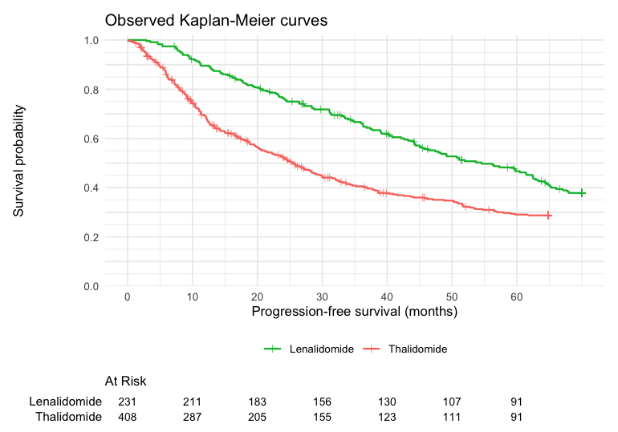
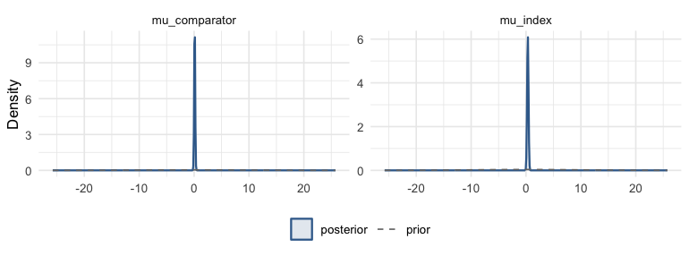
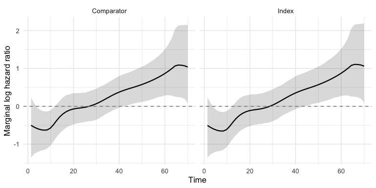
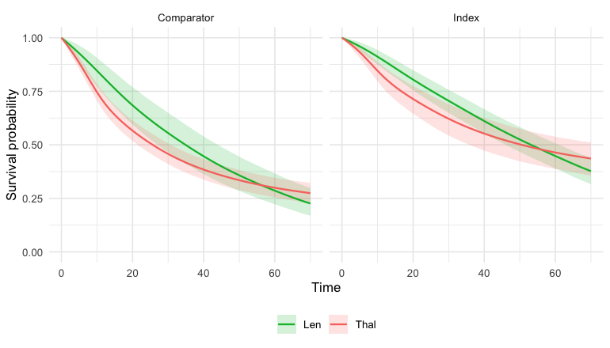
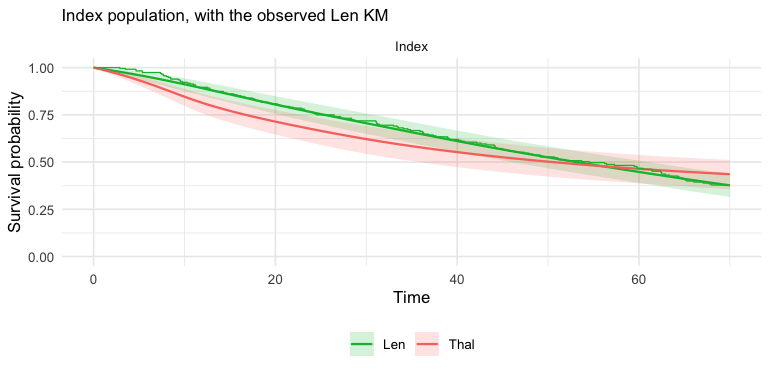
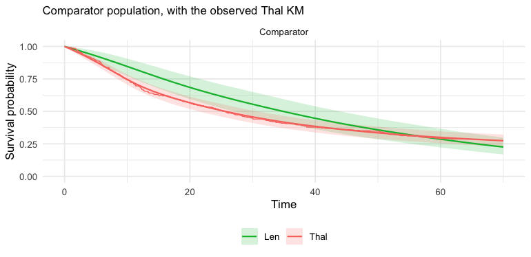
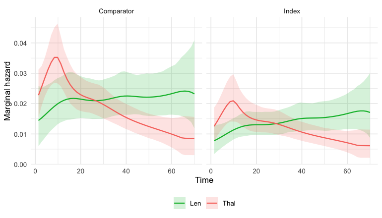
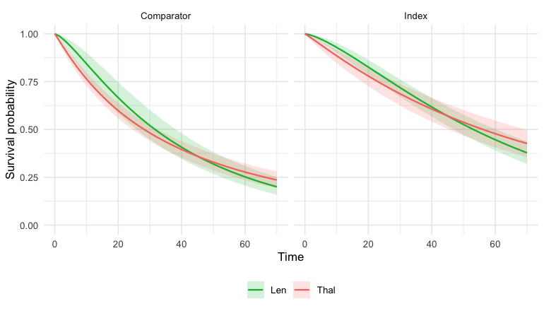

``` r
library(mlumr)
library(ggplot2)
options(mc.cores = parallel::detectCores())
```

This vignette is a complete worked example of an **unanchored** indirect
comparison for a **time-to-event** endpoint, using newly-diagnosed multiple
myeloma (NDMM) data bundled with mlumr (`ndmm_ipd` / `ndmm_agd` / `ndmm_agd_covs`,
copied from the GPL-3 `multinma` package [@multinma]); these are the same
datasets used in multinma's survival ML-NMR example [@Phillippo2025surv]. It is
the unanchored analogue of that analysis [@ChandlerIshak2026]. See
`vignette("data-preparation")` for the integration machinery,
`vignette("fitting-and-diagnostics")` for sampler/prior detail, and
`vignette("choosing-a-method")` to choose between methods.

> **About these data.** `ndmm_ipd` / `ndmm_agd` / `ndmm_agd_covs` are copied
> verbatim from `multinma`, whose IPD is simulated and whose aggregate arms are
> pseudo-IPD reconstructed from digitized Kaplan-Meier curves [@Leahy2019].
> mlumr bundles one arm from each trial, lenalidomide from McCarthy2012 (IPD)
> and thalidomide from Morgan2012 (pseudo-IPD), and omits the placebo arms
> both trials randomized, which would otherwise anchor the comparison. The
> section *Checking against the anchored comparison* puts them back to use.

## The unanchored survival problem

For a survival endpoint the comparator evidence is almost always a
Kaplan-Meier (KM) curve plus a baseline table. mlumr represents the comparator
arm as reconstructed pseudo-IPD, event and censoring times digitized from the
published curve, and integrates the survival likelihood over the comparator's
covariate distribution, as for its other families. The unanchored setting
removes the need for a common arm but still relies on the
shared-prognostic-factor assumption (SPFA).

## The ML-UMR survival model

For a proportional-hazards distribution ML-UMR models the individual hazard
$$h(t\mid x)=h_0(t)\exp(\mu_k+x^\top\beta_k),$$
with a parametric or M-spline baseline $h_0(t)$; accelerated-failure-time
distributions instead scale time by $\exp(\mu_k+x^\top\beta_k)$. The index IPD
enters through the usual survival likelihood; the comparator's reconstructed
pseudo-IPD contributes a likelihood **integrated over its covariate
distribution** $f_{\text{AgD}}(x)$,
$$\ell_{\text{AgD}}=\sum_j\log\!\int h(t_j\mid x)^{\delta_j}\,S(t_j\mid x)\,f_{\text{AgD}}(x)\,dx,$$
approximated by the quasi-Monte Carlo integration points. Population-standardized
quantities follow from the marginal survival
$\bar S(t)=\mathbb{E}_x[S(t\mid x)]$ and marginal hazard
$\bar h(t)=\mathbb{E}_x[h(t\mid x)S(t\mid x)]/\mathbb{E}_x[S(t\mid x)]$. Because
hazard ratios are **non-collapsible**, the marginal log HR is time-varying even
under conditional PH, so we report it as a curve (`predict(type = "loghr")`)
and lean on the collapsible RMST estimands for scalar summaries.

## Survival distributions

The `distribution` argument of `mlumr()` selects the survival model, nine
parametric forms (proportional hazards, PH; or accelerated failure time, AFT)
plus two flexible baselines:

| `distribution` | Family | Treatment effect |
|----------------|--------|------------------|
| `"exponential"`, `"weibull"` (default), `"gompertz"` | PH | hazard ratio |
| `"exponential-aft"`, `"weibull-aft"`, `"lognormal"`, `"loglogistic"`, `"gamma"`, `"gengamma"` | AFT | time ratio only when the baseline shape and the coefficient vector are both shared; otherwise the exponentiated linear-predictor contrast |
| `"mspline"` | Flexible M-spline baseline (PH) | hazard ratio |
| `"pexp"` | Piecewise-exponential baseline (PH) | hazard ratio |

`marginal_effects()` reports these on the natural scale, null 1. For AFT
distributions a population time ratio needs a shared baseline shape and a
shared coefficient vector; otherwise `marginal_effects()` reports
`EXP_DELTA_ETA`. `predict(type = "loghr")` gives the time-varying marginal log
hazard ratio curve. The `"gengamma"` form is restricted to a positive Lawless
shape `Q`; use an `"mspline"` baseline for a hazard shape outside that family.

The flexible baselines estimate the baseline-hazard shape from the data using a
normalized M-spline (the piecewise exponential is the degree-0 case) with a
random-walk smoothing prior [@Phillippo2026mspline]. Knots are placed by
`make_knots()` (control with `n_knots`).

## Censoring

Outcomes are given to `set_ipd()` / `set_agd_surv()` either as a
`survival::Surv()` object or as `time` / `status` / `entry_time` columns. All
standard schemes are supported (internally mapped to status `0` right, `1`
event, `2` left, `3` interval; delayed entry handled as left truncation):


``` r
library(survival)
Surv(time, status)                      # right censoring (status 1 = event)
Surv(entry_time, time, status)          # delayed entry / left truncation
Surv(lower, upper, type = "interval2")  # interval censoring
```

## The data: progression-free survival in NDMM

* **Index (IPD).** Patient-level progression-free survival for **lenalidomide**
  (`Len`) maintenance from the McCarthy2012 study.
* **Comparator (AgD).** A reconstructed KM curve plus covariate moments for
  **thalidomide** (`Thal`) from the Morgan2012 study.

We adjust for age, ISS stage III, complete/very-good-partial response, and sex.


``` r
library(mlumr)
library(ggplot2)

data("ndmm_ipd")        # bundled with mlumr (copied from multinma, GPL-3)
data("ndmm_agd")        # reconstructed pseudo-IPD (KM)
data("ndmm_agd_covs")   # covariate moments for the AgD arm

covs <- c("age", "iss_stage3", "response_cr_vgpr", "male")

# Index IPD: McCarthy2012, lenalidomide. Age stays in years, as in multinma's
# own NDMM example, so the coefficient reads as a per-year log hazard ratio.
ipd_one <- ndmm_ipd[ndmm_ipd$study == "McCarthy2012" & ndmm_ipd$treatment == "Len", ]

# Comparator AgD: Morgan2012, thalidomide (pseudo-IPD + covariate moments).
agd_one <- ndmm_agd[ndmm_agd$study == "Morgan2012" & ndmm_agd$treatment == "Thal", ]
cv <- ndmm_agd_covs[ndmm_agd_covs$study == "Morgan2012" & ndmm_agd_covs$treatment == "Thal", ]
agd_one$age_mean         <- cv$age_mean
agd_one$age_sd           <- cv$age_sd
agd_one$iss_stage3_prop       <- cv$iss_stage3_prop        # proportions (binary covariates)
agd_one$response_cr_vgpr_prop <- cv$response_cr_vgpr_prop
agd_one$male_prop             <- cv$male_prop
```

## Covariate balance

Population adjustment is motivated by the fact that the two single-arm populations
differ on prognostic factors. Comparing the index sample means against the
published comparator means shows the imbalance we must adjust for:


``` r
balance <- data.frame(
  Covariate = c("Age (years)", "ISS stage III (prop.)",
                "CR/VGPR response (prop.)", "Male (prop.)"),
  Index_Len = c(mean(ipd_one$age), mean(ipd_one$iss_stage3),
                mean(ipd_one$response_cr_vgpr), mean(ipd_one$male)),
  Comparator_Thal = c(agd_one$age_mean[1], agd_one$iss_stage3_prop[1],
                      agd_one$response_cr_vgpr_prop[1], agd_one$male_prop[1])
)
knitr::kable(balance, caption = "Prognostic-factor balance: McCarthy2012 Len vs Morgan2012 Thal")
```


Table: Prognostic-factor balance: McCarthy2012 Len vs Morgan2012 Thal

|Covariate                |  Index_Len| Comparator_Thal|
|:------------------------|----------:|---------------:|
|Age (years)              | 57.9334459|      65.5938658|
|ISS stage III (prop.)    |  0.2727273|       0.3186275|
|CR/VGPR response (prop.) |  0.6233766|       0.7450980|
|Male (prop.)             |  0.5238095|       0.6151961|


The observed Kaplan-Meier curves (index IPD and the reconstructed comparator
pseudo-IPD) show the crude, unadjusted survival difference:


``` r
km_obs <- rbind(
  data.frame(eventtime = ipd_one$eventtime, status = ipd_one$status,
             arm = "Lenalidomide"),
  data.frame(eventtime = agd_one$eventtime, status = agd_one$status,
             arm = "Thalidomide")
)
# The displayed observed curves use ggsurvfit: step lines with censoring marks
# and a numbers-at-risk table, the standard survival-reporting layout. (The
# predicted-vs-observed overlay further down draws its KM with mlumr's geom_km().)
arm_cols <- c("Lenalidomide" = "#00BA38",   # green (index)
              "Thalidomide" = "#F8766D")    # red (comparator)
ggsurvfit::survfit2(survival::Surv(eventtime, status) ~ arm, data = km_obs) |>
  ggsurvfit::ggsurvfit(linewidth = 0.7) +
  ggsurvfit::add_censor_mark(shape = 3, size = 1.6, alpha = 0.7) +
  ggsurvfit::add_risktable(risktable_stats = "n.risk", size = 3.2) +
  scale_color_manual(values = arm_cols) +
  scale_fill_manual(values = arm_cols) +
  scale_x_continuous(breaks = seq(0, 60, 10)) +
  scale_y_continuous(
    breaks = seq(0, 1, 0.1),                       # gridline at every 0.1
    labels = function(b) ifelse(round(b * 10) %% 2 == 0,  # label 0, 0.2, .., 1
                                sprintf("%.1f", b), ""),
    limits = c(0, 1), expand = expansion(mult = c(0, 0.02))) +
  labs(x = "Progression-free survival (months)", y = "Survival probability",
       title = "Observed Kaplan-Meier curves") +
  theme_minimal(base_size = 11) + theme(legend.position = "bottom")
```

<div class="figure" style="text-align: center">

<p class="caption">plot of chunk km</p>
</div>

## Setting up the ML-UMR data

The index IPD uses `family = "survival"` with `time`/`status` columns; the
comparator uses **`set_agd_surv()`**, which takes the reconstructed pseudo-IPD
*plus* the covariate moments from the baseline table.


``` r
ipd <- set_ipd(ipd_one, treatment = "treatment", covariates = covs,
               family = "survival", time = "eventtime", status = "status")

agd <- set_agd_surv(agd_one, treatment = "treatment",
                    time = "eventtime", status = "status",
                    cov_means = c("age_mean", "iss_stage3_prop", "response_cr_vgpr_prop", "male_prop"),
                    cov_sds   = c("age_sd", NA, NA, NA),
                    cov_types = c("continuous", "binary", "binary", "binary"))

dat <- suppressWarnings(combine_data(ipd, agd))
dat <- suppressWarnings(add_integration(
  dat, n_int = 64,
  # Age is right-skewed, so a gamma marginal, matching multinma's NDMM example.
  age              = distr(qgamma, mean = age_mean, sd = age_sd),
  iss_stage3       = distr(qbern, prob = iss_stage3_mean),
  response_cr_vgpr = distr(qbern, prob = response_cr_vgpr_mean),
  male             = distr(qbern, prob = male_mean)))
dat
#> Unanchored Comparison Data (Time-to-event)
#> ====================================
#> 
#> Index treatment (IPD): Len 
#>   N = 231 
#>   Events = 133 (57.6%), censored = 98
#> 
#> Comparator treatment (AgD): Thal 
#>   Reconstructed pseudo-IPD: 408 row(s)
#>   Events = 263 (64.5%), censored = 145
#> 
#> Covariates ( 4 ): age, iss_stage3, response_cr_vgpr, male 
#> Integration points: 64 (QMC with Gaussian copula)
```

## Frequentist benchmarks

The **naive** comparison is an unadjusted Cox model (a log hazard ratio), ignoring
the covariate imbalance. Survival **STC** fits a parametric model to the index IPD
and transports it to the comparator population by G-computation, returning a
restricted-mean-survival-time (RMST) difference via `flexsurv`. Both are fast
frequentist reference points for the Bayesian fit below (the two estimands, log
HR and RMST difference, are on different scales, so each is compared like for
like later).

RMST differences to different horizons are different estimands, and the
defaults differ (a stratified flexible baseline uses the follow-up both
studies observed, a parametric fit and `stc()` the pooled maximum), so one
horizon is fixed here and passed to every estimator.


``` r
# The follow-up both arms in this analysis observed.
tau_rmst <- min(max(ipd_one$eventtime), max(agd_one$eventtime))
tau_rmst
#> [1] 64.8
```


``` r
res_naive <- naive(dat)                            # unadjusted Cox log HR
res_stc   <- stc(dat, distribution = "weibull", seed = 2026,
                 rmst_horizon = tau_rmst)          # G-computation RMST diff
res_naive
#> Naive Unadjusted Indirect Comparison
#> =====================================
#> 
#> Treatments: Len vs Thal 
#> 
#> Population basis: index-study outcome versus comparator-population outcome; no common standardized target.
#> 
#> Median survival:
#>   Index (IPD):      54.526 (133 events / 231)
#>   Comparator (AgD): 25.499 (263 events / 408)
#> 
#> Log Hazard Ratio (Cox): -0.5541 (SE: 0.1087)
#> 95% CI: [-0.7672, -0.3410]
#> 
#> All effect measures (95% CI):
#>   Log hazard ratio (Cox)        -0.5541 (SE 0.1087) [-0.7672, -0.3410]
#>   Hazard ratio (Cox)             0.5746 [0.4643, 0.7111]
res_stc
#> Simulated Treatment Comparison (G-computation)
#> ===============================================
#> 
#> Treatments: Len vs Thal 
#> 
#> Estimand population: comparator
#> Treating this as the index-population effect requires a separate effect-equality assumption; this calculation does not transport to the index population.
#> 
#> Method note: package-specific parametric survival extension.
#> Distribution: weibull | RMST horizon: 64.800
#> Marginalized RMST (index trt, comp pop): 36.8432
#> Fitted RMST (comp trt, comp pop):        33.6594
#> 
#> RMST Difference: 3.1837 (bootstrap SE: 2.6586, 200 reps)
#> 95% CI: [-2.0271, 8.3946]
#> 
#> All effect measures (95% CI):
#>   RMST difference                3.1837 (SE 2.6586) [-2.0271, 8.3946]
#>   Log cumulative-hazard ratio (at horizon)   0.0461 (SE 0.1222) [-0.1935, 0.2857]
#>   Cumulative-hazard ratio (at horizon)   1.0472 [0.8241, 1.3306]
```

## Fitting the ML-UMR models

Following multinma's NDMM survival example, the primary model uses a cubic
M-spline baseline hazard (`distribution = "mspline"`) with seven internal
knots, 64 integration points and 4 chains of 2000 iterations. We fit the SPFA
model, a relaxed model with treatment-specific prognostic effects (the
unanchored analogue of multinma's `~ (covariates) * .trt`), and a Weibull
proportional-hazards model as a parametric comparison. `prior_aux` and
`prior_smooth` supplement the usual priors; see
`vignette("fitting-and-diagnostics")`.

The baseline hazard is estimated separately for each study
(`aux_by = ".study"`, the default), as in multinma; a shared shape is
available as `aux_by = "none"` when the two curves plainly agree. Each study
gets its own knots over its own observed support and its spline coefficients
form a simplex, which is what keeps the baseline and the study intercept
separately identified. With two baseline shapes the marginal hazard ratio is
time-varying, so the scalar `HR` is its value at one instant, recorded in the
`at_time` column; `predict(type = "loghr")` gives the whole curve and the RMST
difference does not depend on when you look.


``` r
# Primary: cubic M-spline baseline (the multinma NDMM survival model)
fit_mspline <- mlumr(dat, model = "spfa", distribution = "mspline", n_knots = 7,
                     rmst_horizon = tau_rmst,
                     chains = 4, iter = 2000, warmup = 1000, seed = 2026, refresh = 0)
#> Running MCMC with 4 parallel chains...
#> 
#> Chain 1 finished in 346.3 seconds.
#> Chain 3 finished in 355.9 seconds.
#> Chain 4 finished in 361.9 seconds.
#> Chain 2 finished in 410.9 seconds.
#> 
#> All 4 chains finished successfully.
#> Mean chain execution time: 368.8 seconds.
#> Total execution time: 411.0 seconds.
```


``` r
# Relaxed M-spline: treatment-specific prognostic effects (effect modification),
# the unanchored analogue of multinma's ~ (covariates) * .trt. beta_comparator is
# identified only by the reconstructed comparator likelihood, so we regularize it
# with a tighter autoscaled prior (see the caveat at the end of this vignette).
fit_mspline_relaxed <- mlumr(dat, model = "relaxed", distribution = "mspline",
                             n_knots = 7, rmst_horizon = tau_rmst,
                             prior_beta_comparator = prior_normal(0, 1, autoscale = TRUE),
                             chains = 4, iter = 2000, warmup = 1000, seed = 2026,
                             refresh = 0)
#> Running MCMC with 4 parallel chains...
#> 
#> Chain 4 finished in 508.3 seconds.
#> Chain 3 finished in 528.7 seconds.
#> Chain 1 finished in 537.7 seconds.
#> Chain 2 finished in 539.5 seconds.
#> 
#> All 4 chains finished successfully.
#> Mean chain execution time: 528.5 seconds.
#> Total execution time: 539.7 seconds.
```


``` r
# Parametric comparison: Weibull proportional hazards
fit_weibull <- mlumr(dat, model = "spfa", distribution = "weibull",
                     rmst_horizon = tau_rmst,
                     chains = 4, iter = 2000, warmup = 1000, seed = 2026, refresh = 0)
#> Running MCMC with 4 parallel chains...
#> 
#> Chain 2 finished in 380.7 seconds.
#> Chain 3 finished in 390.1 seconds.
#> Chain 1 finished in 402.2 seconds.
#> Chain 4 finished in 424.2 seconds.
#> 
#> All 4 chains finished successfully.
#> Mean chain execution time: 399.3 seconds.
#> Total execution time: 424.6 seconds.
```


``` r
summary(fit_mspline)
#> ML-UMR Model Summary
#> ====================
#> 
#> Model: SPFA 
#> Family: Time-to-event [mspline] 
#> Link: log 
#> Engine: cmdstanr 
#> Treatments: Len (IPD) vs Thal (AgD)
#> 
#> MCMC Diagnostics:
#>   Divergent transitions: 0 
#>   Max treedepth hits: 0 
#>   Max Rhat: 1.004 
#>   Min ESS: 1362 
#> 
#> Intercepts (log scale):
#>       variable      mean         sd        2.5%     97.5%     Rhat
#>       mu_index 0.3281011 0.11884905  0.09361807 0.5631807 1.002906
#>  mu_comparator 0.1055319 0.08304143 -0.06503476 0.2714046 1.002169
#> 
#> Regression Coefficients:
#>                variable       mean         sd        2.5%     97.5%      Rhat
#>               beta[age] 0.06957188 0.01623353  0.03879512 0.1016364 0.9997473
#>        beta[iss_stage3] 0.40568588 0.18803654  0.03662400 0.7635252 1.0010477
#>  beta[response_cr_vgpr] 0.05911517 0.18257397 -0.30641058 0.4168000 0.9997620
#>              beta[male] 0.07474996 0.17650989 -0.28177263 0.4189003 1.0013708
#> 
#> Baseline hazard: stratified by study (aux_by = ".study")
#> 
#> Shape / smoothing parameters:
#>         variable     mean        sd      2.5%    97.5%     Rhat
#>  sigma_smooth[1] 1.002922 0.4929140 0.2720435 2.157771 1.001996
#>  sigma_smooth[2] 1.237045 0.4891222 0.4424602 2.320887 1.002684
#> 
#> Marginal Treatment Effects:
#>   Log Hazard Ratios at t = 1.4:
#>          variable       mean        sd      2.5%     97.5%
#>       delta_index -0.5078045 0.4148139 -1.360514 0.2311852
#>  delta_comparator -0.5047796 0.4122004 -1.354498 0.2275372
#>   RMST Differences (to t = 64.8):
#>              variable     mean       sd      2.5%    97.5%
#>       rmst_diff_index 3.062956 2.468774 -1.696101 8.050058
#>  rmst_diff_comparator 3.910061 2.668505 -1.280590 9.304018
```

### Priors

Beyond the usual intercept/coefficient priors, survival models add `prior_aux`
(shape/scale parameters) and, for flexible baselines, `prior_smooth` (the
M-spline random-walk smoothing SD). `prior_summary()` shows exactly what was
passed to Stan:


``` r
prior_summary(fit_mspline)
#> Priors for ML-UMR Fit
#> =====================
#> 
#> Intercepts (mu_index, mu_comparator):
#>   normal(0, 10)
#>   (package default, mlumr 0.1.0.9000)
#> 
#> Regression coefficients (beta):
#>   normal(0, 2.5) applied to all 4 covariate(s)
#>   (package default, mlumr 0.1.0.9000)
#> 
#> Survival baseline smoothing (random-walk SD, half-distribution via <lower=0>):
#>   normal(0, 1)
#>   (package default, mlumr 0.1.0.9000)
```

The posterior intercepts (log-baseline scale) versus their $\mathrm{N}(0,10)$ prior:


``` r
plot_prior_posterior(fit_mspline, pars = c("mu_index", "mu_comparator"))
```

<div class="figure" style="text-align: center">

<p class="caption">plot of chunk prior-post</p>
</div>

### Convergence

`mlumr()` warns automatically about divergences, treedepth saturation, high
$\hat R$, and low effective sample size. They are clean here:


``` r
data.frame(
  n_divergent  = fit_mspline$diagnostics$n_divergent,
  max_treedepth = fit_mspline$diagnostics$n_max_treedepth,
  max_Rhat     = round(max(fit_mspline$summary$Rhat, na.rm = TRUE), 3),
  min_ESS      = round(min(fit_mspline$summary$n_eff, na.rm = TRUE))
)
#>   n_divergent max_treedepth max_Rhat min_ESS
#> 1           0             0    1.004    1362
```

## Treatment effects

`marginal_effects()` reports, in each population, the marginal hazard ratio
(`HR`), the RMST difference (`RMSTD`, in months) and the RMST ratio
(`RMSTR`); each RMST row carries its restriction horizon:


``` r
knitr::kable(marginal_effects(fit_mspline, effect = "all"),
   caption = "M-spline population-standardized effects (Len vs Thal)")
```


Table: M-spline population-standardized effects (Len vs Thal)

|variable              |effect |population | at_time| horizon|      mean|        sd|       q2.5|       q50|    q97.5|
|:---------------------|:------|:----------|-------:|-------:|---------:|---------:|----------:|---------:|--------:|
|hr_index              |HR     |Index      |     1.4|      NA| 0.6533356| 0.2650709|  0.2565289| 0.6161399| 1.260093|
|hr_comparator         |HR     |Comparator |     1.4|      NA| 0.6545570| 0.2630883|  0.2580767| 0.6189325| 1.255504|
|rmst_diff_index       |RMSTD  |Index      |      NA|    64.8| 3.0629559| 2.4687736| -1.6961006| 3.0117087| 8.050058|
|rmst_diff_comparator  |RMSTD  |Comparator |      NA|    64.8| 3.9100607| 2.6685054| -1.2805901| 3.8911492| 9.304018|
|rmst_ratio_index      |RMSTR  |Index      |      NA|    64.8| 1.0758567| 0.0629706|  0.9620424| 1.0719896| 1.212050|
|rmst_ratio_comparator |RMSTR  |Comparator |      NA|    64.8| 1.1214761| 0.0842813|  0.9620353| 1.1199694| 1.296189|


Because hazard ratios are non-collapsible, the **marginal** hazard ratio is
time-varying even under conditional PH. Plot `predict(type = "loghr")` directly;
its `plot()` method draws the credible band, facets by population, and adds the
null line at 0:


``` r
plot(predict(fit_mspline, type = "loghr"))
```

<div class="figure" style="text-align: center">

<p class="caption">plot of chunk loghr</p>
</div>

A forest plot of the collapsible RMST difference, in both populations: the
index population is the decision-relevant target for HTA
[@ChandlerIshakTransport], and the comparator row is the like-for-like
comparison with the STC benchmark. The naive Cox estimate is a log hazard
ratio and stays under *Frequentist benchmarks*.


``` r
# Every fit must be integrated to the same restriction time.
rd <- function(fit) marginal_effects(fit, effect = "rmstd", population = "both")
pop <- function(d, which) d[d$population == which, ]
rd_ms  <- rd(fit_mspline)
rd_rel <- rd(fit_mspline_relaxed)
rd_wb  <- rd(fit_weibull)
stopifnot(all.equal(unique(c(rd_ms$horizon, rd_rel$horizon, rd_wb$horizon,
                             res_stc$horizon)), tau_rmst))
row <- function(d, which) pop(d, which)[, c("mean", "q2.5", "q97.5")]
bayes <- rbind(row(rd_ms, "Index"),  row(rd_ms, "Comparator"),
               row(rd_rel, "Index"), row(rd_rel, "Comparator"),
               row(rd_wb, "Index"),  row(rd_wb, "Comparator"))
forest_df <- data.frame(
  label = c("STC (flexsurv, comparator pop.)",
            "ML-UMR M-spline SPFA (index pop.)",
            "ML-UMR M-spline SPFA (comparator pop.)",
            "ML-UMR M-spline relaxed (index pop.)",
            "ML-UMR M-spline relaxed (comparator pop.)",
            "ML-UMR Weibull SPFA (index pop.)",
            "ML-UMR Weibull SPFA (comparator pop.)"),
  est = c(res_stc$rmst_diff, bayes$mean),
  lo  = c(res_stc$ci_lower,  bayes$q2.5),
  hi  = c(res_stc$ci_upper,  bayes$q97.5)
)
mlumr_forest(forest_df, ref_line = 0,
             x = "RMST difference (months)",
             title = "Restricted mean survival time difference",
             subtitle = sprintf(paste0("Every ML-UMR fit and the STC benchmark,",
                                       " integrated to tau = %.4g months"),
                                tau_rmst))
```

<div class="figure" style="text-align: center">

<p class="caption">plot of chunk forest</p>
</div>

## Absolute predictions

Absolute predicted survival summaries (RMST and median) for each treatment,
then the standardized survival and hazard curves. Median survival is
interpolated on the `pred_times` grid, from `S(0) = 1` when it falls before
the first grid point, so pass a denser grid near zero when very early medians
are expected.


``` r
knitr::kable(predict(fit_mspline, type = "rmst"),    caption = "Restricted mean survival time")
```


Table: Restricted mean survival time

|treatment |population | horizon|     mean|       sd|     q2.5|      q50|    q97.5|
|:---------|:----------|-------:|--------:|--------:|--------:|--------:|--------:|
|Len       |Index      |    64.8| 44.88622| 1.383714| 42.11401| 44.89616| 47.54856|
|Thal      |Index      |    64.8| 41.82327| 2.054401| 37.67333| 41.89813| 45.53419|
|Len       |Comparator |    64.8| 36.56521| 2.312381| 32.15020| 36.48156| 41.26836|
|Thal      |Comparator |    64.8| 32.65515| 1.245479| 30.24919| 32.63099| 35.10517|


``` r
knitr::kable(predict(fit_mspline, type = "median"),  caption = "Median survival")
```


Table: Median survival

|treatment |population |     mean|       sd|     q2.5|      q50|    q97.5| p_not_reached|
|:---------|:----------|--------:|--------:|--------:|--------:|--------:|-------------:|
|Len       |Index      | 53.23801| 3.871085| 46.06418| 53.19922| 61.09056|       0.00000|
|Thal      |Index      | 50.52933| 8.211433| 35.74973| 50.09974| 66.96409|       0.05225|
|Len       |Comparator | 34.93992| 4.290860| 27.05821| 34.68099| 43.90881|       0.00000|
|Thal      |Comparator | 25.75542| 2.343685| 21.48948| 25.62412| 30.72446|       0.00000|


The model-based standardized survival curves. `predict()` returns **both**
populations and its `plot()` method facets by population, so the index
population (the decision-relevant target, see above) is shown alongside the
comparator. `predict()` anchors the model curves at (time = 0, survival = 1);
one manual scale keeps the index treatment green and the comparator red:


``` r
surv_cols <- c(Len = "#00BA38", Thal = "#F8766D")   # green index, red comparator
plot(predict(fit_mspline, type = "survival")) +
  scale_color_manual(values = surv_cols, aesthetics = c("colour", "fill"))
```

<div class="figure" style="text-align: center">

<p class="caption">plot of chunk surv-curves</p>
</div>

Each arm's own observed Kaplan-Meier is a check on the fitted curve for that arm,
and it can only be read in the population the arm was observed in. `geom_km()`
(mlumr's analogue of multinma's) draws them; the index arm's KM against the
index-population curves, and the comparator arm's against the comparator-
population curves:


``` r
plot(predict(fit_mspline, population = "index", type = "survival")) +
  geom_km(dat, dat$index_treatment, marks = FALSE) +
  scale_color_manual(values = surv_cols, aesthetics = c("colour", "fill")) +
  ggplot2::labs(subtitle = "Index population, with the observed Len KM")
```

<div class="figure" style="text-align: center">

<p class="caption">plot of chunk surv-curves-km</p>
</div>

``` r

plot(predict(fit_mspline, population = "comparator", type = "survival")) +
  geom_km(dat, dat$comparator_treatment, marks = FALSE) +
  scale_color_manual(values = surv_cols, aesthetics = c("colour", "fill")) +
  ggplot2::labs(subtitle = "Comparator population, with the observed Thal KM")
```

<div class="figure" style="text-align: center">

<p class="caption">plot of chunk surv-curves-km</p>
</div>

The standardized **marginal hazard**, again in both populations. It is
time-varying, and the two treatments' marginal hazards are non-proportional
after integrating over covariates even though the conditional model is PH:


``` r
plot(predict(fit_mspline, type = "hazard")) +
  scale_color_manual(values = surv_cols, aesthetics = c("colour", "fill"))
```

<div class="figure" style="text-align: center">

<p class="caption">plot of chunk hazard-curve</p>
</div>

## Effect modification (relaxed M-spline model)

multinma's NDMM example specifies covariate-by-treatment interactions
(`~ (covariates) * .trt`), i.e. effect modification. The unanchored analogue is
the **relaxed** model fitted above (`fit_mspline_relaxed`), which gives each
treatment its own prognostic coefficients:


``` r
knitr::kable(marginal_effects(fit_mspline_relaxed, effect = "rmstd"),
   caption = "Relaxed M-spline RMST difference (effect modification, collapsible summary)")
```


Table: Relaxed M-spline RMST difference (effect modification, collapsible summary)

|variable             |effect |population | horizon|      mean|       sd|       q2.5|      q50|     q97.5|
|:--------------------|:------|:----------|-------:|---------:|--------:|----------:|--------:|---------:|
|rmst_diff_index      |RMSTD  |Index      |    64.8| 11.849886| 7.408610| -1.2576267| 11.44882| 26.327274|
|rmst_diff_comparator |RMSTD  |Comparator |    64.8|  3.906751| 2.632891| -0.9399761|  3.87162|  9.068319|


Under the relaxed model the conditional hazard ratio depends on the
covariates, so the scalar `HR` is the marginal hazard ratio at the time in
`at_time`; prefer `predict(type = "loghr")` or the RMST estimands. In this
unanchored two-study setting the comparator coefficients are identified only
through the single reconstructed comparator likelihood, so the
index-population relaxed estimand extrapolates them over the IPD covariates
and is correspondingly wide. We regularize `beta_comparator` with a tighter
autoscaled prior, report both populations, and check `prior_sensitivity()`.

## Model comparison

The choice of survival baseline (parametric versus flexible) is itself a model
comparison. We compare the Weibull and M-spline fits by leave-one-out
cross-validation; a lower `looic` favors the more flexible baseline when the
hazard shape departs from the Weibull form:


``` r
compare_models(Weibull = fit_weibull, MSpline = fit_mspline, criterion = "loo")
#> 
#> Model Comparison (LOO)
#> ======================
#> 
#>    model elpd_diff se_diff p_worse diag_diff diag_elpd
#>  MSpline       0.0     0.0      NA                    
#>  Weibull      -5.4     3.9    0.92                    
#> 
#> 
#> elpd_diff is the difference in expected log pointwise predictive
#> density vs the best model, and se_diff is its standard error: the
#> uncertainty about that difference, not evidence for it. Read the two
#> together. A difference small relative to se_diff is not distinguished
#> from zero by this comparison, whatever se_diff itself is.
#> Treat any ratio as a heuristic, not a decision rule, and check the
#> PSIS diagnostics and whether the difference matters for the
#> prediction you care about.
```

The Weibull fit's own standardized effects, in both populations, so the
baseline-shape choice can be judged on the estimand and not only on `looic`:


``` r
knitr::kable(marginal_effects(fit_weibull, effect = "all"),
   caption = "Weibull population-standardized effects (Len vs Thal), both populations")
```


Table: Weibull population-standardized effects (Len vs Thal), both populations

|variable              |effect |population | at_time| horizon|      mean|        sd|       q2.5|       q50|     q97.5|
|:---------------------|:------|:----------|-------:|-------:|---------:|---------:|----------:|---------:|---------:|
|hr_index              |HR     |Index      |     1.4|      NA| 0.4321323| 0.1718592|  0.1863515| 0.4044666| 0.8495956|
|hr_comparator         |HR     |Comparator |     1.4|      NA| 0.4385704| 0.1722747|  0.1898217| 0.4114319| 0.8565592|
|rmst_diff_index       |RMSTD  |Index      |      NA|    64.8| 0.9728680| 2.0067392| -2.8338304| 0.9359614| 4.9852264|
|rmst_diff_comparator  |RMSTD  |Comparator |      NA|    64.8| 1.7830618| 2.2265493| -2.4792818| 1.7635118| 6.1484112|
|rmst_ratio_index      |RMSTR  |Index      |      NA|    64.8| 1.0232273| 0.0462188|  0.9386665| 1.0208617| 1.1197285|
|rmst_ratio_comparator |RMSTR  |Comparator |      NA|    64.8| 1.0550456| 0.0682076|  0.9279087| 1.0532360| 1.1934411|


``` r
plot(predict(fit_weibull, type = "survival")) +
  scale_color_manual(values = surv_cols, aesthetics = c("colour", "fill"))
```

<div class="figure" style="text-align: center">

<p class="caption">plot of chunk weibull-surv</p>
</div>

## Checking against the anchored comparison

Both trials randomized patients to placebo, and the analysis above discards
those arms, so the answer can be checked against the anchored one, which a
genuine unanchored analysis never can. `multinma` (a `Suggests`) reaches the
arms mlumr does not bundle.


``` r
data("ndmm_ipd", package = "multinma")
data("ndmm_agd", package = "multinma")
data("ndmm_agd_covs", package = "multinma")

tau <- res_stc$horizon   # the RMST horizon used above
mcc_pbo <- ndmm_ipd[ndmm_ipd$studyf == "McCarthy2012" & ndmm_ipd$trtf == "Pbo", ]
mor_pbo <- ndmm_agd[ndmm_agd$studyf == "Morgan2012" & ndmm_agd$trtf == "Pbo", ]
mor_cov <- ndmm_agd_covs[ndmm_agd_covs$studyf == "Morgan2012" &
                           ndmm_agd_covs$trtf == "Pbo", ]

# Conditional constancy becomes testable with the shared arm: fit it in one
# trial, transport it to the other, and compare with what that trial observed.
set.seed(2026)
m_pbo <- flexsurv::flexsurvreg(
  survival::Surv(eventtime, status) ~ age + iss_stage3 + response_cr_vgpr + male,
  data = mcc_pbo, dist = "weibullPH")
n <- 5e4
nd <- data.frame(age = rnorm(n, mor_cov$age_mean, mor_cov$age_sd),
                 iss_stage3 = rbinom(n, 1, mor_cov$iss_stage3),
                 response_cr_vgpr = rbinom(n, 1, mor_cov$response_cr_vgpr),
                 male = rbinom(n, 1, mor_cov$male))
km_rmst <- function(d) unname(summary(
  survival::survfit(survival::Surv(eventtime, status) ~ 1, data = d),
  rmean = tau)$table["rmean"])

rmst_own       <- km_rmst(mcc_pbo)
rmst_transport <- mean(summary(m_pbo, newdata = nd, type = "rmst",
                               t = tau, ci = FALSE, tidy = TRUE)$est)
rmst_observed  <- km_rmst(mor_pbo)
rmst_gap       <- rmst_observed - rmst_transport

knitr::kable(data.frame(
  Quantity = c("McCarthy2012 placebo, observed in its own population",
               "McCarthy2012 placebo model, transported to Morgan2012",
               "Morgan2012 placebo, observed"),
  `RMST (months)` = c(rmst_own, rmst_transport, rmst_observed),
  check.names = FALSE), digits = 2,
  caption = "Conditional-constancy check on the placebo arms this example discards")
```


Table: Conditional-constancy check on the placebo arms this example discards

|Quantity                                              | RMST (months)|
|:-----------------------------------------------------|-------------:|
|McCarthy2012 placebo, observed in its own population  |         37.63|
|McCarthy2012 placebo model, transported to Morgan2012 |         29.34|
|Morgan2012 placebo, observed                          |         30.86|


The transported placebo arm predicts about 29.3
months of restricted mean survival for Morgan2012's placebo population, against
the 30.9 months observed: the transport
machinery, run on an arm both trials share, roughly recovers what that arm
did. The remaining 1.5-month shortfall is what is
left of a real extrapolation (mean age 57.9 to 65.6 years) after adjusting for
the four measured covariates.

Now the anchored answers. Both trials contain a placebo arm, so two anchored
estimates are available. The first is a **Bucher** indirect comparison: take each
trial's own within-trial Cox log hazard ratio against placebo and subtract. For
two studies and one common comparator that is what a fixed-effect NMA returns.


``` r
cox_lhr <- function(d, active) {
  d <- d[d$trtf %in% c("Pbo", active), ]
  d$trt <- factor(as.character(d$trtf), levels = c("Pbo", active))
  f <- survival::coxph(survival::Surv(eventtime, status) ~ trt, data = d)
  c(est = unname(coef(f)), se = unname(sqrt(diag(vcov(f)))))
}
lhr_mcc <- cox_lhr(ndmm_ipd[ndmm_ipd$studyf == "McCarthy2012", ], "Len")
lhr_mor <- cox_lhr(ndmm_agd[ndmm_agd$studyf == "Morgan2012", ], "Thal")
anchored <- unname(c(lhr_mcc["est"] - lhr_mor["est"],
                     sqrt(lhr_mcc["se"]^2 + lhr_mor["se"]^2)))
anchored_ci <- anchored[1] + c(-1.96, 1.96) * anchored[2]
```

The second is a population-adjusted ML-NMR fitted with `multinma` on the same
two trials, with the same M-spline baseline and covariates, both with
prognostic factors only and with multinma's own `* .trt` interaction. With
interactions the contrast is population-specific, so `multinma` returns one
estimate per study, matching the index and comparator pair ML-UMR reports.


``` r
# Reload multinma's full network; mlumr bundles a single arm.
data("ndmm_ipd", package = "multinma")
data("ndmm_agd", package = "multinma")
data("ndmm_agd_covs", package = "multinma")

mcc <- droplevels(ndmm_ipd[ndmm_ipd$studyf == "McCarthy2012", ])
mor <- droplevels(ndmm_agd[ndmm_agd$studyf == "Morgan2012", ])
mor_covs <- droplevels(ndmm_agd_covs[ndmm_agd_covs$studyf == "Morgan2012", ])

net <- multinma::combine_network(
  multinma::set_ipd(mcc, study = studyf, trt = trtf,
                    Surv = survival::Surv(eventtime, status)),
  multinma::set_agd_surv(mor, study = studyf, trt = trtf,
                         Surv = survival::Surv(eventtime, status),
                         covariates = mor_covs))
net <- multinma::add_integration(net,
  age              = multinma::distr(multinma::qgamma, mean = age_mean, sd = age_sd),
  iss_stage3       = multinma::distr(multinma::qbern, iss_stage3),
  response_cr_vgpr = multinma::distr(multinma::qbern, response_cr_vgpr),
  male             = multinma::distr(multinma::qbern, male),
  n_int = 64)

nmr_fit <- function(form) {
  multinma::nma(net, likelihood = "mspline", n_knots = 7,
                trt_effects = "fixed", regression = form,
                prior_intercept = multinma::normal(0, 10),
                prior_trt = multinma::normal(0, 10),
                prior_reg = multinma::normal(0, 2.5),
                prior_aux = multinma::half_normal(1),
                QR = TRUE, adapt_delta = 0.9,
                chains = 4, iter = 2000, warmup = 1000,
                seed = 2026, refresh = 0)
}

# Prognostic factors only: the anchored analogue of the SPFA model above.
fit_nmr <- nmr_fit(~ age + iss_stage3 + response_cr_vgpr + male)

# Full interaction, exactly multinma's own NDMM specification: the anchored
# analogue of the relaxed model.
fit_nmr_em <- nmr_fit(~ (age + iss_stage3 + response_cr_vgpr + male) * .trt)

# This vignette suppresses warnings, so report the sampler diagnostics for the
# anchored fit explicitly rather than letting them go unseen.
for (nm in c("prognostic only", "with * .trt")) {
  f <- if (nm == "prognostic only") fit_nmr else fit_nmr_em
  cat(sprintf("ML-NMR (%s) divergent transitions: %d of %d draws\n", nm,
              rstan::get_num_divergent(f$stanfit), nrow(as.matrix(f$stanfit))))
}
#> ML-NMR (prognostic only) divergent transitions: 0 of 4000 draws
#> ML-NMR (with * .trt) divergent transitions: 0 of 4000 draws

# multinma reports Thal vs Len; flip to match this vignette's direction.
nmr_contrast <- function(f, study = NULL) {
  d <- as.data.frame(multinma::relative_effects(f, all_contrasts = TRUE)$summary)
  d <- d[grepl("Thal", d$parameter) & grepl("Len", d$parameter), ]
  # Once covariates interact with treatment the contrast is population-specific,
  # so multinma returns one row per study: McCarthy2012 is the index population
  # and Morgan2012 the comparator, the same pair ML-UMR reports.
  if (nrow(d) > 1 && !is.null(study)) d <- d[grepl(study, d$parameter), ]
  d[1, ]
}
nmr      <- nmr_contrast(fit_nmr)
nmr_em_i <- nmr_contrast(fit_nmr_em, study = "McCarthy2012")
nmr_em_c <- nmr_contrast(fit_nmr_em, study = "Morgan2012")

# ML-UMR reports a log HR in each population; pull both from the fit summary.
lhr_row <- function(fit, var) fit$summary[fit$summary$variable == var, ]

# `fit$summary` stores coefficients under Stan's positional names, `beta[1]`
# and so on, so look them up by position.
beta_mean <- function(fit, cov) {
  k <- match(cov, fit$data$covariates)
  stopifnot(length(k) == 1L, !is.na(k), fit$model == "spfa")
  out <- fit$summary$mean[fit$summary$variable == sprintf("beta[%d]", k)]
  stopifnot(length(out) == 1L)
  out
}
lhr_i     <- lhr_row(fit_mspline, "delta_index")
lhr_c     <- lhr_row(fit_mspline, "delta_comparator")
lhr_rel_i <- lhr_row(fit_mspline_relaxed, "delta_index")
lhr_rel_c <- lhr_row(fit_mspline_relaxed, "delta_comparator")

knitr::kable(data.frame(
  Method = c("Naive Cox (unadjusted)",
             "ML-UMR M-spline (SPFA, prognostic only)",
             "ML-UMR M-spline (SPFA, prognostic only)",
             "ML-UMR M-spline (relaxed, effect modification)",
             "ML-UMR M-spline (relaxed, effect modification)",
             "Anchored: Bucher / fixed-effect NMA",
             "Anchored: ML-NMR, prognostic only",
             "Anchored: ML-NMR, with * .trt (multinma's own model)",
             "Anchored: ML-NMR, with * .trt (multinma's own model)"),
  Anchored = c("no", "no", "no", "no", "no", "yes", "yes", "yes", "yes"),
  # The naive Cox row contrasts the two crude arms.
  Population = c("unstandardized", "index", "comparator", "index", "comparator",
                 "not population-specific", "not population-specific",
                 "index", "comparator"),
  `log HR` = c(res_naive$estimate,
               lhr_i$mean, lhr_c$mean, lhr_rel_i$mean, lhr_rel_c$mean,
               anchored[1], -nmr$mean, -nmr_em_i$mean, -nmr_em_c$mean),
  `2.5%`   = c(res_naive$ci_lower,
               lhr_i[["2.5%"]], lhr_c[["2.5%"]],
               lhr_rel_i[["2.5%"]], lhr_rel_c[["2.5%"]],
               anchored_ci[1], -nmr[["97.5%"]],
               -nmr_em_i[["97.5%"]], -nmr_em_c[["97.5%"]]),
  `97.5%`  = c(res_naive$ci_upper,
               lhr_i[["97.5%"]], lhr_c[["97.5%"]],
               lhr_rel_i[["97.5%"]], lhr_rel_c[["97.5%"]],
               anchored_ci[2], -nmr[["2.5%"]],
               -nmr_em_i[["2.5%"]], -nmr_em_c[["2.5%"]]),
  check.names = FALSE), digits = 3,
  caption = "Unanchored estimates against the anchored references, in both target populations (log hazard ratio, Len vs Thal)")
```


Table: Unanchored estimates against the anchored references, in both target populations (log hazard ratio, Len vs Thal)

|Method                                               |Anchored |Population              | log HR|   2.5%|  97.5%|
|:----------------------------------------------------|:--------|:-----------------------|------:|------:|------:|
|Naive Cox (unadjusted)                               |no       |unstandardized          | -0.554| -0.767| -0.341|
|ML-UMR M-spline (SPFA, prognostic only)              |no       |index                   | -0.508| -1.361|  0.231|
|ML-UMR M-spline (SPFA, prognostic only)              |no       |comparator              | -0.505| -1.354|  0.228|
|ML-UMR M-spline (relaxed, effect modification)       |no       |index                   | -1.060| -2.347|  0.368|
|ML-UMR M-spline (relaxed, effect modification)       |no       |comparator              | -0.492| -1.351|  0.255|
|Anchored: Bucher / fixed-effect NMA                  |yes      |not population-specific | -0.375| -0.677| -0.073|
|Anchored: ML-NMR, prognostic only                    |yes      |not population-specific | -0.362| -0.698| -0.025|
|Anchored: ML-NMR, with * .trt (multinma's own model) |yes      |index                   | -0.837| -1.838|  0.077|
|Anchored: ML-NMR, with * .trt (multinma's own model) |yes      |comparator              | -0.290| -0.741|  0.206|


The three anchored estimates agree with one another and put lenalidomide
ahead of thalidomide by a similar margin. In the comparator population the
unanchored SPFA and relaxed fits agree almost exactly
(-0.505 and -0.492) and
point the same way as the anchored band, with much wider intervals. In the
index population SPFA stays close to its comparator value
(-0.508) while the relaxed model moves to
-1.060. That divergence is weak identification,
not evidence of effect modification: `beta_comparator` is informed only by one
reconstructed curve, which constrains `beta'X` but not the direction of
`beta`, and the index-population estimand extrapolates that direction across
the IPD covariates. `marginal_effects()` reports the marginal
posterior-to-prior variance change for each comparator coefficient as a
descriptive signal of this.

So the direction and approximate magnitude of the anchored answer are
recovered, and the precision is not: the unanchored intervals are roughly
three times wider, because nothing here is protected by randomization and the
comparator's baseline and coefficients come from one reconstructed curve. The
three log hazard ratios in the table are also different estimands: the naive
figure is an unadjusted marginal Cox estimate, `multinma` reports a
conditional contrast, and ML-UMR a population-standardized marginal effect at
the first prediction time. Compare methods on the collapsible RMST difference
or the `predict(type = "loghr")` curve when the distinction matters. The
prognostic coefficients sit close to multinma's network estimates (age
0.07 per year against 0.08, ISS
stage III 0.41 against
0.35, response and sex near zero in both). Where a common comparator exists
it should be used; where none exists, report both the SPFA and relaxed fits
so the contribution of the modeling assumptions is visible.

## Interpretation

* The naive Cox log hazard ratio ignores a real prognostic imbalance (mean
  age 57.9 against 65.6 years, 27% against 32% ISS stage 3) and is the most
  extreme estimate in the table.
* ML-UMR adjusts for it and recovers the direction and rough magnitude of the
  anchored answer at roughly three times the interval width, with effects in
  both populations. The SPFA and relaxed fits agree in the comparator
  population and diverge in the index population, which measures how much of
  the index-population answer rests on comparator coefficients one curve
  cannot identify.
* With a baseline hazard per study the marginal hazard ratio varies with
  time; prefer `predict(type = "loghr")` and the collapsible RMST estimands.
* Reserve ML-UMR for genuinely unanchored evidence; when a common comparator
  exists, prefer an anchored network meta-analysis.

> **Data provenance.** `ndmm_ipd` / `ndmm_agd` / `ndmm_agd_covs` are bundled with
> mlumr, copied verbatim from the GPL-3 `multinma` package [@multinma], which
> provides simulated IPD and reconstructed Kaplan-Meier pseudo-IPD for the
> aggregate arm [@Leahy2019]. This unanchored two-study framing is for
> illustration.

## References
